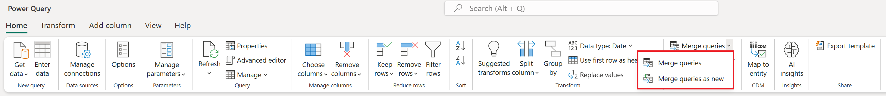

# Merge queries overview

A merge queries operation joins two existing tables together based on matching values from one or multiple columns. You can choose to use different types of joins, depending on the output you want.

## Merging queries

You can find the **Merge queries** command on the **Home** tab, in the **Combine** group. From the drop-down menu, you'll see two options:

* **Merge queries**: Displays the **Merge** dialog box, with the selected query as the left table of the merge operation.
* **Merge queries as new**: Displays the **Merge** dialog box without any preselected tables for the merge operation.

### Identify tables for merging

The merge operation requires two tables:

* **Left table for merge**: The first selection, from top to bottom of your screen.
* **Right table for merge**: The second selection, from top to bottom of your screen.

>[!NOTE]
>The position&mdash;left or right&mdash;of the tables becomes very important when you select the correct join kind to use.

### Select column pairs

After you've selected both the left and right tables, you can select the columns that drive the join between the tables. In the example below, there are two tables:

* **Sales**: The **CountryID** field is a key or an identifier from the **Countries** table.
* **Countries**: This table contains the **CountryID** and the name of the country.

:::image type="complex" source="media/merge-queries-overview/merge-window-one-column-sample.png" alt-text="Merge dialog box with left and right tables and columns selected.":::
   Merge dialog box with the Left table for merge set to Sales and the CountryID column selected, and the Right table for merge set to Countries and the CountryID column selected.
:::image-end:::

The goal is to join these tables by using the **CountryID** column from both tables, so you select the **CountryID** column from each table. After you make the selections, a message appears with an estimated number of matches at the bottom of the dialog box.

>[!NOTE]
> Although this example shows the same column header for both tables, this isn't a requirement for the merge operation. Column headers don't need to match between tables. However, it's important to note that the columns must be of the same data type, otherwise the merge operation might not yield correct results.

You can also select multiple columns to perform the join by selecting **Ctrl** as you select the columns. When you do so, the order in which the columns were selected is displayed in small numbers next to the column headings, starting with 1.

For this example, you have the **Sales** and **Countries** tables. Each of the tables has **CountryID** and **StateID** columns, which you need to pair for the join between both columns.

First select the **CountryID** column in the **Sales** table, select **Ctrl**, and then select the **StateID** column. (This will show the small numbers in the column headings.) Next, perform the same selections in the **Countries** table. The following image shows the result of selecting those columns.

:::image type="complex" source="media/merge-queries-overview/merge-window-multiple-columns-sample.png" alt-text="Merge dialog box with settings for the left and right tables.":::
   ![Merge dialog box with the Left table for merge set to Sales, with the CountryID and StateID columns selected, and the Right table for merge set to Countries, with the CountryID and StateID columns selected. The Join kind is set to Left outer.
:::image-end:::

>[!NOTE]
> When selecting multiple columns for a join, the order you select the columns in each table must match. For example, the first column selected in the left table is matched with the first column selected in the right table, and so on. Otherwise, you will observe incorrect join results.

### Use the column pair suggestion

When selecting the left and right table in the Merge dialog, you can check the lightbulb icon on the top right corner of the dialog to see if there are any suggestions when it comes to column-pair-mapping between both tables.

There can be many suggestions in place but, for this scenario, there's only one suggestion by the feature, where it maps the column CountryID from the Sales table to the CountryID column from the Countries table. You can select it and the column-pair-mapping will be automatically applied to your dialog.

:::image type="content" source="media/merge-queries-overview/suggested-pairing.png" alt-text="Screenshot of Merge dialog showcasing the suggested pairing of columns for the Sales and Countries tables where they are joined by the CountryID columns in both tables.":::

>[!NOTE]
>Only the column-pair-mapping is suggested. Other options in this dialog, such as the join kind or fuzzy matching configuration, are out of scope for this suggestion.

### Expand or aggregate the new merged table column

After selecting **OK** in the **Merge** dialog box, the base table of your query will have all the columns from your left table. Also, a new column will be added with the same name as your right table. This column holds the values corresponding to the right table on a row-by-row basis.

From here, you can choose to expand or aggregate the fields from this new table column, which will be the fields from your right table.

:::image type="complex" source="media/merge-queries-overview/expand-table-column.png" alt-text="Expand table column menu.":::
   Table showing the merged Countries column on the right, with all rows containing a Table. The expand icon on the right of the Countries column header has been selected, and the expand menu is open. The expand menu has the Select all, CountryID, StateID, Country, and State selections selected. The Use original column name as prefix is also selected.
:::image-end:::

>[!NOTE]
>Currently, the Power Query Online experience only provides the expand operation in its interface. The option to aggregate will be added later this year.

## Join kinds

A *join kind* specifies how a merge operation will be performed. The following table describes the available join kinds in Power Query.

|Join kind| Icon| Description|
|---------------|-----|-----------|
|[Left outer](merge-queries-left-outer.md)| | All rows from the left table, matching rows from the right table|
|[Right outer](merge-queries-right-outer.md)| | All rows from the right table, matching rows from the left table|
|[Full outer](merge-queries-full-outer.md)| | All rows from both tables|
|[Inner](merge-queries-inner.md)| | Only matching rows from both tables|
|[Left anti](merge-queries-left-anti.md)| | Only rows from the left table|
|[Right anti](merge-queries-right-anti.md)| | Only rows from the right table|

## Fuzzy matching

You use fuzzy merge to apply fuzzy matching algorithms when comparing columns, to try to find matches across the tables you're merging. You can enable this feature by selecting the **Use fuzzy matching to perform the merge** check box in the **Merge** dialog box. Expand **Fuzzy matching options** to view all available configurations.

>[!NOTE]
>Fuzzy matching is only supported for merge operations over text columns.
