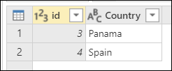
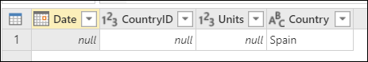
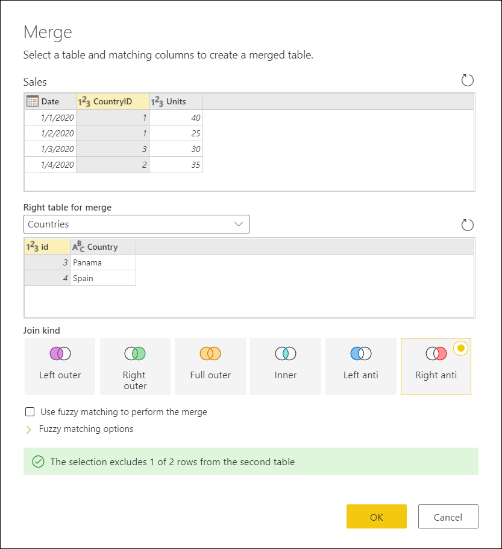
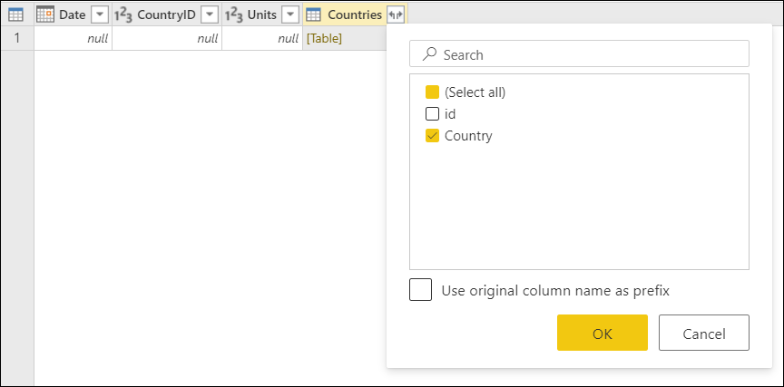

# Merge queries: Right anti join

A Right anti join is one of the join kinds available inside the **Merge queries** window in Power Query. To read more about the merge operations in Power Query, see [Merge operations overview](merge-queries-overview.md).

A Right anti join brings only rows from the right table that don't have any matching rows from the left table.

This article demonstrates, with a practical example, how to perform a merge operation using the Right anti join as the join kind.

>[!Note]
>Samples used in this article are only to showcase the concepts. The concepts showcased here apply to all queries in Power Query.

## Sample input and output tables

The sample source tables for this example are:

* **Sales**&mdash;with the fields **Date**, **CountryID**, and **Units**. The *CountryID* is a whole number value that represents the unique identifier from the **Countries** table.

* **Countries**&mdash;this table is a reference table with the fields **id** and **Country**. The *id* represents the unique identifier of each record.

The goal is to merge both tables, where the **Sales** table will be the left table and the **Countries** table the right one. The join will be made between the following columns:

|Field from Sales table| Field from Countries table|
|-----------|------------------|
|CountryID|id|

The goal is to reach the following table where only the rows from the right table that do not match any from the left table are kept. As a common use case, you can find all of the rows that are available in the right table, but that are not found in the left table.

## Right anti join

To do a Right anti join:

1. Select the **Sales** query and then select **Merge queries** to create a new step inside the Sales query that will merge the **Sales** query with the **Countries** query.
2. Select the **Countries** as the **Right table for merge**.
3. Select the **CountryID** column from the **Sales** table.
4. Select the **id** column from the **Countries** table.
5. From the **Join Kind** section, select the **Right anti** option.
6. Select **OK** button.

>[!TIP]
>Take a closer look at the message at the bottom of the Merge window that reads *"The selection excludes 1 of 2 rows from the seecond table"* as this is crucial to understand the result that you get from this operation. 

In the Countries table, you have the *Country* Spain with the id 4, but there are no records for *CountryID* 4 in the Sales table, hence why only 1 of 2 rows from the right (second) table found a match. Due to how the Right anti join works, you will never see any rows from the left (first) table in the output of this operation.

From the newly created **Countries** column after the merge operation, expand the **Country** field without using the original column name as prefix.

After doing this operation, the desired result is reached. The newly expanded Country field doesn't have any values and that's because the Right anti join does not bring any values from the left table - it only keeps rows from right table.

