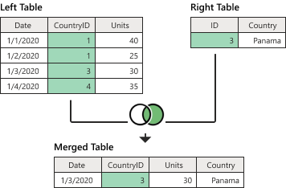
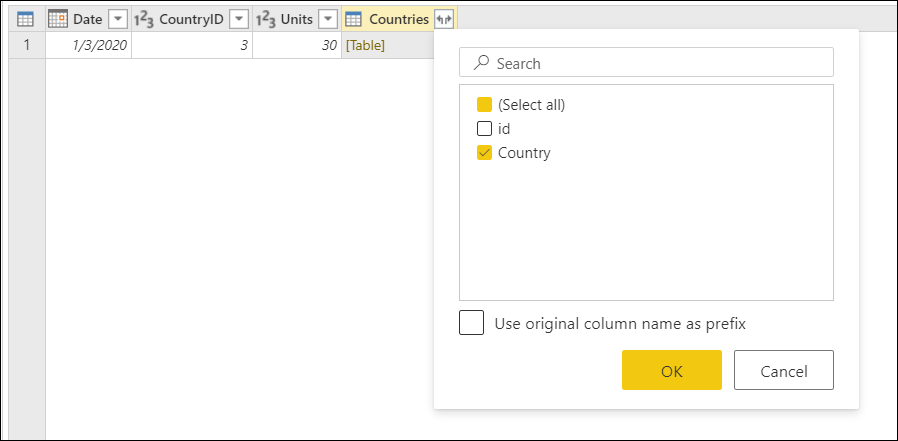

# Right outer join

One of the join kinds available in the **Merge** dialog box in Power Query is a *right outer join*, which keeps all the rows from the right table and brings in any matching rows from the left table. More information: [Merge operations overview](merge-queries-overview.md)

<!-- Keep?
>[!NOTE]
>Samples used in this article are only to showcase the concepts. The concepts showcased here apply to all queries in Power Query.-->

This article uses sample data to show how to do a merge operation with the right outer join. The sample source tables for this example are:

* **Sales**: This table includes the fields **Date**, **CountryID**, and **Units**. The **CountryID** is a whole number value that represents the unique identifier from the **Countries** table.

   

* **Countries**: This is a reference table with the fields **id** and **Country**. The **id** field represents the unique identifier for each record.

   

In this example, you'll merge both tables, with the **Sales** table as the left table and the **Countries** table as the right one. The join will be made between the following columns.

|Field from the Sales table| Field from the Countries table|
|-----------|------------------|
|CountryID|id|

The goal is to create a table like the following, where the name of the country appears as a new **Country** column in the **Sales** table. Because of how the right outer join works, all rows from the right table will be brought in, but only matching rows from the left table will be kept.

<!--markdownlint-disable MD036-->
**To perform a right outer join**
<!--markdownlint-enable MD036-->
1. Select the **Sales** query, and then select **Merge queries**.
2. In the **Merge** dialog box, under **Right table for merge**, select **Countries**.
3. In the **Sales** table, select the **CountryID** column.
4. In the **Countries** table, select the **id** column.
5. In the **Join kind** section, select **Right outer**.
6. Select **OK**.

From the newly created **Countries** column, expand the **Country** field. Don't select the **Use original column name as prefix** check box.

After performing this operation, you'll create a table that looks like the following image.

