# Moving columns

A process in cleaning and preparing data is to move the columns within the dataset. 

To do this process, you can either select the **Move** option or to *Drag and drop* the column.

## Move option

To show the different ways of moving the columns, we'll be using the following example.
We will focus on moving the **Contact Name** column.

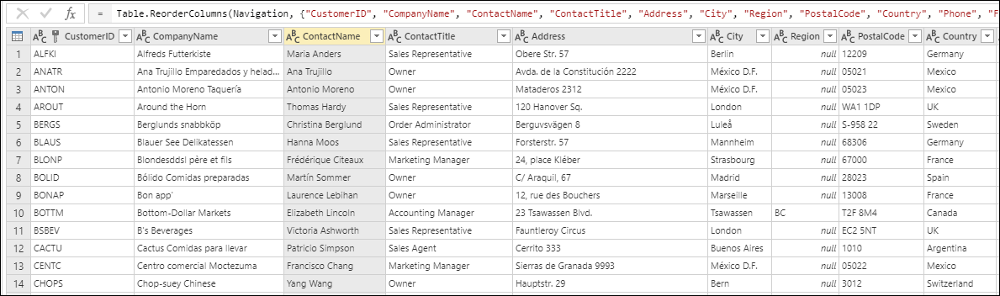

To move the column using the **Move** option. This option can be found inside the contextual menu when doing a right-click on a column and also inside the *Any column* group inside the Transform tab. Within the **Move** option, there are a couple of choices: Before, After, To beginning and To end.

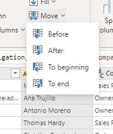

If you want to move the column 1 space left, then select **Before**.

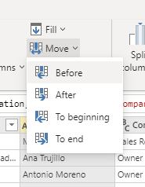

The following outcome is where the column is newly placed.

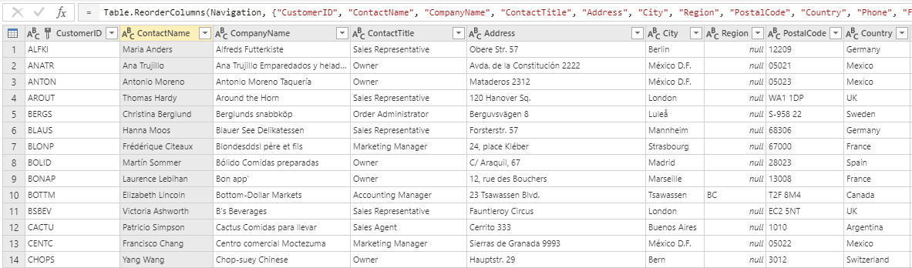

If you want to move the column 1 space right, then select **After**.

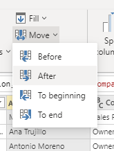

The following outcome is where the column is newly placed.

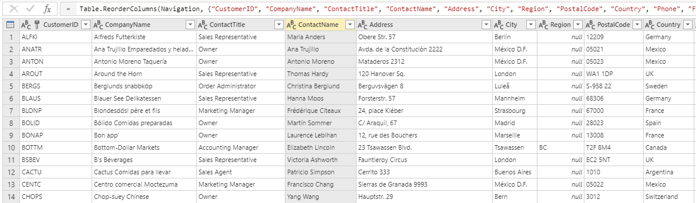

If you want to move the column to the most left space of the dataset, then select **To beginning**.

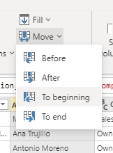

The following outcome is where the column is newly placed.

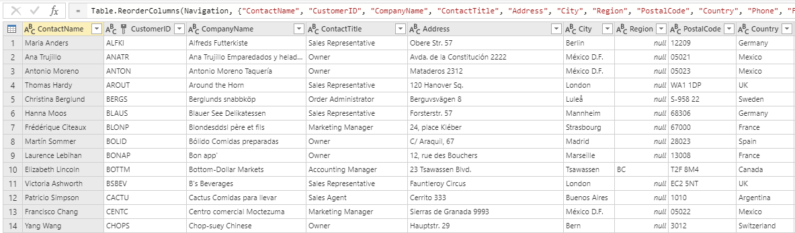

If you want to move the column to the most right space of the dataset, then select **To end**.

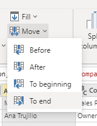

The following outcome is where the column is newly placed.

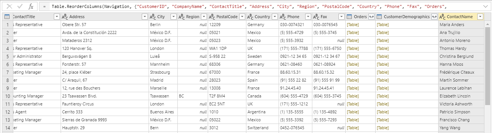

## Drag and drop

Another way to move the columns through the dataset is the drag and drop the column.
Move the column to the place that you would like to place it at.

## Go to column feature

If you want to find a specific column, then go to the **View** tab in the ribbon and select **Go to column**.

From there, you will be able to specfically go to the column you would like to view. This is especially useful if there are a lot of columns.

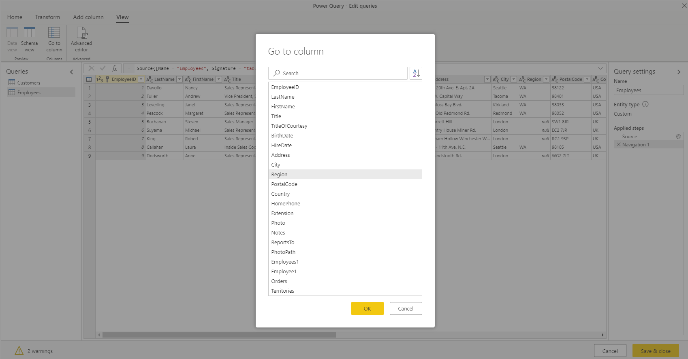

