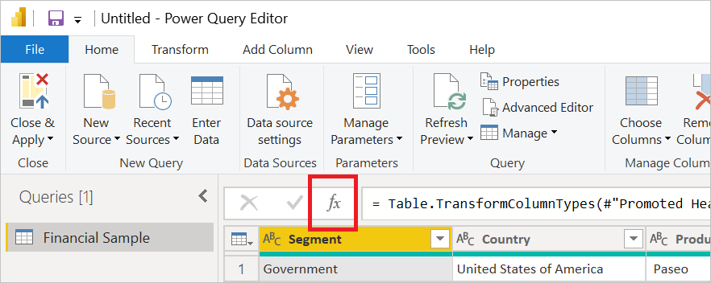
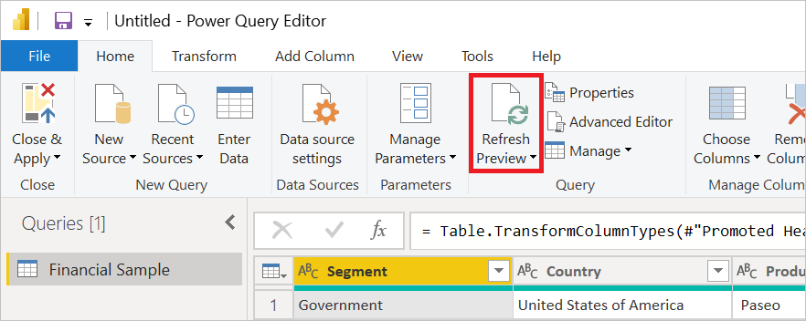

# Why does my query run multiple times?

When refreshing in the Power Query editor, there's a lot done behind the scenes to attempt to give you a fluent user experience. However, in some cases you might notice that multiple API requests are being triggered from Power BI Desktop and Power BI service when data is refreshed. In normal operation, connectors can make multiple calls to the backend for various reasons, including metadata, caching of results, pagination, and so on. This behavior is normal and is designed to work that way.

This article describes a few instances when queries normally run multiple times. It also includes information on how you can isolate the actual query that's running multiple times.

## Multiple queries from a single table

You might come across a time when multiple queries occur when refreshing a single table only. There's no single answer for why the exact same query might be run more than once, and the conditions that cause it vary between Power BI Desktop and Power BI service refresh.

In a cloud environment, if the query doesn't have a "top 1000" and the multiple requests happen in cloud refresh, the most likely explanation is that the same data source is being used to populate multiple tables in the data model. This is because each table in the data model is a separate evaluation of the underlying M query. In non-desktop environments, those evaluations each start out with an empty data cache, and so don't benefit from the same query having been run for a different table. You might be able to avoid multiple queries by using Table.Buffer. More information: [Use a table buffer](#doing-a-table-buffer)

In a desktop environment, a single refresh of all the tables in the data model is run using a single shared cache. Even here, though, you can get multiple requests either because the cache is too small (which is relatively unlikely) or because the queries are running at roughly the same time and the cache is "write-behind".

In general, disabling data privacy&mdash;assuming that's acceptable&mdash;would eliminate the "TOP 1000" queries in refresh. More information: [Disable the data privacy firewall](#disable-the-data-privacy-firewall)

## Multiple queries for Analysis Services refresh

In a desktop environment, Analysis Services (AS) does refresh with two evaluations&mdash;one to check for schema changes and one to fetch data&mdash;and sometimes has to fetch data for both.

## Multiple queries from query diagnostics

The editor runs multiple queries as described in [Explaining multiple evaluations](/power-query/querydiagnostics#explaining-multiple-evaluations) in the Query Diagnostics article. These queries have the same timing issue for the persistent cache.

## Multiple queries for data privacy analysis

Analysis for data privacy also runs multiple queries.

## Isolating multiple queries

You can isolate instances of multiple queries by turning off specific parts of the query process to isolate where the duplicate requests are coming from. For example, if you start:

* In the Power Query Editor
* With the firewall disabled
* With background analysis disabled
* \[Optional] Doing a Table.Buffer

### Set up Power Query Editor

The first step to isolating multiple queries is setting up your data in the Power Query Editor. You can then refresh the data in the editor. Basically, you take the same steps to set up your data in the Power Query Editor that you always do: connect to your data source, select the data you want in the Power Query Navigator, and then select **Transform data**.

### Disable the data privacy firewall

The next step is to disable the data privacy firewall. This step assumes you aren't concerned about data leakage between sources, so disabling the data privacy firewall can be done using the **Always ignore Privacy Level settings** described in [Set Fast Combine option](https://support.microsoft.com/office/set-privacy-levels-power-query-cc3ede4d-359e-4b28-bc72-9bee7900b540) in Excel or using the **Ignore the Privacy levels and potentially improve performance** setting described in [Power BI Desktop privacy levels](/power-bi/admin/desktop-privacy-levels) in Power BI Desktop.

Be sure to undo this step before resuming normal testing.

### Disable background analysis

The next step is to disable background analysis. Background analysis is controlled by the **Allow data preview to download in the background** setting described in [Disable Power Query background refresh](/power-bi/guidance/power-query-background-refresh).

### Use a table buffer

Optionally, you can also use Table.Buffer to force all the data to be read, which imitates what happens during a load. To use Table.Buffer in the Power Query Editor:

1. In the Power Query Editor formula bar, select the **fx** button to add a new step.

   

2. In the formula bar, surround the name of the previous step with Table.Buffer(\<_previous step name goes here_>). For example, if the previous step was named `Source`, the formula bar will display `= Source`. Edit the step in the formula bar to say `= Table.Buffer(Source)`.

More information: [Table.Buffer](/powerquery-m/table-buffer)

### Run the test

To run the test, do a refresh in the Power Query Editor.

In this example, you’ll have only a single M evaluation that happens when you refresh the Power Query Editor preview. If the duplicate requests occur at this point, then they’re somehow inherent in the way the query is authored. If not, and if you enable the settings above one-by-one, you can then observe at what point the duplicate requests start occurring.
