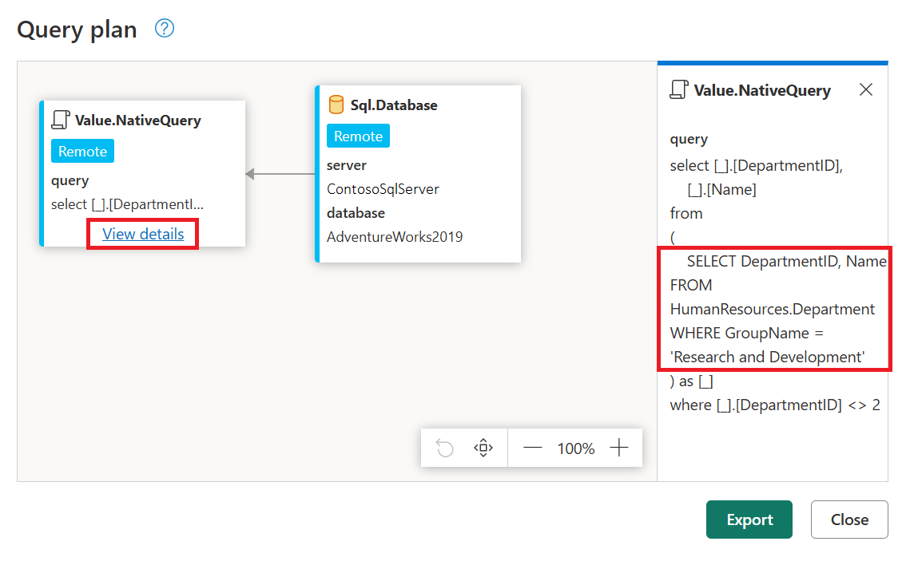

# Query folding on native queries

In Power Query, you are able to define a native query and run it against your data source. The article on [Import data from a database using native database query](native-database-query.md) explains how to do this process that applies to multiple data sources but, by doing so your query will not be taking advantage of any query folding from subsequent query steps.

This article showcases an alternative method to create native queries against your data source using the [Value.NativeQuery](https://docs.microsoft.com/powerquery-m/value-nativequery) function and keep the query folding mechanism active for subsequent steps of your query.

>[!NOTE]
>It is recommended that you read the documentation on [query folding](query-folding-basics.md) and the [step folding indicators](query-folding-basics.md) to better understand the concepts used throughout this article.


## Supported data connectors

The following method is applicable to the following data connectors.

* [Dataverse and dataflows](connectors/dataverse.md) *(when using enhanced compute)*
* [SQL Server](connectors/sqlserver)
* [PostgreSQL](connectors/postgresql.md)
* [MySQL](connectors/mysqldatabase.md)
* [Amazon Redshift](connectors/amazonredshift.md)
* [Google BigQuery](connectors/googlebigquery.md)
* [Snowflake](connectors/snowflake.md)

## Connect to data source

>[!NOTE]
>To showcase this process, this article will use the SQL Server connector and the [AdventureWorks2019 sample database](https://docs.microsoft.com/sql/samples/adventureworks-install-configure).
>However, the contents described in this article are applicable to all supported connectors.

When connecting to the data source, is important that you connect to the node or level where you'll want to execute your native query. For this case, that will be the database level inside the server.


After defining the connection settings along with the connection credentials for your connection, you will be taking through the navigation dialog for your data source where you'll see all the available objects that you can connect to.

From this list, need to select the object where the query should be executed (also known as the target). For this case that's the database level that reads *SQL Server database*.

### For Power Query Desktop

For the desktop versions of Power Query, you are able to right-click the database node in the navigator window and select the options that read **Transform Data** which will create a new query of the overall view of your database, which is the target that you need to execute your native query.


### For Power Query Online

>[!NOTE]
>The method showcased in the Power Query Desktop section is the preferred method. However, this method is not currently possible in Power Query Online and this gap is being addressed.
>The following section showcases a workaround to reach the same target defined in the previous section.

Inside the Navigator window, you can select a single object from the list and then click the button to get to the Query editor.


Once your query is shown in the Query editor window, check the *Applied steps* section on the right side of the screen and look for the last step of your query. Delete the last step of your query, which should have a name similar to **Navigation**.


After the step has been deleted, only the Source step should be shown which displays a table with all the available objects in your database similarly to how they were displayed in the Navigator window.


## Use Value.NativeQuery function

The goal of this process is to execute the SQL code below and apply more transformations with Power Query that can be folded back to the source.

```sql
SELECT DepartmentID, Name FROM HumanResources.Department WHERE GroupName = 'Research and Development'
```

The first step was to  define the correct target that in this case is the database where the SQL code will be executed.
Once a step has the correct target, you can select that step and click the fx button in the formula bar to add a custom step and replace the formula from ```Source``` to be the following formula:

```M
Value.NativeQuery(Source, "SELECT DepartmentID, Name FROM HumanResources.Department WHERE GroupName = 'Research and Development'  ", null, [EnableFolding = true])
```
The most important component of this formula is the usage of the optional record for the forth parameter of the function that has the **EnableFolding** record field set to *true*.


>[NOTE]
>You can read more about the Value.NativeQuery function from the [official documentation article](https://docs.microsoft.com/powerquery-m/value-nativequery).

After you've entered the formula, a warning will be shown that will require you to enable native queries to run for your specific step. You can click continue for this step to be evaluated.

This SQL statement yields a table with only three rows and 2 columns.


## Test query folding

To test the query folding of your query, you can try to apply a filter to any of your columns and see if the step folding indicator in the applied steps section shows the step as folded. For this case, you can filter the DepartmentID column to have values that are not equal to two.


After adding this filter, you can check that the step folding indicators still show the query folding happening at this new step.


To further validate what query is being sent to the data source, you can right-click the **Filtered rows** step and select the option that reads *View query plan* to check the query plan for that step.

In the query plan view, you can see that a node with the name Value.NativeQuery at the left side of the screen that has a hyperlink text that reads *View details*. You can click this hyperlink text to view the exact query that is being sent to the SQL Server database.

The native query is wrapped around another SELECT statement to create  a subquery of the original. Power Query will do its best to create the most optimal query given the transforms used and the native query provided.

