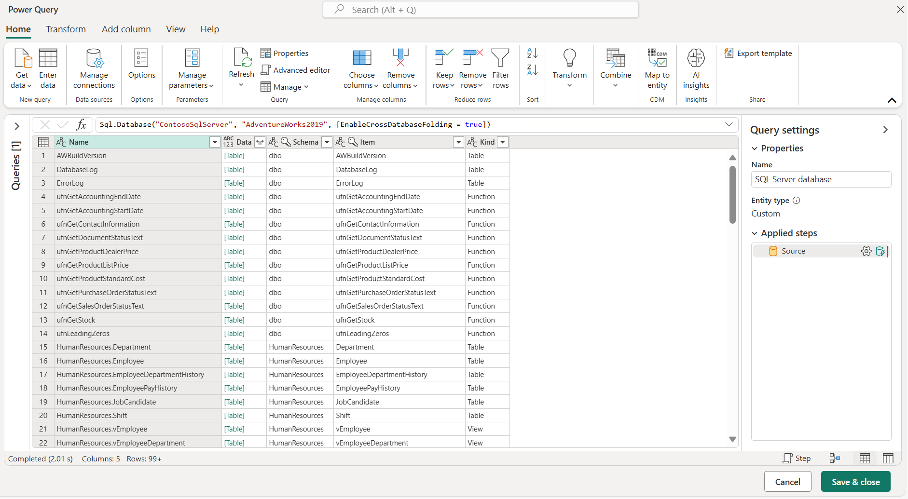
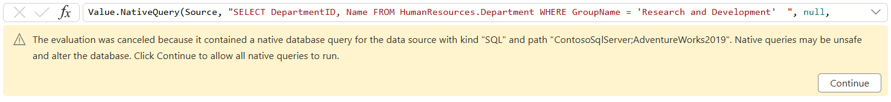

# Query folding on native queries

In Power Query, you're able to define a native query and run it against your data source. The [Import data from a database using native database query](native-database-query.md) article explains how to do this process with multiple data sources. But, by using the process described in that article, your query won't take advantage of any query folding from subsequent query steps.

This article showcases an alternative method to create native queries against your data source using the [Value.NativeQuery](/powerquery-m/value-nativequery) function and keep the query folding mechanism active for subsequent steps of your query.

>[!NOTE]
>We recommend that you read the documentation on [query folding](query-folding-basics.md) and the [query folding indicators](query-folding-basics.md) to better understand the concepts used throughout this article.

## Supported data connectors

The method described in the next sections applies to the following data connectors:

* [Amazon Redshift](connectors/amazon-redshift.md)
* [Dataverse](connectors/dataverse.md) *(when using enhanced compute)*
* [Google BigQuery](connectors/google-bigquery.md)
* [PostgreSQL](connectors/postgresql.md)
* [SAP HANA](connectors/sap-hana/overview.md)
* [Snowflake](connectors/snowflake.md)
* [SQL Server](connectors/sql-server.md)

## Connect to target from data source

>[!NOTE]
>To showcase this process, this article uses the SQL Server connector and the [AdventureWorks2019 sample database](/sql/samples/adventureworks-install-configure).
>The experience may vary from connector to connector, but this article showcases the fundamentals on how to enable query folding capabilities over native queries for the supported connectors.

When connecting to the data source, it's important that you connect to the node or level where you want to execute your native query. For the example in this article, that node will be the database level inside the server.


After defining the connection settings and supplying the credentials for your connection, you'll be taken to the navigation dialog for your data source. In that dialog, you'll see all the available objects that you can connect to.

From this list, you need to select the object where the native query is run (also known as the target). For this example, that object is the database level.

At the navigator window in Power Query, right-click the database node in the navigator window and select the **Transform Data** option. Selecting this option creates a new query of the overall view of your database, which is the target you need to run your native query.


Once your query lands in the Power Query editor, only the **Source** step should show in the Applied steps pane. This step contains a table with all the available objects in your database, similar to how they were displayed in the Navigator window.



## Use Value.NativeQuery function

The goal of this process is to execute the following SQL code, and to apply more transformations with Power Query that can be folded back to the source.

```sql
SELECT DepartmentID, Name FROM HumanResources.Department WHERE GroupName = 'Research and Development'
```

The first step was to define the correct target, which in this case is the database where the SQL code will be run.
Once a step has the correct target, you can select that step&mdash;in this case, **Source** in **Applied Steps**&mdash;and then select the **fx** button in the formula bar to add a custom step. In this example, replace the `Source` formula with the following formula:

```powerquery-m
Value.NativeQuery(Source, "SELECT DepartmentID, Name FROM HumanResources.Department WHERE GroupName = 'Research and Development'  ", null, [EnableFolding = true])
```

The most important component of this formula is the use of the optional record for the forth parameter of the function that has the **EnableFolding** record field set to *true*.



>[!NOTE]
>You can read more about the Value.NativeQuery function from the [official documentation article](/powerquery-m/value-nativequery).

After you have entered the formula, a warning will be shown that will require you to enable native queries to run for your specific step. You can click continue for this step to be evaluated.

This SQL statement yields a table with only three rows and two columns.


## Test query folding

To test the query folding of your query, you can try to apply a filter to any of your columns and see if the query folding indicator in the applied steps section shows the step as folded. For this case, you can filter the DepartmentID column to have values that are not equal to two.


After adding this filter, you can check that the query folding indicators still show the query folding happening at this new step.


To further validate what query is being sent to the data source, you can right-click the **Filtered rows** step and select the option that reads *View query plan* to check the query plan for that step.

In the query plan view, you can see that a node with the name Value.NativeQuery at the left side of the screen that has a hyperlink text that reads *View details*. You can click this hyperlink text to view the exact query that is being sent to the SQL Server database.

The native query is wrapped around another SELECT statement to create  a subquery of the original. Power Query will do its best to create the most optimal query given the transforms used and the native query provided.


>[!TIP]
>For scenarios where you get errors because query folding wasn't possible, it is recommended that you try validating your steps as a subquery of your original native query to check if there might be any syntax or context conflicts.
