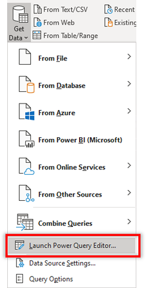
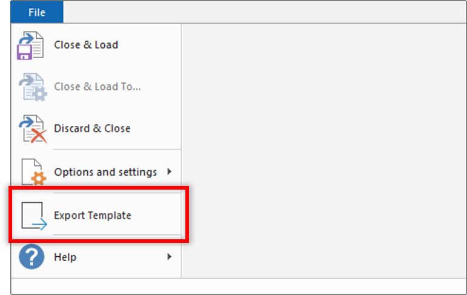
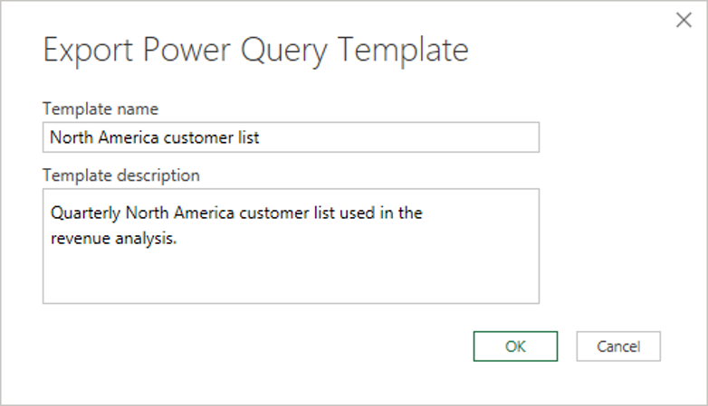

# Create Power Microsoft Platform dataflows from queries in Microsoft Excel (Preview)

[This topic is pre-release documentation and is subject to change.]

You can create Microsoft Power Platform dataflows from queries in Microsoft Excel workbooks to take advantage of cloud-powered dataflows refreshing and processing the data at regular intervals instead of performing these operations manually in Excel.

This article walks you through how to export queries from Excel into a Power Query template that can then be imported into Power Platform dataflow to create a dataflow.

> [!NOTE]
> The preview feature for creating Power Query templates from queries feature is only available to Office Insiders. For more information on the Office insider program, go to [Office Insider](https://insider.office.com).

## Overview

Working with large datasets or long-running queries can be cumbersome every time you have to manually trigger a data refresh in Excel because it takes resources from your computer to do this, and you have to wait until the computation is done to get the latest data. Moving these data operations into a Power Platform dataflow is an effective way to free up your computer's resources and to have the latest data easily available for you to consume in Excel.

It only takes two quick steps to do this:

1. Exporting queries in Excel to a Power Query template
2. Creating a Power Platform dataflow from the Power Query template

## Exporting queries in Excel to a Power Query template

The first step is to create a Power Query template with your queries in Excel.

1. Start the Power Query editor from **Data** tab > **Get Data** > **Launch Power Query Editor**.

    

2. Once Power Query loads, select **File** > **Export Template**.

    

3. The template requires basic information such as a name and a description before it can be saved locally on your computer.

    

## Creating a Power Platform dataflow from the Power Query template

1. Sign in to [Power Apps](https://make.powerapps.com).

2. In the left navigation pane, select **Data** > **Dataflows**.

3. From the toolbar, select **New dataflow** > **Import template**.

    

4. Select the Power Query template you created earlier. The dataflow name will prepopulate with the template name provided. Once you're done with the dataflow creation screen, select **Next** to view your queries from Excel in the query editor.

5. From this point, go through the normal dataflow creation and configuration process so you can further transform your data, set refresh schedules on the dataflow, and any other dataflow operation possible. For more information on how to configure and create Power Platform dataflows, go to [Create and use dataflows](dataflows/create-use.md).

### See also

[Create and use dataflows in Power Apps](/powerapps/maker/common-data-service/create-and-use-dataflows)
