# Optimize Power Query when expanding table columns

The simplicity and ease of use that allows Power BI users to quickly gather data and generate interesting and powerful reports to make intelligent business decisions also allows users to easily generate poorly performing queries. This often occurs when there are two tables that are related in the way a foreign key relates SQL tables or SharePoint lists. (For the record, this issue isn't specific to SQL or SharePoint, and occurs in many backend data extraction scenarios, especially where schema is fluid and customizable.) There's also nothing inherently wrong with storing data in separate tables that share a common key&mdash;in fact this is a fundamental tenet of database design and normalization. But it does imply a better way to expand the relationship.

Consider the following example of a SharePoint customer list.

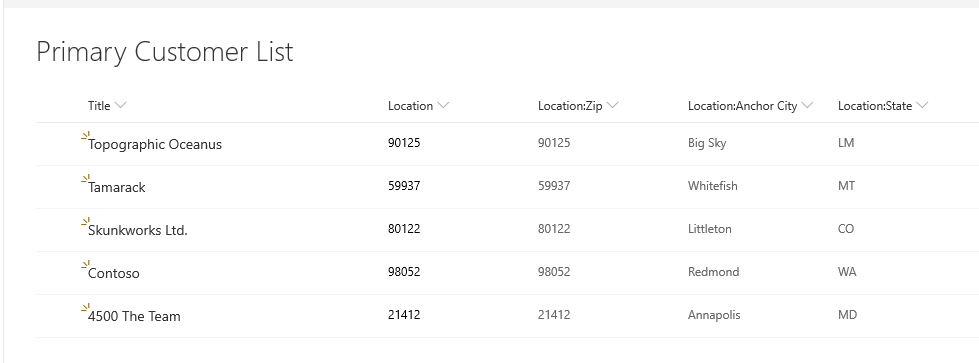

And the following location list it refers to.

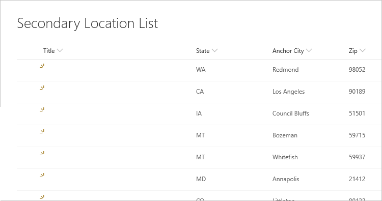

When first connecting to the list, the location shows up as a record.

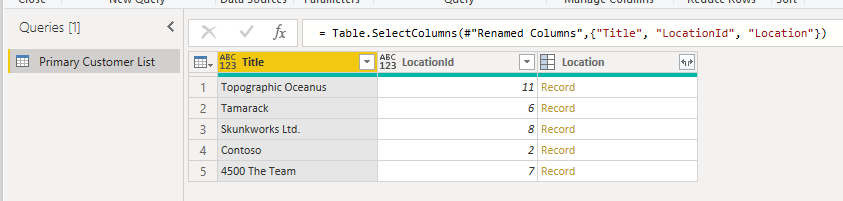

This top-level data is gathered through a single HTTP call to the SharePoint API (ignoring the metadata call), which you can see in any web debugger.

When you expand the record, you see the fields joined from the secondary table.

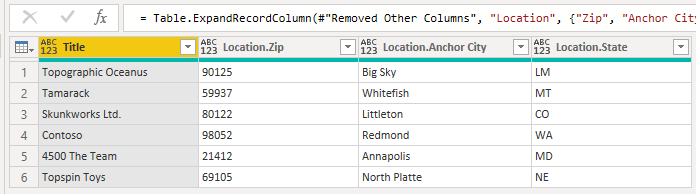

When expanding related rows from one table to another, the default behavior of Power BI is to generate a call to `Table.ExpandTableColumn`. You can see this in the generated formula field. Unfortunately, this method generates an individual call to the second table for every row in the first table.

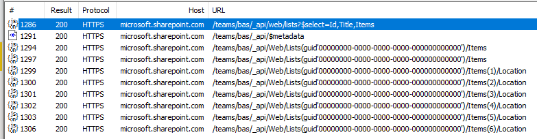

This increases the number of HTTP calls by one for each row in the primary list. This may not seem like a lot in the above example of five or six rows, but in production systems where SharePoint lists reach hundreds of thousands of rows, this can cause a significant experience degradation.

When queries reach this bottleneck, the best mitigation is to avoid the call-per-row behavior by using a classic table join. This ensures that there will be only one call to retrieve the second table, and the rest of the expansion can occur in memory using the common key between the two tables. The performance difference can be massive in some cases. 

First, start with the original table, noting the column you want to expand, and ensuring you have the ID of the item so that you can match it. Typically the foreign key is named similar to the display name of the column with **Id** appended. In this example, it's **LocationId**.

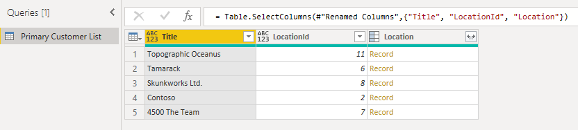

Second, load the secondary table, making sure to include the **Id**, which is the foreign key. Right-click on the Queries panel to create a new query.

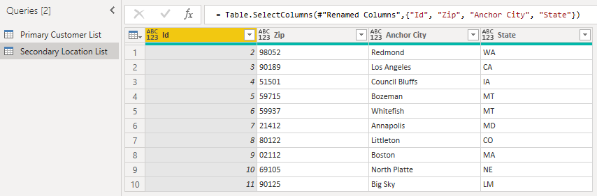

Finally, join the two tables using the respective column names that match. You can typically find this field by first expanding the column, then looking for the matching columns in the preview.

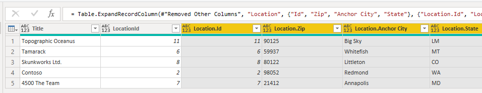

In this example, you can see that **LocationId** in the primary list matches **Id** in the secondary list. The UI renames this to **Location.Id** to make the column name unique. Now let's use this information to merge the tables.

By right-clicking on the query panel and selecting **New Query** > **Combine** > **Merge Queries as New**, you see a friendly UI to help you combine these two queries.

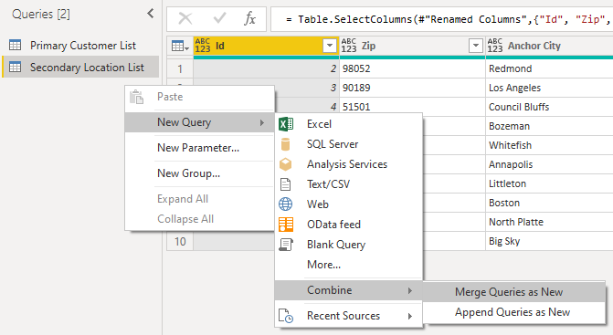

Select each table from the drop-down to see a preview of the query.

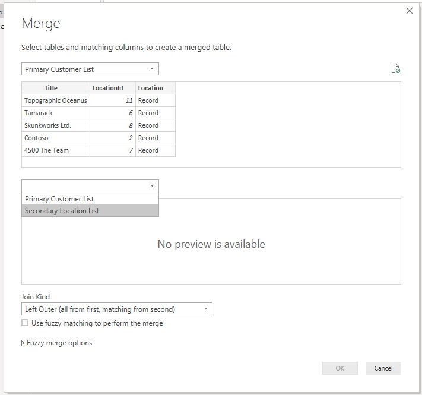

Once you've selected both tables, select the column that joins the tables logically (in this example, it's **LocationId** from the primary table and **Id** from the secondary table). The dialog will instruct you how many of the rows match using that foreign key. You'll likely want to use the default join kind (left outer) for this kind of data.

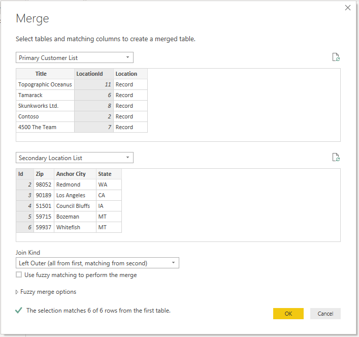

Select **OK** and you'll see a new query, which is the result of the join. Expanding the record now doesn't imply additional calls to the backend.

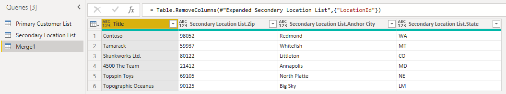

Refreshing this data will result in only two calls to SharePoint&mdash;one for the primary list, and one for the secondary list. The join will be performed in memory, significantly reducing the number of calls to SharePoint.

This approach can be used for any two tables in PowerQuery that have a matching foreign key.

>[!NOTE]
>SharePoint user lists and taxonomy are also accessible as tables, and can be joined in exactly the way described above, provided the user has adequate privileges to access these lists.

