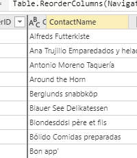

not application language

Approved AFGS Authentication Services

# Options and Settings in Power Query
There are many options and settings within Power Query. Whether it's the editor layouts, the diagnostics or the language settings, you can change many your Power Query experience using the settings.

You can change those options in the **Options** feature in Power Query. This feature can be found in different places on each of the versions of Power Query. 

In Desktop, it can be found within the **File Tab** and inside **Options and Settings**.

In Online, it can be found within the **Home Tab** as a feature.

## Global vs. Current/Project Options
Within Options, there are two layers that the user can set their choices. The first is the Global level.

The Global level has different settings that affect each of the entities/dataflows/projects and the general Power Query. An example of the type of settings in Global are Power Query Editor settings.

The second level is the project level, which is more specific to the projects that are in the Power Query editor currently.

## Power Query Online
Currently in Power Query Online, there are a couple of functionalities that can be used.

-- Look over to see if we want PQ Online to be represented.

## Power Query Desktop

### Data Load

Type Detection Link

Data Cache

### Power Query Editor

Parameter Link

M Formula Docs Link

### Security

Native Database Queries Link

### Privacy 

Privacy Levels Link

-- dO NOT mention PQ Diagnostics

## Regional Settings

-- Mike will write.