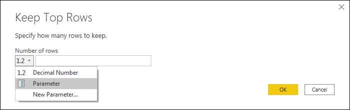

# Using parameters

A parameter serves as way to easily store and manage a value that can be reused.

Transformations in Power Query can require arguments to be entered by the user. 

One example where you can use parameters is for the *Keep top rows* transformations as showcased in the [Filter by row position](filter-row-position.md) article where you have to enter a numeric value in the *Number of rows* argument. A parameter can help you centralize and easily manage that numeric value not only in one transformation, but in as many transformations or data source functions as you may need.

You can easily manage your parameters inside the **Manage Parameters** window. You can get to the **Manage Parameters** window by clicking the *Manage Parameters* option inside the *Manage Parameters* button in the Home tab.

## Creating a parameter

Power Query provides two easy ways to create parameters:

* **From an existing query** - You can easily right-click a query whose output is a non-structured value such as, but not limited to, a date, text, number, and select **Convert to Parameter**.
    

>[!NOTE]
>You can also convert a parameter to a query by right-clicking the parameter and then selecting **Convert To Query** as shown in the image below.
>
>

* **Using the Manage Parameters window** - You can click the *New Parameter* option from the dropdown menu of the Manage Parameters button in the Home tab, or you can launch the **Manage Parameters** window and click in the *New* button on the top to create a parameter. You can fill in this form and hit OK to create a new parameter.

After creating the parameter, you can always go back to the **Manage Parameters** window to modify any of your parameters at any moment.

## Components of a parameter

A parameter stores a value that can be used for transformations in Power Query. Apart from the name of the parameter and the value that it stores, it also has other components that provide metadata to it. The components of a parameter are as follows.

* **Name** - Provide a name for this parameter that lets you easily recognize and differentiate it from other parameters you might create.
* **Description** - The description is displayed next to the parameter name when parameter information is displayed, helping users who are specifying the parameter value to understand its purpose, and its semantics.
* **Required** - The checkbox indicates whether subsequent users can specify whether a value for the **Current Value** component of the parameter must be provided.
* **Type** - It is highly recommended that you always set up the data type of your parameter. You can learn more about the importance of data types from the article [Data types](data-types.md).
* **Suggested Values** - Provides the user with suggestions to select a value for the **Current Value** from the available options:
    * *Any value* - The current value can be any manually entered value. 
    * *List of values* - Provides you with a simple table-like experience so you can define a list of suggested values that you can later select from for the **Current Value**. When this option is selected a new option called *Default Value* will be available where you can select what should be the default value for this parameter, which will be the default value shown to the user when referencing the parameter. This is not to be confused with the **Current Value**, which is the value that is stored inside the Parameter and can be passed as an argument in transformations. Using this option will enable a drop-down menu to be displayed in the *Default Value* and **Current Value** fields where you can pick one of the values from the suggested list of values.

    

    >[!NOTE]
    > You can still manually type any value that you want to pass to the parameter. The list of suggested values only serves as simple suggestions.
    
    * *Query* - Uses a list query (a query whose output is a list) to provide the list of suggested values that you can later select for the **Current Value**.

    

* **Current Value** - The value that will be stored in this parameter.

## Where to use parameters

A parameter can be used in many different ways, but it is more commonly used in two scenarios:
* **Transformation step argument** - With the use of the User Interface you can use a parameter as the argument of multiple transformations driven from the User Interface.
* **Custom Function argument** - You can create a new function from a query and reference parameters as the arguments of your custom function.

In the next sections, you'll see an example for these two scenarios.

### Transformation step argument

To enable this feature, first go to the *View* tab in the Power Query Editor and enable the *Always allow* option in the Parameters group.

>[!NOTE]
>This feature is currently not availble in Power Query Online experiences.

For example purposes, you can see the following **Orders** query with the fields OrderID, Units, and Margin.

You can create a new parameter with the name **Minimum Margin** with a *Decimal Number* type and a *Current Value* of 0.2 as shown in the next image:

You can go to the **Orders** query, and in the Margin field select the filter option with the name *Greater Than...*.

In the Filter rows window, you will see a button with a data type for the field selected. You can click this button to display a dropdown menu in which you can select to use a Parameter. From the field selection right next to it, you can select the parameter that you want to pass to this argument. In this case, it's the *Minimum Margin* parameter.

After you hit OK, you can see that your table has been filtered using the **Current Value** for your Parameter.

You can modify the **Current Value** of your *Minimum Margin* parameter to be 0.3 and you can immediately see how your Orders query gets updated and shows you only the rows where the *Margin* is above 30%.

>[!TIP]
> Multiple transformations in Power Query offer this experience where you can select your parameter from a dropdown, so it is recommended that you always look for it and take advantage of what parameters can offer you. 

### Custom Function argument

With Power Query, you can create a Custom Function from an existing query with a simple click. Following the previous example, you can right-click the **Orders** query and select *Create Function...* which will launch a new *Create Function* window where you can name your new function and it will tell you the Parameters being referenced in your query. These Parameters will be used as the Parameters for the Custom Function.

You can name this new Function however you want. For demonstration purposes, the name of this new function will be **MyFunction**. After you hit the OK button a new group will be created in the Queries pane using the name of your new function and in this Group you will find the parameters being used for the function, the query that was used to create the function and the function itself:

You can test this new function by entering a value such as 0.4 in the field underneath the *Minimum Margin* label and then clicking the Invoke button. This will create a new query with the name *Invoked Function* effectively passing the value 0.4 to be used as the argument for the function and giving you only the rows where the Margin is above 40%. 

You can learn more about how to create Custom Functions from the article [Creating a Custom Function](custom-function.md).
