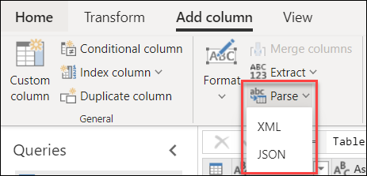
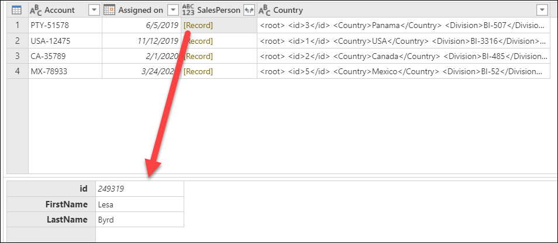
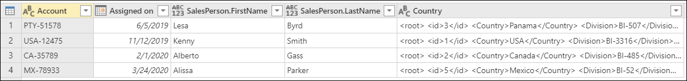
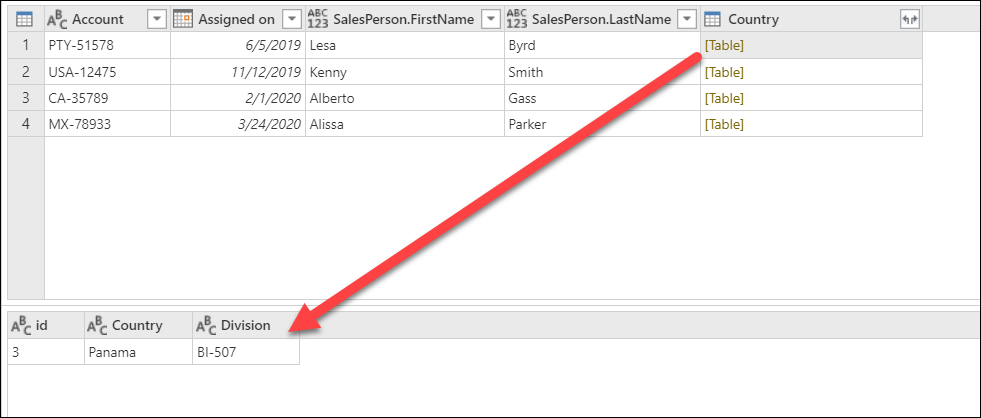
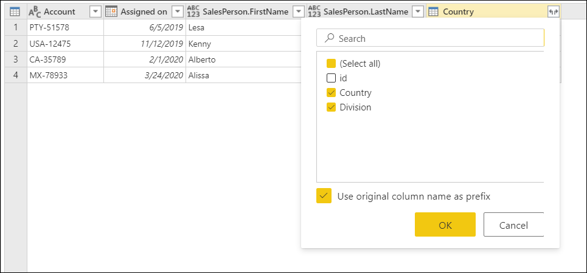

# Parse text as JSON or XML

In Power Query you are able to parse the contents of a column with text strings by identifying the contents as either a JSON or XML text string. 

You can perform this parse operation by selecting the **Parse** button found inside the following places in the Power Query Editor:

* **Transform tab** - This button will transform the existing column by parsing its contents.

    

* **Add column tab** - This button will add a new column to the table parsing the contents of the selected column.

    

For this article we'll be using the following sample table that contains the following columns that we need to parse:
* **SalesPerson** -  Contains unparsed JSON text strings with information about the *FirstName* and *LastName* of the sales person as in the following example.

```json
{
  "id" : 249319,
  "FirstName": "Lesa",
  "LastName": "Byrd"
}
```

* **Country** - Contains unparsed XML text strings with information about the Country and the Division that the account has been assigned to as in the following example. 

```xml
<root>
  <id>1</id>
  <Country>USA</Country>
  <Division>BI-3316</Division>
</root>
```
The sample table looks as follows.


The goal is to parse the above mentioned columns and expand the contents of those columns to get this output.


## As JSON

Select the **SalesPerson** column and click the **JSON** button from the **Parse** dropdown menu inside the *Transform tab*. This will transform the **SalesPerson** column from having text strings to having *Record* values as shown in the next image. You can click in the whitespace inside the cell of the *Record* value to get a detail preview of the contents of the *Record* at the bottom of the screen.



Click the expand icon next to the **SalesPerson** column header and from the expand columns menu select only the fields *FirstName* and *LastName* as shown in the image below.


The result of that operation will give you the following table.



## As XML

Select the **Country** column and click the **XML** button from the **Parse** dropdown menu inside the *Transform tab*. This will transform the **Country** column from having text strings to having *Table* values as shown in the next image. You can click in the whitespace inside the cell of the *Table* value to get a detail preview of the contents of the *Table* at the bottom of the screen.



Click the expand icon next to the **Country** column header and from the expand columns menu select only the fields *Country* and *Division* as shown in the image below.



You can define all the new columns as text columns. The result of that operation will give you the output table that you are looking for.

