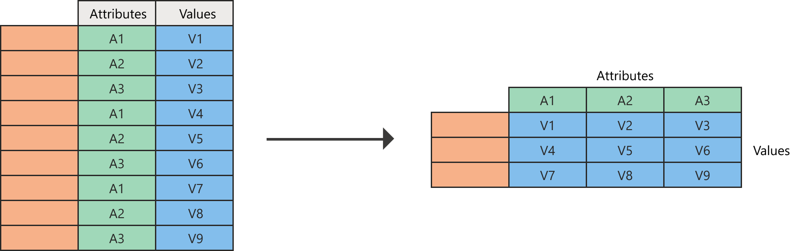

# Pivot columns

In Power Query, you can create a table that contains an aggregate value for each unique value in a column. Power Query groups each unique value, does an aggregate calculation for each value, and pivots the column into a new table. 

Imagine a table like the one in the following image.

This table contains values by country and date in a simple table. In this example, you want to transform this table into the one where the date column is pivoted, as shown in the following image.

<!--markdownlint-disable MD036-->
**To pivot a column**
<!--markdownlint-enable MD036-->

1. Select the column that you want to pivot. 
2. On the **Transform** tab in the **Any column** group, select **Pivot column**.

   

3. In the **Pivot column** dialog box, in the **Value column** list, select **Value**.

   

   By default, Power Query will try to do a sum as the aggregation, but you can select the **Advanced** option to see other available aggregations. 

   

The available options are:

- Don't aggregate
- Count (all)
- Count (not blank)
- Minimum
- Maximum
- Median
- Sum
- Average

## Pivoting columns that can't be aggregated

You can pivot columns without aggregating when you're working with columns that can't be aggregated, or aggregation isn't required for what you're trying to do. For example, imagine a table like the following image, that has **Country**, **Position**, and **Product** as fields.

Let's say you want to pivot the **Position** column in this table so you can have its values as new columns. For the values of these new columns, you'll use the values from the **Product** column. Select the **Position** column, and then select **Pivot column** to pivot that column.

Then select the **Product** column as the value column. Select the **Advanced** option button in the **Pivot columns** dialog box, and then select **Don't aggregate**.

The result of this operation will yield the result shown in the following image.

### Errors when using the Don't aggregate option

The way the **Don't aggregate** option works is that it grabs a single value for the pivot operation to be placed as the value for the intersection of the column and row pair. For example, let's say you have a table like the one in the following image.

You want to pivot that table by using the **Date** column, and you want to use the values from the **Value** column. Because this pivot would make your table have just the **Country** values on rows and the **Dates** as columns, you'd get an error for every single cell value because there are multiple rows for every combination of **Country** and **Date**. The outcome of the **Pivot column** operation will yield the results shown in the following image.

Notice the error message "Expression.Error: There were too many elements in the enumeration to complete the operation." This error occurs because the **Don't aggregate** operation only expects a single value for the country and date combination.
