# Pivot columns
In Power Query, you can create a table that contains an aggregate value for each unique value in a column. Power Query groups each unique value, performs an aggregate calculation for each value, and pivots the column into a new table. 

Imagine a table like the one in the following image.

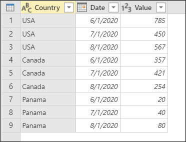

This table contains values by country and date as a simple table. In this example, you want to transform this table into the following one with the date column pivoted.

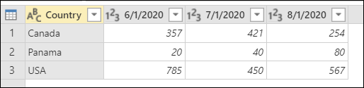

## To pivot a column
To make this happen, select the column that you want to pivot. Go to the **Transform** tab and select **Pivot column** from the **Any column** group.

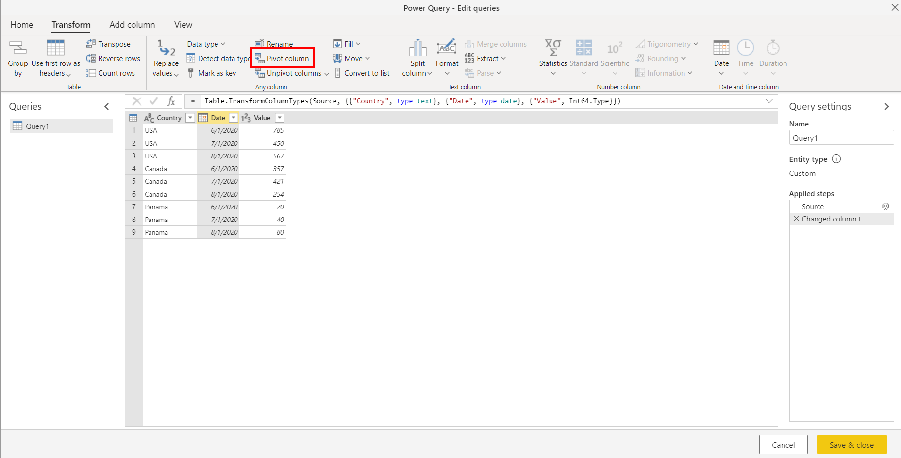

After selecting **Pivot column**, you'll be prompted with a new window called **Pivot column**.

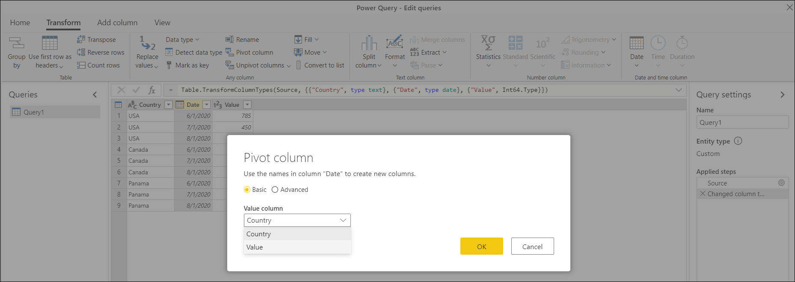

From the **Value column** dropdown, select the column that you want to be aggregated, which in this case is the **Value** column. By default, Power Query will try to do a sum as the aggregation, but you can select the **Advanced** option to see other available aggregations. 

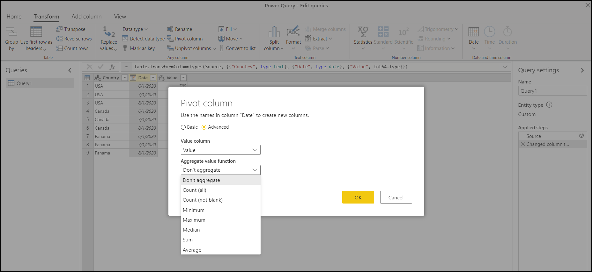

The available options are:
- Don't aggregate
- Count (all)
- Count (not blank)
- Minimum
- Maximum
- Median
- Sum
- Average

## About the don't aggregate option
The pivot columns operation acts in much the same way as the operation that you see in a pivot table operation in Excel. However, Power Query has an option called **Don't aggregate**, which is particularly important for certain scenarios.

### Pivot a column with no aggregation
The don't aggregate option is especially helpful in cases when you're trying to pivot columns with text as values. For example, imagine a table, like the following image, that has **Country**, **Position**, and **Product** as fields.

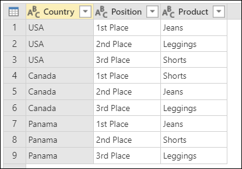

For example, let's say you want to pivot the **Position** column in this table so you can have its values as new columns. As values for these new columns you'll use the values from the **Product** column. Select the **Position** column and then select **Pivot column** to pivot that column.

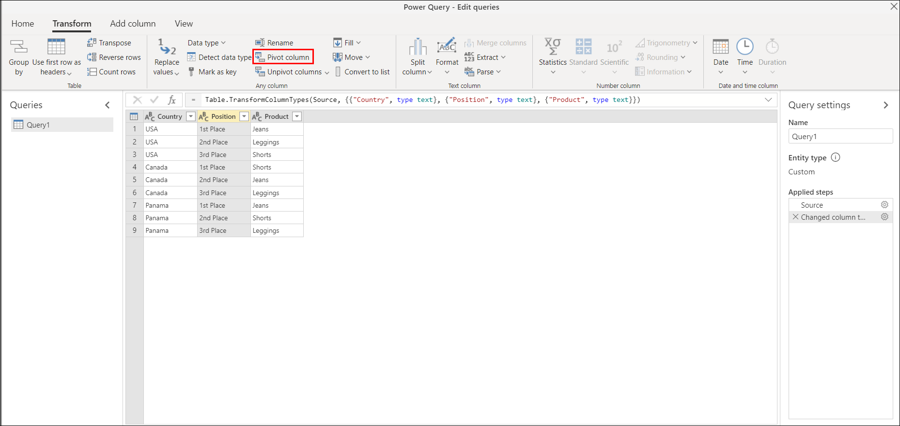

Then select the **Product** column as the value column. From the **Advanced** section inside **Pivot columns**, select the **don't aggregate** option.

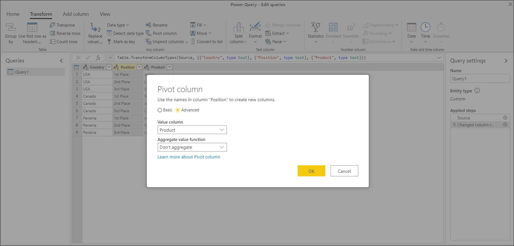

The result of this operation will yield your expected result.

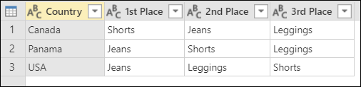

### Errors when using the don't aggregate option
The way that the don't aggregate option works is that it grabs a single value for the pivot operation to be placed as the value for the intersection of the column and row pair. For example, if you have a table like the one in the following image:

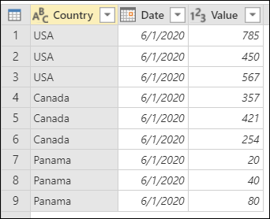

Let's say you want to pivot that table using the **Date** column, and you want to use the values from the **Value** column. Because this pivot would make your table have just the Country values on rows and the Dates as columns, you would get an error for every single cell value because there are multiple rows for every combination of Country and Date. The outcome of the Pivot column operation will yield the following results:

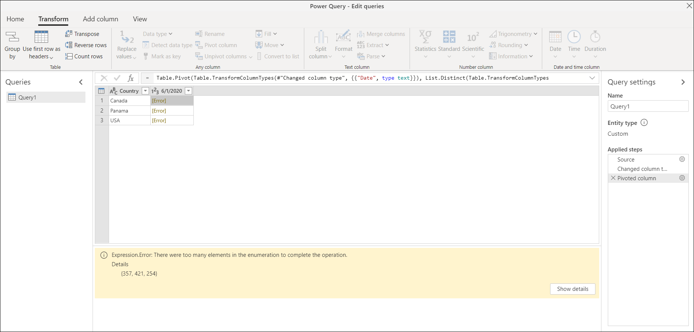

Notice how the error message in the details window shows you the message `Expression.Error: There were too many elements in the enumeration to complete the operation.`. This error happens because the don't aggregate operation only expects a single value for the country and date combination.
