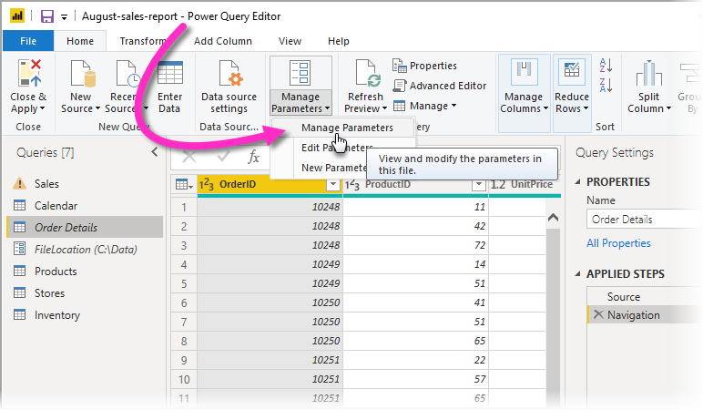
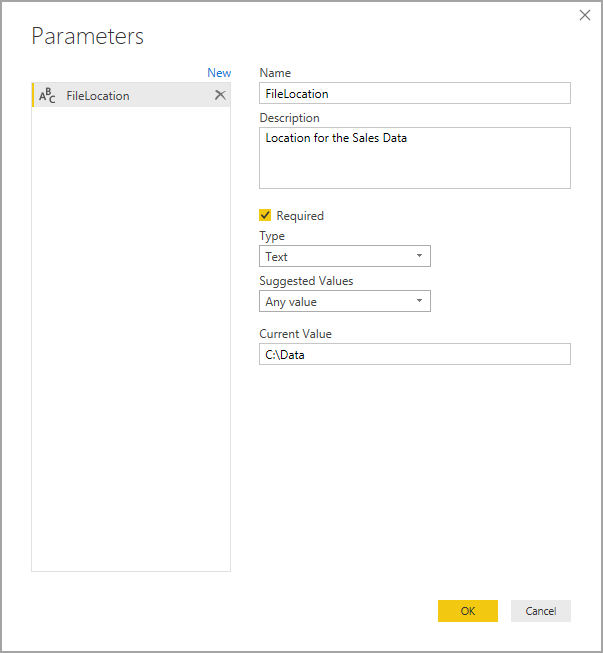
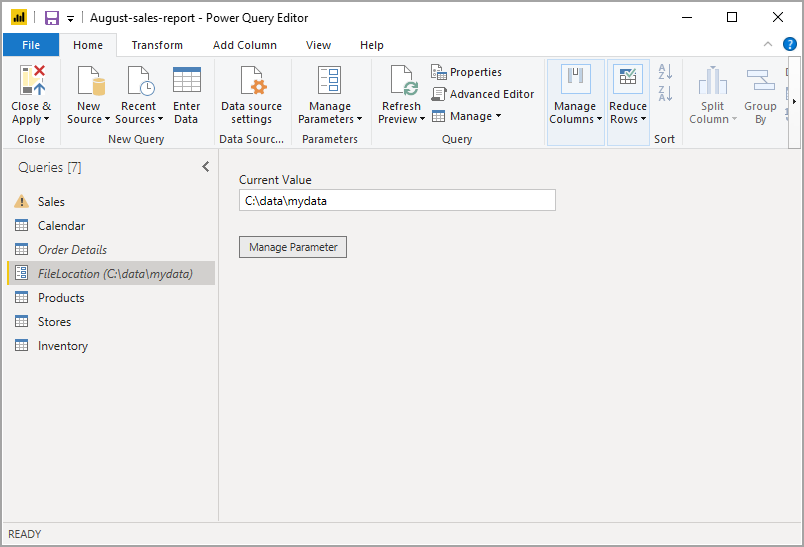
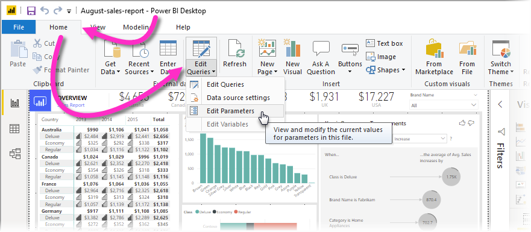
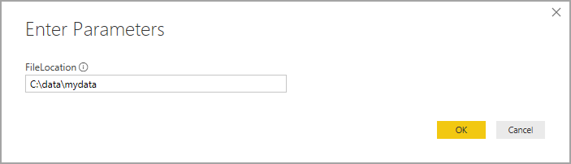

# Using Query Parameters in Power BI Desktop

With **Power Query** and **Power BI Desktop,** you can add **Query Parameters** to a report and make elements of the report dependent on those parameters. For example, you could use Query Parameters to automatically have a report create a filter, load a data model or a data source reference, generate a measure definition, and many other abilities. Query Parameters let users open a report, and by providing values for its Query Parameters, jump-start creating that report with just a few clicks. 

You can have one parameter, or multiple parameters for any report. Let's take a look at how to create parameters in Power BI Desktop.

## Creating Query Parameters

To create or access Query Parameters in a Power BI Desktop report, go to the **Home** ribbon and select **Edit Queries > Edit Parameters** to bring up the **Power Query Editor** window.

In the **Power Query Editor** window, from the **Home** ribbon select **Manage Parameters** to bring up the **Parameters** dialog.

The **Parameters** dialog has the following elements that let you create new parameters, or specify metadata and setting for each parameter:

* **Name**&mdash;Provide a name for this parameter that lets you easily recognize and differentiate it from other parameters you might create.

* **Description**&mdash;The description is displayed next to the parameter name when parameter information is displayed, helping users who are specifying the parameter value to understand its purpose, and its semantics.

* **Required**&mdash;The checkbox indicates whether subsequent users can specify whether a value for the parameter must be provided.

* **Type**&mdash;Applies a Data Type restriction to the input value for the parameter. For example, users can define a parameter of type *Text*, or *Date/Time*. If you want to provide the greatest flexibility for users, you can specify *Any value* from the list of available types in the drop-down.

* **Suggested Values**&mdash;You can further restrict the entries that users can select or provide for a given parameter. For example, you could specify that the Data Type for a parameter is *Text*, and then restrict the acceptable values for that parameter to a static list of Text values. Users then can pick one of the available values when specifying the parameter value.

* **Default Value**&mdash;Sets the default value for a parameter.

* **Current Value**&mdash;Specifies the parameter's value for the current report.

Once you define these values for a parameter and select **OK**, a new query is defined for each parameter that was created, shown in the **Power Query Editor** dialog.

## Using Query Parameters

Once you've defined Query Parameters, you can specify how they're being referenced or used by other queries. For reports that have parameters, users accessing or using the report are prompted for parameter input with one or more dialog boxes. 

Once information about the parameter value has been provided, select **Close & Apply** in the **Power Query Editor** ribbon to have the data loaded into the data model. Once the selection or data for parameters have been provided, you can reference the parameters from DAX expressions within the report, or in any other way you might reference a parameter value. 

If you want to change the value for a Query Parameter, you can do that within the report by selecting **Edit Parameters** from the **Edit Queries** button, found on the **Home** ribbon of **Power BI Desktop**.

Selecting **Edit Parameters** brings up a window that allows you to provide a different value for the parameter. Providing a different value and then selecting **OK** refreshes the report data, and any visuals, based on the new parameter values. 

Query Parameter values are currently available only in **Power BI Desktop**.

## Next steps
There are all sorts of things you can do with Power Query and Power BI Desktop. For more information, check out the following resources:

* [Query Overview with Power BI Desktop](https://docs.microsoft.com/power-bi/desktop-query-overview)
* [Data Types in Power BI Desktop](https://docs.microsoft.com/power-bi/desktop-data-types)
* [Shape and Combine Data with Power BI Desktop](https://docs.microsoft.com/power-bi/desktop-shape-and-combine-data)
* [Common Query Tasks in Power BI Desktop](https://docs.microsoft.com/power-bi/desktop-common-query-tasks)    
* [Using templates in Power BI Desktop](https://docs.microsoft.com/power-bi/desktop-templates)
