# Using parameters

A parameter serves as a way to easily store and manage a value that can be reused.

Parameters give you the flexibility to dynamically change the output of your queries depending on their value, and can be used for:

* Changing the argument values for particular transforms and data source functions
* Inputs in custom functions

You can easily manage your parameters inside the **Manage Parameters** window. You can get to the **Manage Parameters** window by selecting the **Manage Parameters** option inside **Manage Parameters** in the **Home** tab.

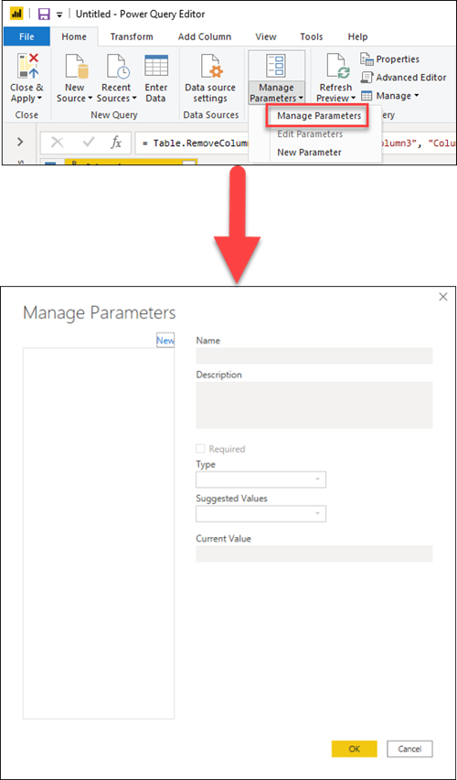

## Creating a parameter

Power Query provides two easy ways to create parameters:

* **From an existing query**&mdash;You can easily right-click a query whose value is a simple non-structured constant such as, but not limited to, a date, text, or number, and select **Convert to Parameter**. 
    
   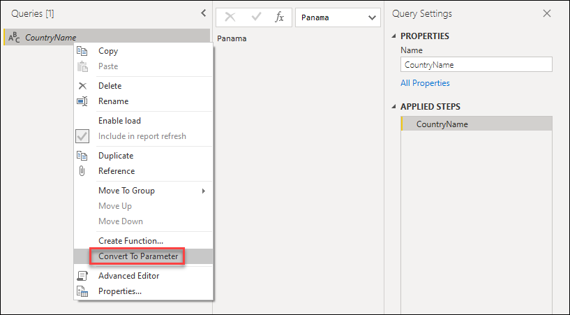

   >[!NOTE]
   >You can also convert a parameter to a query by right-clicking the parameter and then selecting **Convert To Query**, as shown in the following image.
   >
   >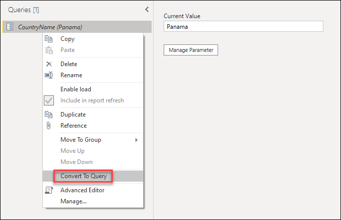

* **Using the Manage Parameters window**&mdash;You can select the **New Parameter** option from the dropdown menu of **Manage Parameters** in the **Home** tab, or you can launch the **Manage Parameters** window and select in the **New** button on the top to create a parameter. You can fill in this form and select **OK** to create a new parameter.

   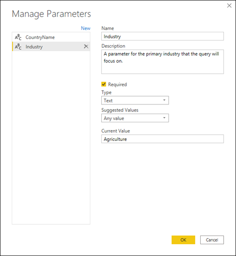

After creating the parameter, you can always go back to the **Manage Parameters** window to modify any of your parameters at any moment.

## Parameter properties

A parameter stores a value that can be used for transformations in Power Query. Apart from the name of the parameter and the value that it stores, it also has other properties that provide metadata to it. The properties of a parameter are as follows.

* **Name**&mdash;Provide a name for this parameter that lets you easily recognize and differentiate it from other parameters you might create.
* **Description**&mdash;The description is displayed next to the parameter name when parameter information is displayed, helping users who are specifying the parameter value to understand its purpose and its semantics.
* **Required**&mdash;The checkbox indicates whether subsequent users can specify whether a value for the parameter must be provided.
* **Type**&mdash;We recommended that you always set up the data type of your parameter. You can learn more about the importance of data types from the [Data types](data-types.md) article.
* **Suggested Values**&mdash;Provides the user with suggestions to select a value for the **Current Value** from the available options:
    * **Any value**&mdash;The current value can be any manually entered value. 
    * **List of values**&mdash;Provides you with a simple table-like experience so you can define a list of suggested values that you can later select from for the **Current Value**. When this option is selected, a new option called **Default Value** will be made available. From here you can select what should be the default value for this parameter, which will be the default value shown to the user when referencing the parameter. This value isn't the same as the **Current Value**, which is the value that's stored inside the parameter and can be passed as an argument in transformations. Using the *List of values* will enable a drop-down menu to be displayed in the **Default Value** and **Current Value** fields, where you can pick one of the values from the suggested list of values.

       

       >[!NOTE]
       > You can still manually type any value that you want to pass to the parameter. The list of suggested values only serves as simple suggestions.
    
    * **Query**&mdash;Uses a list query (a query whose output is a list) to provide the list of suggested values that you can later select for the **Current Value**.

       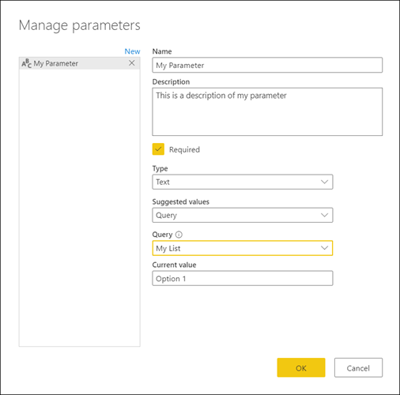

* **Current Value**&mdash;The value that will be stored in this parameter.

## Where to use parameters

A parameter can be used in many different ways, but it's more commonly used in two scenarios:
* **Step argument**&mdash;You can use a parameter as the argument of multiple transformations driven from the user interface (UI).
* **Custom Function argument**&mdash;You can create a new function from a query and reference parameters as the arguments of your custom function.

In the next sections, you'll see an example for these two scenarios.

### Step argument

To enable this feature, first go to the **View** tab in the Power Query Editor and enable the **Always allow** option in the **Parameters** group.

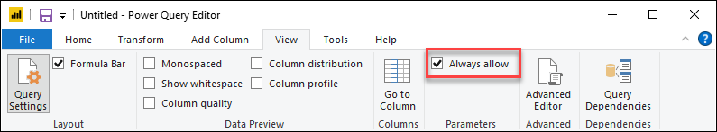

For example purposes, you can see the following **Orders** query with the fields **OrderID**, **Units**, and **Margin**.

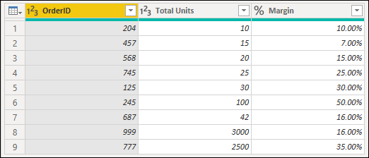

You can create a new parameter with the name **Minimum Margin** with a **Decimal Number** type and a **Current Value** of 0.2, as shown in the next image.

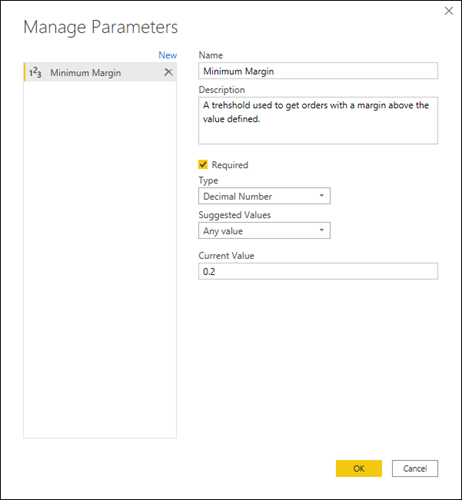

You can go to the **Orders** query, and in the **Margin** field select the **Greater Than** filter option.

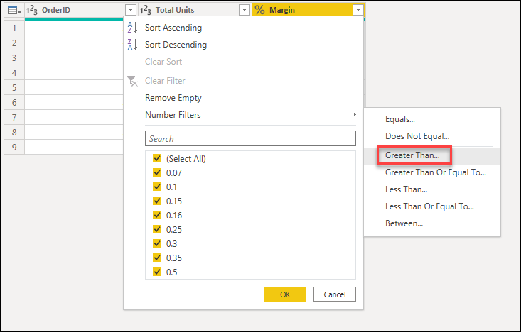

In the **Filter Rows** window, you'll see a button with a data type for the field selected. You can select the **Parameter** option from the dropdown menu for this button. From the field selection right next to the data type button, you can select the parameter that you want to pass to this argument. In this case, it's the **Minimum Margin** parameter.

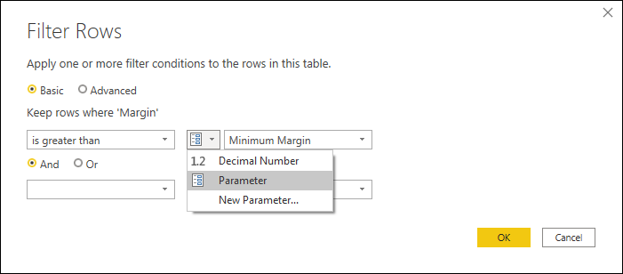

After you select **OK**, you can see that your table has been filtered using the **Current Value** for your parameter.

If you modify the **Current Value** of your **Minimum Margin** parameter to be 0.3, you can immediately see how your orders query gets updated and shows you only the rows where the **Margin** is above 30%.

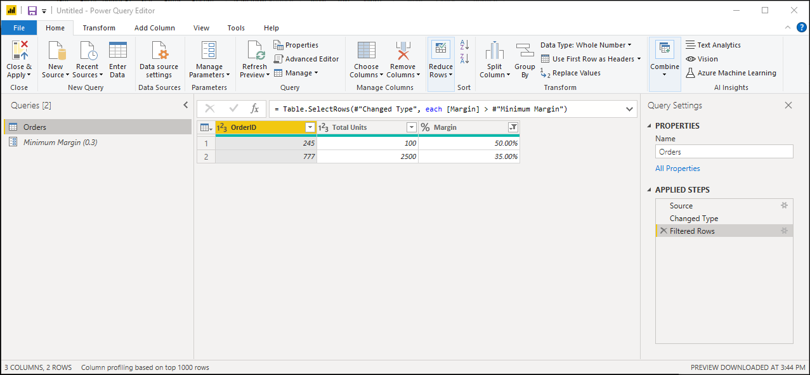

>[!TIP]
> Multiple transformations in Power Query offer this experience where you can select your parameter from a dropdown. So we recommend that you always look for it and take advantage of what parameters can offer you.

### Custom function argument

With Power Query, you can create a custom function from an existing query with a simple click. Following the previous example, you can right-click the **Orders** query and select **Create Function**, which will launch a new **Create Function** window. In this window, you can name your new function and it will tell you the parameters being referenced in your query. These parameters will be used as the parameters for the custom function.

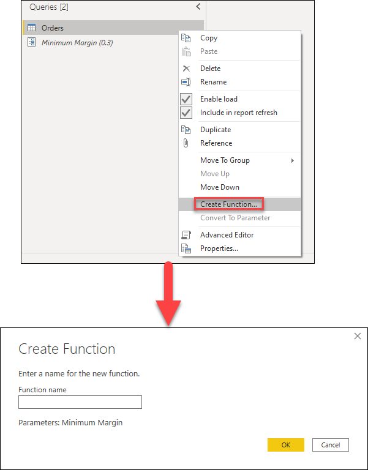

You can name this new function however you want. For demonstration purposes, the name of this new function will be **MyFunction**. After you select **OK**, a new group will be created in the **Queries** pane using the name of your new function. In this group, you'll find the parameters being used for the function, the query that was used to create the function, and the function itself.

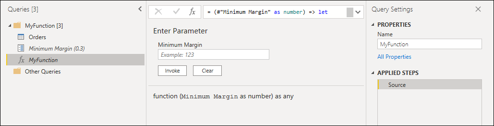

You can test this new function by entering a value, such as 0.4, in the field underneath the **Minimum Margin** label. Then select the **Invoke** button. This will create a new query with the name **Invoked Function**, effectively passing the value 0.4 to be used as the argument for the function and giving you only the rows where the margin is above 40%.

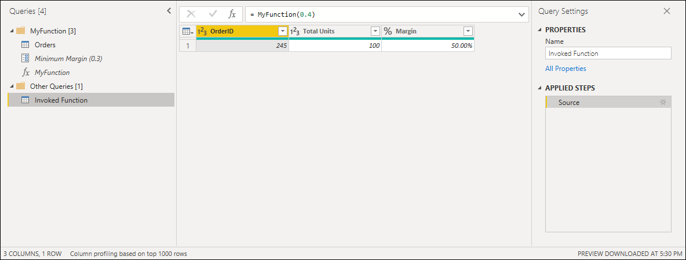

You can learn more about how to create custom functions from the article [Creating a custom function](custom-function.md).

## Multi-value or list parameters

A new type of parameter available only in the Power Query Online experience are multi-value or list parameters. This section will showcase how to create a new list parameter and how to use it in your queries.

Following the previous sample, change the current value for Minimum Margin from **0.3** to **0.1**.  The new goal is to create a list parameter that can hold the order numbers of the orders that you're interested in analyzing. To create the new parameter you can go to the *Manage Parameter* dialog and click the *New* button to create a new parameter. The name of this new parameter will have the following information:

* **Name:** Interesting Orders
* **Description:** A set of of order numbers which are interesting for a specific analysis
* **Required:** True
* **Type:** List

After defining these fields, a new grid will pop up where you will be able to enter the values that you want to store for your parameter. In this case those values are **125**, **777** and **999** as shown in the image below.

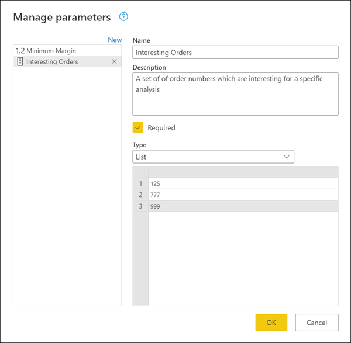

With the new **Interesting Orders** list parameters in place, you can head back to the Orders query and click the auto-filter menu of the **OrderID** field to find the sub-menu for *Numbers filters*, and inside the sub-menu find the **In..** option.

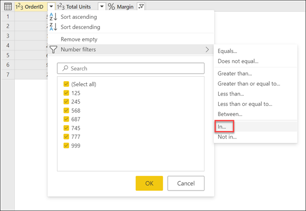

After selecting this option, a new *Filter rows* dialog will appear where you are able to select the list parameter from a drop-down menu.

>[!NOTE]
>List parameters can work with either the **In...** or **Not in...** options. The **In...** allows you to filter by only the values from your list, while the **Not in...** does exactly the opposite and tries to filter your column to get all values that are not equal to the values stored in your parameter.

After clicking the OK button, you'll be taken back to your query where you'll be able to see how your query has been filtered using the list parameter that you've created and only kept the rows where the OrderID was equal to either **125**, **777** or **999**.

>[!TIP]
>If you wish to have more control about what values are used in your list parameter, you can always create a list with constant values and convert your list query to a parameter as showcased previously in this article.