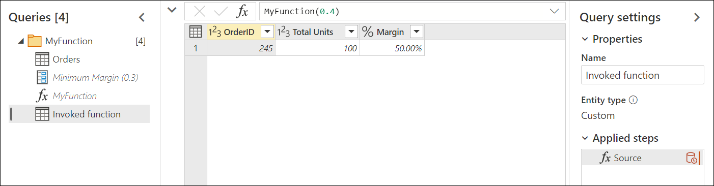
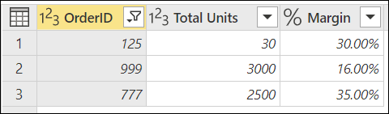

# Using parameters

A parameter serves as a way to easily store and manage a value that can be reused.

Parameters give you the flexibility to dynamically change the output of your queries depending on their value, and can be used for:

* Changing the argument values for particular transforms and data source functions.
* Inputs in custom functions.

You can easily manage your parameters inside the **Manage Parameters** window. To get to the **Manage Parameters** window, select the **Manage Parameters** option inside **Manage Parameters** in the **Home** tab.

:::image type="content" source="media/power-query-query-parameters/manage-parameters.png" alt-text="Manage Parameters window.":::

## Creating a parameter

Power Query provides two easy ways to create parameters:

* **From an existing query**: Right-click a query whose value is a simple non-structured constant, such as a date, text, or number, and then select **Convert to Parameter**.

   :::image type="content" source="media/power-query-query-parameters/convert-to-parameter.png" alt-text="Convert to parameter.":::

   You can also convert a parameter to a query by right-clicking the parameter and then selecting **Convert To Query**.

   :::image type="content" source="media/power-query-query-parameters/convert-to-query.png" alt-text="Convert to query.":::

* **Using the Manage Parameters window**: Select the **New Parameter** option from the dropdown menu of **Manage Parameters** in the **Home** tab. Or launch the **Manage Parameters** window and select **New** on the top to create a parameter. Fill in this form, and then select **OK** to create a new parameter.

   :::image type="content" source="media/power-query-query-parameters/create-parameter.png" alt-text="Create a parameter from the Manage Parameters window.":::

After creating the parameter, you can always go back to the **Manage Parameters** window to modify any of your parameters at any moment.

## Parameter properties

A parameter stores a value that can be used for transformations in Power Query. Apart from the name of the parameter and the value that it stores, it also has other properties that provide metadata to it. The properties of a parameter are:

* **Name**: Provide a name for this parameter that lets you easily recognize and differentiate it from other parameters you might create.
* **Description**: The description is displayed next to the parameter name when parameter information is displayed, helping users who are specifying the parameter value to understand its purpose and its semantics.
* **Required**: The checkbox indicates whether subsequent users can specify whether a value for the parameter must be provided.
* **Type**: Specifies the data type of the parameter. We recommend that you always set up the data type of your parameter. To learn more about the importance of data types, go to [Data types](data-types.md).
* **Suggested Values**: Provides the user with suggestions to select a value for the **Current Value** from the available options:
  * **Any value**: The current value can be any manually entered value.
  * **List of values**: Provides you with a simple table-like experience so you can define a list of suggested values that you can later select from for the **Current Value**. When this option is selected, a new option called **Default Value** will be made available. From here, you can select what should be the default value for this parameter, which is the default value shown to the user when referencing the parameter. This value isn't the same as the **Current Value**, which is the value that's stored inside the parameter and can be passed as an argument in transformations. Using the **List of values** provides a drop-down menu that's displayed in the **Default Value** and **Current Value** fields, where you can pick one of the values from the suggested list of values.

       :::image type="content" source="media/power-query-query-parameters/list-of-values.png" alt-text="Parameter with a suggest list of values.":::

       >[!NOTE]
       > You can still manually type any value that you want to pass to the parameter. The list of suggested values only serves as simple suggestions.

  * **Query**: Uses a list query (a query whose output is a list) to provide the list of suggested values that you can later select for the **Current Value**.

       :::image type="content" source="media/power-query-query-parameters/parameters-query.png" alt-text="Parameter with list query.":::

* **Current Value**: The value that's stored in this parameter.

## Where to use parameters

A parameter can be used in many different ways, but it's more commonly used in two scenarios:

* **Step argument**: You can use a parameter as the argument of multiple transformations driven from the user interface (UI).
* **Custom Function argument**: You can create a new function from a query and reference parameters as the arguments of your custom function.

In the next sections, you'll see an example for these two scenarios.

### Step argument

To enable this feature, first go to the **View** tab in the Power Query editor and select the **Always allow** option in the **Parameters** group.

:::image type="content" source="media/power-query-query-parameters/always-allow.png" alt-text="Always allow parameters.":::

For example, the following **Orders** table contains the **OrderID**, **Units**, and **Margin** fields.

:::image type="content" source="media/power-query-query-parameters/step-argument-sample-table.png" alt-text="Sample table for Orders with margin.":::

In this example, create a new parameter with the name **Minimum Margin** with a **Decimal Number** type and a **Current Value** of 0.2.

:::image type="content" source="media/power-query-query-parameters/step-argument-sample-parameter.png" alt-text="Sample Parameter.":::

Go to the **Orders** query, and in the **Margin** field select the **Greater Than** filter option.

:::image type="content" source="media/power-query-query-parameters/step-argument-sample-parameter-greater-than.png" alt-text="Greater than filter option for Margin field.":::

In the **Filter Rows** window, there's a button with a data type for the field selected. Select the **Parameter** option from the dropdown menu for this button. From the field selection right next to the data type button, select the parameter that you want to pass to this argument. In this case, it's the **Minimum Margin** parameter.

:::image type="content" source="media/power-query-query-parameters/step-argument-sample-parameter-select-parameter.png" alt-text="Select parameter for transformation argument.":::

After you select **OK**, your table is filtered using the **Current Value** for your parameter.

:::image type="content" source="media/power-query-query-parameters/step-argument-sample-parameter-used.png" alt-text="Sample parameter used as a transformation argument.":::

If you modify the **Current Value** of your **Minimum Margin** parameter to be 0.3, your orders query gets updated immediately and shows you only the rows where the **Margin** is above 30%.

:::image type="content" source="media/power-query-query-parameters/step-argument-sample-parameter-updated.png" alt-text="Updated Current Value for parameter.":::

>[!TIP]
> Many transformations in Power Query let you select your parameter from a dropdown. We recommend that you always look for it and take advantage of what parameters can offer you.

### Custom function argument

With Power Query, you can create a custom function from an existing query with a simple click. Following the previous example, right-click the **Orders** query and select **Create Function**. This action launches a new **Create Function** window. In this window, name your new function and it will tell you the parameters being referenced in your query. These parameters are used as the parameters for the custom function.

:::image type="content" source="media/power-query-query-parameters/create-function.png" alt-text="Create Function.":::

You can name this new function however you want. For demonstration purposes, the name of this new function is **MyFunction**. After you select **OK**, a new group is created in the **Queries** pane using the name of your new function. In this group, you'll find the parameters being used for the function, the query that was used to create the function, and the function itself.

:::image type="content" source="media/power-query-query-parameters/function-created.png" alt-text="Function created.":::

To test this new function, enter a value, such as 0.4, in the field underneath the **Minimum Margin** label. Then select the **Invoke** button. This creates a new query with the name **Invoked Function**, effectively passing the value 0.4 to be used as the argument for the function and giving you only the rows where the margin is above 40%.

To learn more about how to create custom functions, go to [Creating a custom function](custom-function.md).

## Multi-value or list parameters

A new type of parameter available only in Power Query Online is multi-value or list parameters. This section describes how to create a new list parameter and how to use it in your queries.

Following the previous example, change the current value for **Minimum Margin** from **0.3** to **0.1**. The new goal is to create a list parameter that can hold the order numbers of the orders that you're interested in analyzing. To create the new parameter, go to **Manage Parameters** dialog and select **New** to create a new parameter. Fill in this new parameter with the following information:

* **Name:** Interesting Orders
* **Description:** A set of order numbers that are interesting for a specific analysis
* **Required:** True
* **Type:** List

After defining these fields, a new grid pops up where you can enter the values that you want to store for your parameter. In this case, those values are **125**, **777**, and **999**.

>[!NOTE]
> While this example uses numbers, you can also store other data types in your list, such as text, dates, datetime, and more. More information: [Data types in Power Query](data-types.md)

>[!TIP]
>If you want to have more control over what values are used in your list parameter, you can always create a list with constant values and convert your list query to a parameter as showcased previously in this article.

With the new **Interesting Orders** list parameters in place, head back to the **Orders** query. Select the auto-filter menu of the **OrderID** field. Select **Number filters** > **In**.

:::image type="content" source="media/power-query-query-parameters/numbers-filters-in-list-parameter.png" alt-text="In option inside the Numbers filters sub-menu for the OrderID column.":::

After selecting this option, a new **Filter rows** dialog box appears. From here, you can select the list parameter from a drop-down menu.

:::image type="content" source="media/power-query-query-parameters/filter-rows-list-parameter.png" alt-text="Filter rows dialog showing the in operator where you can use the new Interesting Orders list parameter.":::

>[!NOTE]
>List parameters can work with either the **In** or **Not in** options. **In** lets you filter only by the values from your list. **Not in** does exactly the opposite, and tries to filter your column to get all values that are not equal to the values stored in your parameter.

After selecting **OK**, you'll be taken back to your query. There, your query has been filtered using the list parameter that you've created, with the result that only the rows where the **OrderID** was equal to either **125**, **777**, or **999** was kept.

