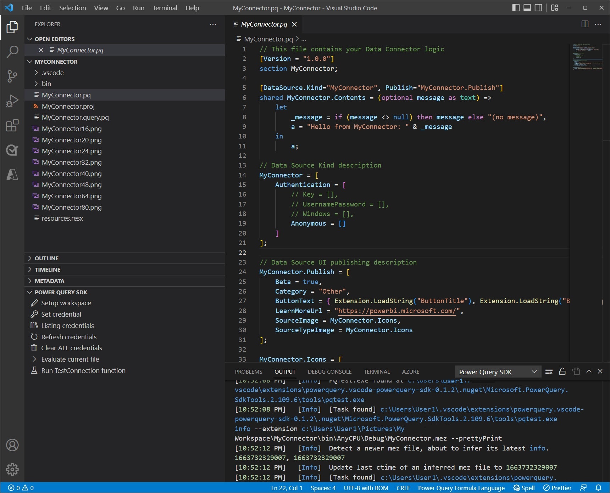

# Using the Power Query SDK

This article focuses on the experience available for the Power Query SDK found in Visual Studio Code. You can learn more on how to install the Power Query SDK for Visual Studio from the article on [Installing the SDK](/powerquery-docs/InstallingSDK.md).

## Create a new project

>[!TIP]
>Before creating an extension project, it is recommended that you create a new folder (workspace) where you'll store your extension project.

Once in Visual Studio Code, navigate to the folder where you'll want to store your extension project and its files. In the main *Explorer* pane of Visual Studio Code, you will be able to see a section with the name **Power Query SDK**. This section will have only one button that reads *Create an extension project*. Click this button.

This button will open an input field at the top of the Visual Studio Code interface where you can enter the name of your new extension project and hit Enter.

After a few seconds, your Visual Studio Code window should open the main *.pq file for your extension project that contains your connector logic. The Power Query SDK will automatically run some necessary tasks to complete the setup of your workspace and you can check this in the Output console in Visual Studio Code.

The Power Query SDK automatically creates the following set of files:

* A **settings.json** file that dictates specific settings to work with at your workspace level
* It builds the extension as a **.mez** file and stores it in a new *bin\AnyCPU\Debug* folder
* A set of connector icons as png files
* A **resources.resx** that serves as the main storage for strings to be used in the extension
* A .pq file which holds the main logic of your extension or connector
* A .query.pq file which main purpose is to be used as a way to create test queries that you can later evaluate
* A .proj file which holds information about the extension project

Once a extension project is recognized by the Power Query SDK, the section for the Power Query SDK will change its appearance and will now display a list of tasks that you can run against your new extension project.

In the following sections this article will showcase these tasks and their main purpose.

## Credentials

The Power Query SDK offers multiple tasks through its user interface to allow you to set, list and delete credentials from your extension project.

### Set credential

### List credentials

### Delete credentials

## Bring a legacy extension project to the new SDK

## Settings file

What it is 
what you can add to it

## Evaluate a query

## Results pane

## Build a extension file

## Run TestConnection function

## Feedback and bugs

Do you have any feedback, suggestions or bugs that you'd like to report? Visit our [official public repository on GitHub](https://github.com/microsoft/vscode-powerquery-sdk).

You can use the [Power BI Community forum](https://community.powerbi.com/t5/Power-Query/bd-p/power-bi-services) to post general questions around Power Query, the M language and custom connector development.