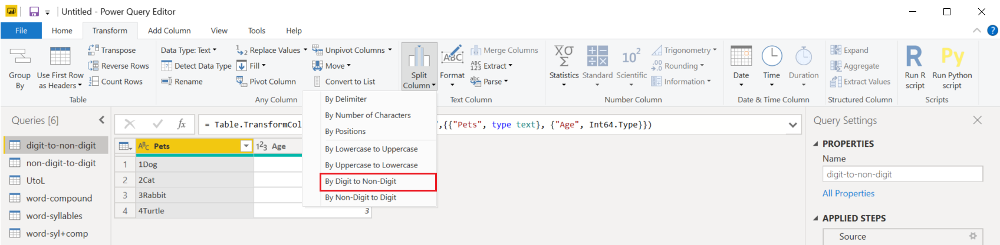
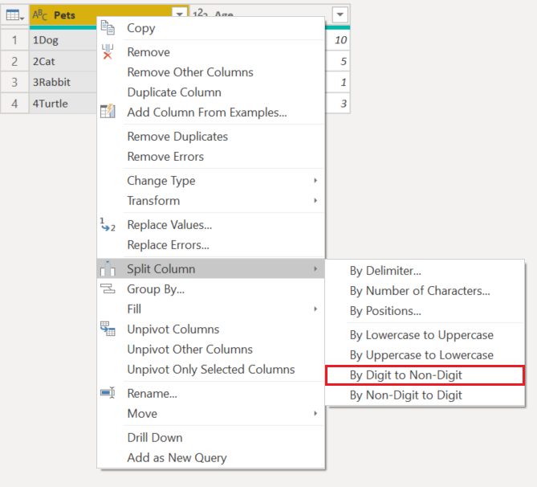

# Split Columns: By Digit to Non-Digit

In Power Query, you can create a split a column through different functions.
In this case, the column(s) selected can be split by every instance of a digit followed by a non-digit.

## Where to find the Split Columns: By Digit to Non-Digit
We can find the Split Columns: By Digit to Non-Digit option in 3 places:
1. **Home tab** - under the Split column dropdown menu inside the Transform group 

2. **Transform tab** - under the Split column dropdown menu inside the Text column group

3. **Right click a column** - inside the split columns option

## Split Columns By Digit to Non-Digit 

Our initial table will be the one below with a column for "Pets" and other extra columns.
We will only focus on the "Pets" column.

This column holds 2 values in each row:
1. **Rank** - The rank of the animal
2. **AnimalType** - The second part of the word type of animal

We want to split this column into the 2 columns described before. 
To do this, we simply select the column and select the option to split the column by Digit to Non-Digit.

This singular column will split into multiple columns given every instance of a digit followed with a non-digit. In this case, it only splits it into two.

Our final table is will be as such:

