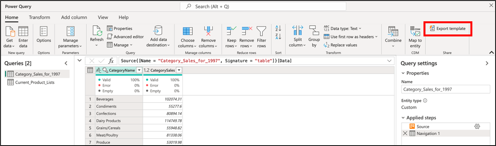
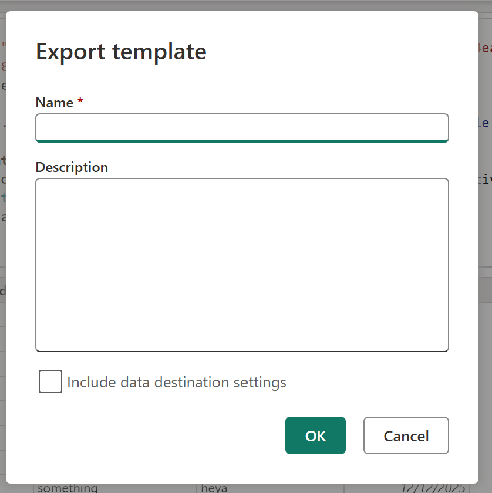
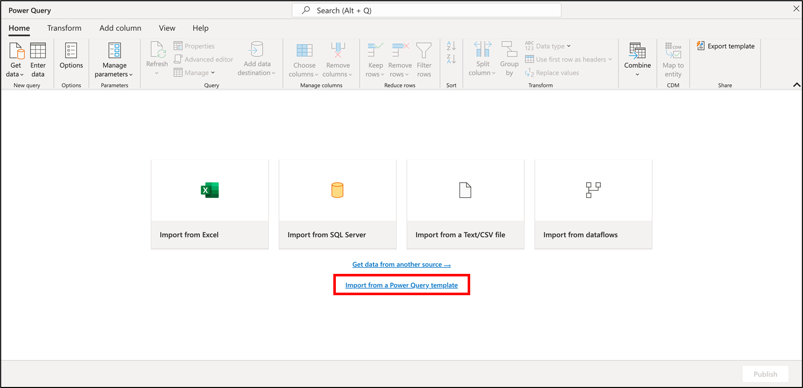

# Power Query templates (Preview)

A Power Query template is a file that encompasses the mashup document and its associated metadata for a single Power Query project. 

It's meant to be used as a simple means to package your entire Power Query project in a single file to be able to share it or import it in other Power Query hosts.

>[!NOTE]
>A Power Query project can be defined as a single instance of the Power Query editor which could contain any number of parameters, queries and specific settings such as the locale that should be used to interpret data types.

>[!IMPORTANT]
>Concepts that are outside of the mashup document or its metadata are outside of the scope of what to find in a Power Query template. Some examples of it are dataflow related concepts such as scheduled refresh definition, refresh history, Dataflow ids, connections referenced and other concepts that are not stored in the mashup document or the mashup metadata of a Power Query project.

## Export a template

>[!NOTE]
>The following guide applies to all Power Query Online hosts.
>
>For Power Query in Excel for Windows, follow the guide on [exporting queries in Excel to a Power Query template](new-dataflow-from-template.md#exporting-queries-in-excel-to-a-power-query-template).

Inside of the Home tab of the ribbon, you can find a group with the name *Share* where the **Export template** button is located.

Clicking this button prompts a new dialog where you can enter the name of the template and the description that will be used for such template.

This operation downloads a file with the extension.pqt, which is your Power Query template file.

## Import a template

>[!NOTE]
>This functionality is only available inside of the Dataflows Gen2 experience for Microsoft Fabric.

The option to import from a template is only available in Power Query projects with no queries or parameters set. In the home screen of the Power Query editor, you're able to see a clickable link that reads **Import from Power Query template**.

Clicking the **Import from Power Query template** button triggers an experience to help you upload your Power Query template and immediately load the project with all its queries, parameters and settings.

>[!IMPORTANT]
>Connections and / or credential definitions are not stored inside of a Power Query template file. These will need to be set after importing the template.