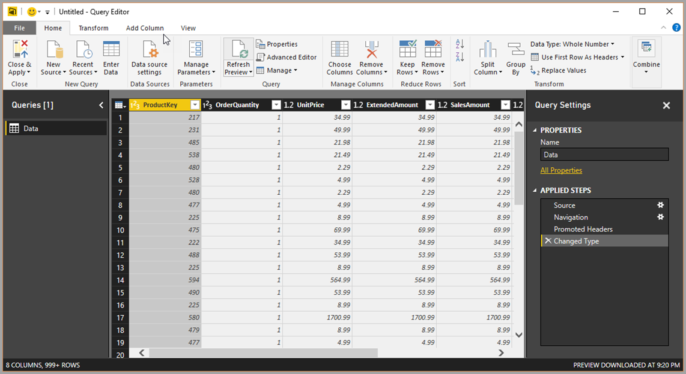

# What is Power Query? 

**Power Query** is the Microsoft data connectivity and data preparation technology that enables business users to seamlessly access data stored in hundreds of data sources and reshape it to fit their needs, with an easy to use, engaging and no-code user experience. 

Supported data sources include a wide range of file types, databases, Microsoft Azure services and many other third-party online services. **Power Query** also provides a **Custom Connectors SDK** so that third parties can create their own data connectors and seamlessly plug them into Power Query. 

The **Power Query Editor** is the primary data preparation experience, allowing users to apply over 300 different data transformations by previewing data and selecting transformations in the user experience. These data transformation capabilities are common across all data sources, regardless of the underlying data source limitations.

## Where to use Power Query

**Power Query** is natively integrated in several Microsoft products, including the following.

 

|Product Name      |Overview  |
|-------------------------------|---------|
|Microsoft Power BI     |Power Query enables data analysts and report authors to connect and transform data as part of creating Power BI reports using Power BI Desktop.|
|Microsoft Excel         |Power Query enables Excel users to import data from a wide range of data sources into Excel for analytics and visualizations.  Starting with Excel 2016, Power Query capabilities are natively integrated and can be found under the “Get & Transform” section of the Data tab in the Excel Desktop ribbon.  Excel 2010 and 2013 users can also leverage Power Query by installing the Microsoft Power Query for Excel add-in. |
|Microsoft SQL Server Data Tools for Visual Studio     |Business Intelligence Developers can create Azure Analysis Services and SQL Server Analysis Services tabular models using SQL Server Data Tools for Visual Studio. Within this experience, users can leverage Power Query to access and reshape data as part of defining tabular models.         |
|Microsoft Common Data Service for Apps     | Common Data Service (CDS) for Apps lets you securely store and manage data that's used by business applications. Data within CDS for Apps is stored within a set of entities. An entity is a set of records used to store data, similar to how a table stores data within a database.  CDS for Apps includes a base set of standard entities that cover typical scenarios, but you can also create custom entities specific to your organization and populate them with data using Power Query. App makers can then use PowerApps to build rich applications using this data.        |

## How Power Query helps with data acquisition

Business users spend up to 80% of their time on data preparation, delaying the time to analysis and decision making. There are many challenges that cause this situation, and **Power Query** helps address many of them.

|Existing Challenge  |How does Power Query help?  |
|---------|---------|
|Finding & Connecting to data is too difficult     |Power Query enables connectivity to a wide range (100s) of data sources, including data of all sizes and shapes. |
|Experiences for data connectivity are too fragmented     | Consistency of experience, and parity of query capabilities over all data sources with Power Query.        |
|Data often needs to be reshaped before consumption     | Highly interactive and intuitive experience for rapidly and iteratively building queries over any data source, any size.        |
|Any shaping is one-off and not repeatable     |  When using Power Query to access and transform data, users are defining a repeatable process (query) that can be easily refreshed in the future to get up-to-date data.  In the event that the process/query needs to be modified to account for underlying data or schema changes, Power Query provides users with the ability to modify existing queries using the same interactive and intuitive experience that they used when initially defining their queries.      |
|Volume (data sizes), Velocity (rate of change) and Variety (breadth of data sources and data shapes)     |  Power Query offers the ability to work against a subset of the entire data set in order to define the required data transformations, allowing users to easily filter down and transform their data to a manageable size.  Power Query queries can be refreshed manually or by leveraging schedule refresh capabilities in specific products (such as Power BI) or even programmatically (using Excel’s Object Model).  Power Query provides connectivity to hundreds of data sources and over 350 different types of data transformations for each of these sources, allowing users to work with data from any source and in any shape.      |

## Next steps

Next, learn how to use Power Query in **Power BI Desktop**.

* [Quickstart: Using Power Query in Power BI Desktop](power-query-quickstart-using-power-bi.md)
