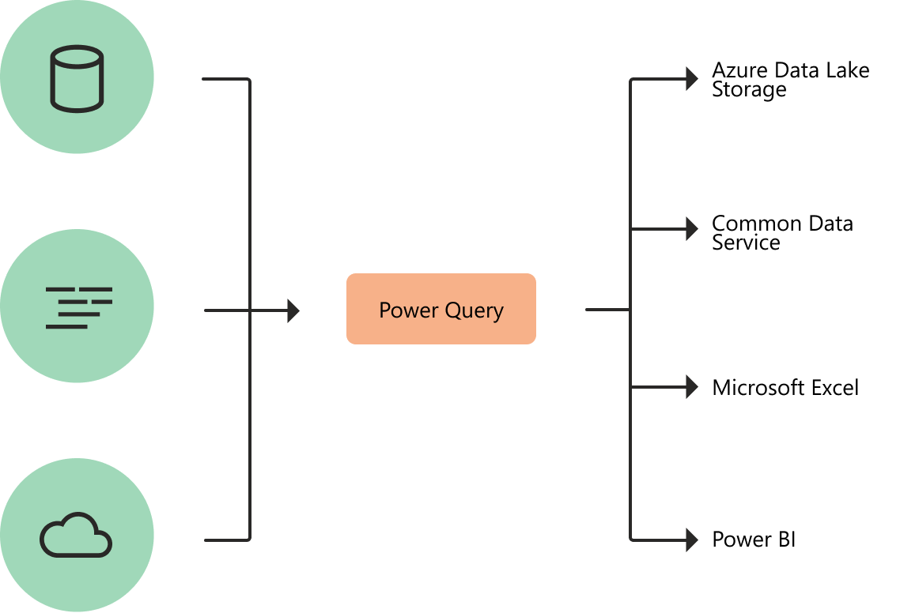

<!--
#Customer intent: As a data analyst or report creator, I want to know what Power Query is, so I can decide whether Power Query has the features and services I need to connect to and transform data.
-->

# What is Power Query?

Power Query is a data transformation and data preparation engine. Power Query comes with a graphical interface for getting data from sources, and a Power Query Editor for applying transformations. Because the engine is available in many products and services, the destination where the data will be stored depends on where Power Query was used. Using Power Query, you can perform the extract, transform, and load (ETL) processing of data.




## How Power Query helps with data acquisition

Business users spend up to 80% of their time on data preparation, delaying the time to analysis and decision making. There are many challenges that cause this situation, and **Power Query** helps address many of them.


|Existing Challenge  |How does Power Query help?  |
|---------|---------|
|Finding and connecting to data is too difficult     |Power Query enables connectivity to a wide range of data sources, including data of all sizes and shapes. |
|Experiences for data connectivity are too fragmented     | Consistency of experience, and parity of query capabilities over all data sources with Power Query.        |
|Data often needs to be reshaped before consumption     | Highly interactive and intuitive experience for rapidly and iteratively building queries over any data source, of any size.        |
|Any shaping is one-off and not repeatable     |  When using Power Query to access and transform data, users are defining a repeatable process (query) that can be easily refreshed in the future to get up-to-date data. <br/>In the event that the process/query needs to be modified to account for underlying data or schema changes, Power Query provides users with the ability to modify existing queries using the same interactive and intuitive experience they used when initially defining their queries.      |
|Volume (data sizes), velocity (rate of change), and variety (breadth of data sources and data shapes)     |  Power Query offers the ability to work against a subset of the entire data set to define the required data transformations, allowing users to easily filter down and transform their data to a manageable size. <br/>Power Query queries can be refreshed manually or by leveraging scheduled refresh capabilities in specific products (such as Power BI) or even programmatically (using Excel’s Object Model). <br/>Power Query provides connectivity to hundreds of data sources and over 350 different types of data transformations for each of these sources, allowing users to work with data from any source and in any shape.      |

## Power Query experiences

The Power Query user experience is provided through the Power Query Editor user interface. The goal of this interface is to help you apply the transformations you need simply by interacting with a user-friendly set of ribbons, menus, buttons, and other sets of interactive components.

The Power Query Editor is the primary data preparation experience, allowing users to connect to a wide range of data sources and apply hundreds of different data transformations by previewing data and selecting transformations in the user experience. These data transformation capabilities are common across all data sources, whatever the underlying data source limitations.

When creating a new transformation step by interacting with the components of the Power Query interface, Power Query will automatically create the M code required to do the transformation without the need for you to write any code.
 
Currently there are two Power Query experiences available:

* **Power Query Online**&mdash;Found in integrations such as Power BI dataflows, Power Platform dataflows, Azure Data Factory wrangling dataflows, and many more that provide the experience through an online webpage.
* **Power Query for Desktop**&mdash;Found in integrations such as Power Query for Excel and Power BI Desktop. 

>[!Note]
>While these two experiences exist, they both provide almost the same user experience in every scenario.

## Transformations

The transformation engine in Power Query includes many pre-build transformation functions that can be used through the graphical interface of the Power Query Editor. These transformations can be as simple as removing a column or filtering rows, or as common as using the first rows as headers. There are also advanced transformation options such as merge, append, group by, pivot, unpivot, and so on. 

All of these transformations are made possible by choosing the transformation option in the menu, and then applying the options required for that transformation. The following illustration shows a few of the transformations available in Power Query Editor.


To learn more about data transformations using Power Query, see [Quickstart - using Power Query in Power BI](power-query-quickstart-using-power-bi.md).

## Dataflows

Power Query can be used in many products, such as Power BI and Excel. However, using Power Query inside a specific product limits its usage to only within that specific product. Dataflows are a service version of the Power Query experience. Using dataflows, you can get data and transform the data in the same way. But instead of sending the output to Power BI or Excel, you can store the output in other storage options, such as Common Data Services and Azure Data Lake Storage Gen2. This storage option will let you use the output of dataflows in other products and services. Dataflows are a product-agnostic Power Query service that runs in the cloud.

To learn more about dataflows, see [What are dataflows?](/dataflows/overview-dataflows-across-power-platform-dynamics-365.md).

## The Power Query Formula Language (M)

In any data transformation scenario, there are some transformations that can't be done in the best way using the graphical editor. Some of these transformations might require special configurations and settings that the graphical interface doesn't currently support. The Power Query engine uses a scripting language behind the scenes for all Power Query transformations called the Power Query Formula Language, also known as M. 

The M language is the data transformation language of Power Query. Anything that happens in the query is ultimately written in M. If you want to do advanced transformations using the Power Query engine, you can use the Advanced Editor to access the script of the query and modify it as you want. If you find that the user interface functions and transformations won’t perform the exact changes you need, you can use the Advanced Editor and the M language to fine tune your functions and transformations.

```powerquery-m
let
    Source = Exchange.Contents("xyz@contoso.com"),
    Mail1 = Source{[Name="Mail"]}[Data],
    #"Expanded Sender" = Table.ExpandRecordColumn(Mail1, "Sender", {"Name"}, {"Name"}),
    #"Filtered Rows" = Table.SelectRows(#"Expanded Sender", each ([HasAttachments] = true)),
    #"Filtered Rows1" = Table.SelectRows(#"Filtered Rows", each ([Subject] = "sample files for email PQ test") and ([Folder Path] = "\Inbox\")),
    #"Removed Other Columns" = Table.SelectColumns(#"Filtered Rows1",{"Attachments"}),
    #"Expanded Attachments" = Table.ExpandTableColumn(#"Removed Other Columns", "Attachments", {"Name", "AttachmentContent"}, {"Name", "AttachmentContent"}),
    #"Filtered Hidden Files1" = Table.SelectRows(#"Expanded Attachments", each [Attributes]?[Hidden]? <> true),
    #"Invoke Custom Function1" = Table.AddColumn(#"Filtered Hidden Files1", "Transform File from Mail", each #"Transform File from Mail"([AttachmentContent])),
    #"Removed Other Columns1" = Table.SelectColumns(#"Invoke Custom Function1", {"Transform File from Mail"}),
    #"Expanded Table Column1" = Table.ExpandTableColumn(#"Removed Other Columns1", "Transform File from Mail", Table.ColumnNames(#"Transform File from Mail"(#"Sample File"))),
    #"Changed Type" = Table.TransformColumnTypes(#"Expanded Table Column1",{{"Column1", type text}, {"Column2", type text}, {"Column3", type text}, {"Column4", type text}, {"Column5", type text}, {"Column6", type text}, {"Column7", type text}, {"Column8", type text}, {"Column9", type text}, {"Column10", type text}})
in
    #"Changed Type"
```

To lean more about M, see [Power Query M formula language](https://docs.microsoft.com/powerquery-m/index).

## Where to use Power Query?

Power Query can be found in the following Microsoft products and services:

|Product|M engine|Power Query Desktop|Power Query Online|Dataflows|
|-------|---------|-------------------|------------------|---------|
|Excel for Windows|||| |
|Excel for Mac|||| |
|Power BI|||| 
|Power Apps|  ||| ||
|Power Automate|  | |  | |
|Azure Data Factory|  | | ||
|SQL Server Integration Services| | |||
|SQL Server Analysis Services| | |||
|Dynamics 365 Customer Insights||||


|Label|Description|
|----|--|
|M engine| Underlying query execution engine that runs queries expressed in the Power Query formula language (“M”). |
|Power Query Desktop| Power Query experience found in desktop applications.|
|Power Query Online|Power Query experience found in web browser applications.|
|Dataflows| Power Query as a service that runs in the cloud, and is product agnostic. The stored result can be used in other applications as services.|

## More resources
* [Data sources in Power Query](connectors/index.md)
* [Getting data](get-data-experience.md)
* [Power Query quickstart](power-query-quickstart-using-power-bi.md)
* [Shape and combine data using Power Query](power-query-tutorial-shape-combine.md)
* [What are dataflows](dataflows/overview-dataflows-across-power-platform-dynamics-365.md)
