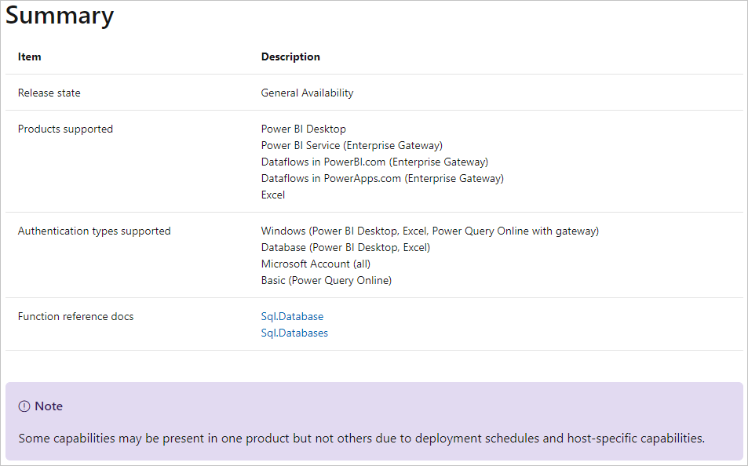

# Providing user documentation for your custom connector

Once you've finished designing your Power Query custom connector, you'll need to submit an article that provides instructions on how to use your connector for publication on Microsoft Learn. This article discusses the layout of such an article and how to format the text of your article.

## Article layout

This section describes the general layout of the Power Query connector articles. Your custom connector article should follow this general layout.

### Support note

Right after the title of the article, insert the following note.

>[!Note]
>The following connector article is provided by \<_company name_>, the owner of this connector and a member of the Microsoft Power Query Connector Certification Program. If you have questions regarding the content of this article or have changes you would like to see made to this article, visit the \<_company name_> website and use the support channels there.

Replace \<_company name_> with your company name.

### Summary table

After the support note, provide a summary table that contains the following information:

* **Release state**: Indicates whether the connector is in preview or general availability. Use either "Preview" or "General Availability".
* **Products supported**: Lists the products that can use your custom connector.
* **Authentication types supported**: Lists the authentication types your custom connector supports.
* **Function reference documentation**: Lists any M formula language documentation associated with your custom connector.

If your custom connector is implemented on various products, but has different capabilities on these products, include the following or similar note in your article after the summary table.

>[!Note]
>Some capabilities may be present in one product but not others due to deployment schedules and host-specific capabilities.

### Prerequisites

If your custom connector requires that other applications be installed on the system running your connector or requires that a set-up procedure be done before using your custom connector, you must include a Prerequisites section that describes these installation and set-up procedures. This section will also include any information about setting up various versions of your connector (if applicable).

### Capabilities supported

This section should contain a list of the capabilities supported by your custom connector. These capabilities are usually a bulleted list that indicates if the connector supports Import and DirectQuery modes, and also any advanced options that are available in the initial dialog box that appears after the user selects your connector in **Get data**.

### Connection instructions

This section contains the procedures required to connect to data. If your custom connector is only used in Power Query Desktop, only one procedure is required. However, if your custom connector is used on both Power Query Desktop and Power Query Online, you must supply a separate procedure in separate sections for each instance. That is, if your custom connector is only used by Power Query Desktop, you'll have one procedure starting with a second order heading and a single step-by-step procedure. If your custom connector is used by both Power Query Desktop and Power Query Online, you'll have two procedures. Each procedure starts with a second order heading, and contains a separate step-by-step procedure under each heading. For examples of each of these types of procedures, go to [Example connector articles](#example-connector-articles).

The procedure is made up of a numbered list that includes each step required to fill in the information needed to provide a normal connection (not requiring advance options) to the data.

>[!NOTE]
>All new certified connectors are required to support Power BI dataflows, and must contain sections for connecting to your data in both Power Query Desktop and Power Query Online.

### Connect using advanced options (optional)

If your custom connector contains advanced options that can be used to connect to the data, this information should be covered in a separate section of the documentation. Each of the advanced options should be documented, and the purpose of each advanced option explained in this section.

### Troubleshooting (optional)

If you know of any common errors that may occur with your custom connector, you can add a troubleshooting section to describe ways to either fix the error, or work around the error. This section can also include information on any known limitations of your connector or the retrieval of data. You can also include any known issues with using your connector to connect to data.

### Additional instructions (optional)

Any other instructions or information about your connector that hasn't been covered by the previous sections can go in this section.

## Article location and format

Your article should be made available on GitHub under the Connectors folder in the Power Query documentation repo: <https://github.com/MicrosoftDocs/powerquery-docs/tree/master/powerquery-docs/connector>. Ensure that you also add a link to your article in the [list of connectors](./connectors/index.md) referencing the correct logo image uploaded to `/connectors/media/index` folder. Lastly, ensure that you add a link to your article in the table of contents file (`TOC.yml`). Certified connectors will only be available under **Power BI (Datasets)**.

See our [contributor guide](/contribute/) on how you can contribute to our repo.

The article should be formatted and submitted as a Markdown file. It should use the Microsoft style for describing procedures and the UI layout.  

The following articles include instructions on formatting your document in Markdown, and the Microsoft style that you should follow when authoring your article:

* [Docs Markdown reference](/contribute/markdown-reference)
* [Microsoft Writing Style Guide](/style-guide/welcome/)

## Example connector articles

Here's a couple of example Power Query connector articles that you can use as a starting point:

* [Adobe Analytics](./connectors/adobe-analytics.md) (Power Query Desktop only)
* [Azure SQL database](./connectors/azure-sql-database.md) (Power Query Desktop and Power Query Online)
