# Query folding basics

Whenever you apply transforms to source data in Power Query, it does its best to have as many as possible of these performed on the data source, rather than locally (on your machine or in the cloud service). This is called *query folding*. All of the transforms you apply when working in Power Query are stored in a document (that can be viewed in the Advanced Editor) written in the [M language](https://docs.microsoft.com/powerquery-m/), and a subset of them are turned into the native query language (such as SQL and API calls) of your data source.

Depending on how the query is structured, there could be three possible outcomes for this mechanism:
* **Full query Folding**: When all of your query transformations get pushed back to the data source and no processing occurs locally by the Power Query engine. Instead you receive your desired output directly from the data source.
* **Partial query Folding**: When only a few transformations in your query, and not all, can be pushed back to the data source. This means that a subset of your transformations are performed at your data source and the rest of your query transformations occur locally.
* **No query folding**:  When the query contains transformations that can't be translated to the native query language of your data source, either because the transformations are not supported or the connector doesn't support query folding. For this case, Power Query gets the raw data from your data source and works locally with the Power Query engine to achieve your desired output.

>[!NOTE]
>The Query folding mechanism is primarily available in connectors for structured data sources such as, but not limited to, [Microsoft SQL Server](Connectors/sqlserver.md) and [OData Feed](Connectors/odatafeed.md). 
>
>Leveraging a data source that has more processing resources and has Query folding capabilities can expedite your query loading times as the processing occurs at the data source and not locally in the Power Query engine.

This article provides some example scenarios for each of the possible outcomes for query folding. It will also include some suggestions on how to get the most out of the query folding mechanism.

## Full query folding

For this scenario, you'll be connecting to a Microsoft SQL Server and the data you'll be using is the sample AdventureWorks database in its Data Warehouse version. You can download this database from the article [AdventureWorks sample database](https://docs.microsoft.com/sql/samples/adventureworks-install-configure).

After identifying the data source, we suggest that you pick the native connectors found in the **Get Data** dialog box. In this case, the connector to be used is the [Microsoft SQL Server Connector](Connectors/SQLServer.md).

Your goal is to summarize the data inside the FactInternetSales table by performing the following transformations:

1. Only get the data from September 2012 by filtering the rows on the OrderDate column.

   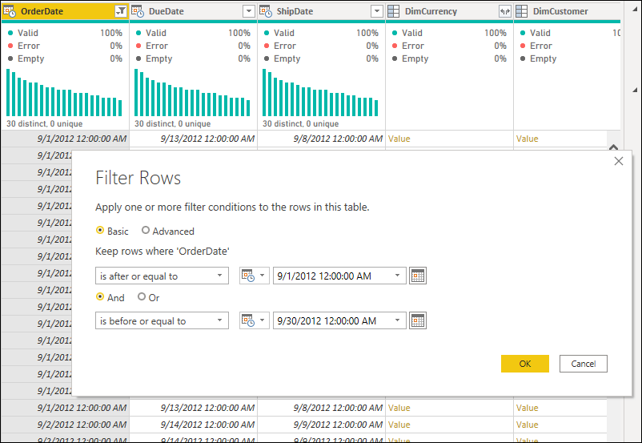

   >[!NOTE]
   > To learn more about how to filter rows by their values, go to [Filter values](filter-values.md).

2. Group by the OrderDate column and create a new aggregated column using the **Sum** operation on the SalesAmount column. Name this new column Total Sales Amount.

   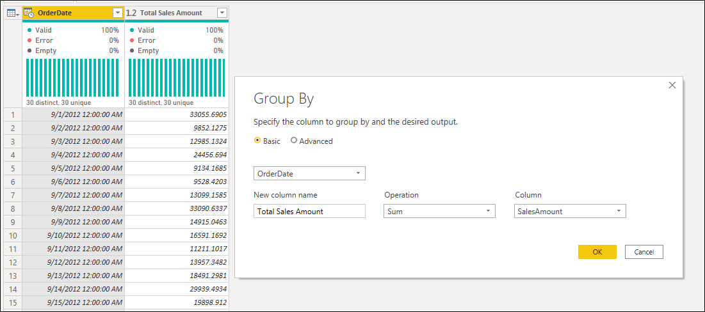

   >[!NOTE]
    > To learn more about how to use the group by feature, go to [Grouping or summarizing rows](group-by.md).

3. Now with the summarized table at the date level, filter the new Total Sales Amount column to only keep rows with values greater than or equal to 15000.

   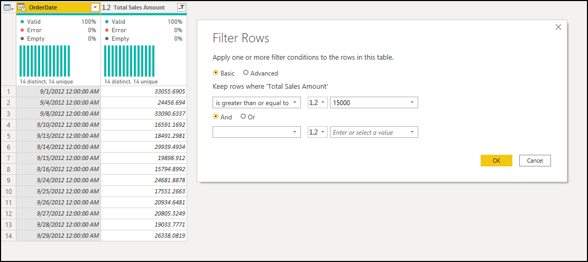

One simple way to check if the step in your query can fold back to the data source is to right-click the step and see if the **View Native Query** option is enabled or disabled (grayed out).

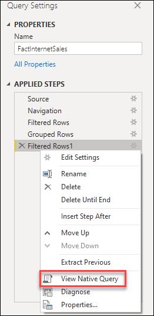

When you select the **View Native Query** option, a new **Native Query** dialog box appears. Here you'll see the native query that Power Query has translated from all the transformations that construct the selected step.

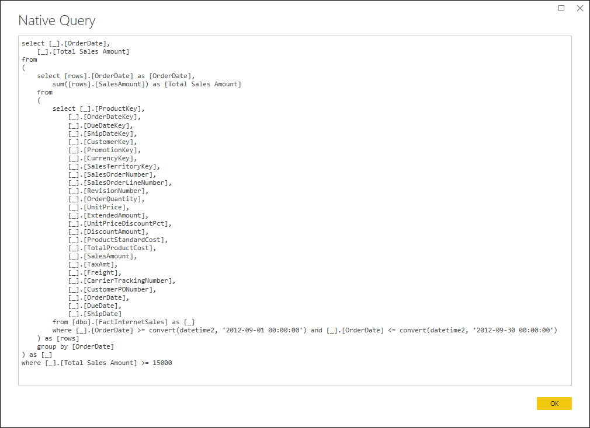

This native query is sent to the data source (Microsoft SQL Server) and Power Query only receives the result of that query.

## Partial query folding

Taking the query created in the previous section for **Full Query folding** as your starting point, your new goal is to filter that table to only analyze the rows for dates that fall in the weekdays Friday, Saturday, or Sunday.

To do this, first select the OrderDate column. In the **Add Column** menu from the ribbon, select the **Date** option in the **From Date & Time** group. From this context menu, select the **Day**option. This selection displays a new context menu where you select the **Name of Day** option. 

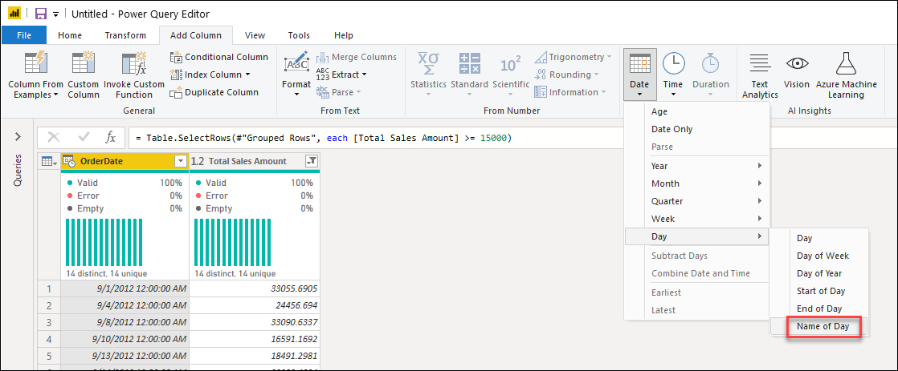

After selecting this option, a new column called **Day Name** appears in your table with the name of the day. You can now filter the table using this **Day Name** column to only keep the rows with the values Friday, Saturday, or Sunday.

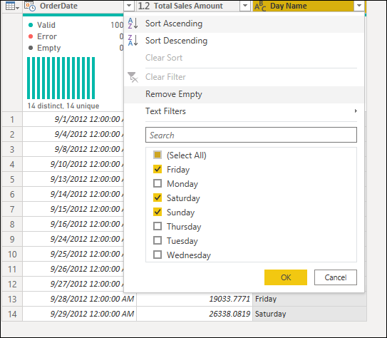

Now check the **View Native Query** option for the last step you created. You'll notice that this option appears grayed out or disabled. However, you can right-click the **Filtered Rows1** step and you'll see that the **View Native Query** option is available for that step.

For this particular scenario, the query is partially folded to the data source until the *Filtered Rows1* step.

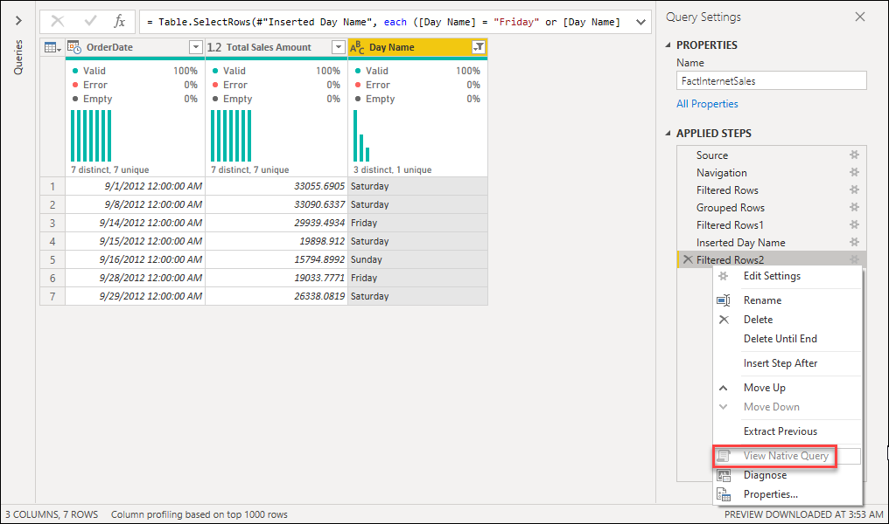

Another option to verify query folding is to use the query diagnostics tools, more specifically the **Diagnose Step** option. To learn more about how to use the query diagnostics tool, go to [What is Query Diagnostics for Power Query?](querydiagnostics.md).

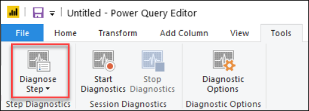

To use query diagnostics, select the query that you want to analyze and then select the **Diagnose Step** button. This action creates a new group and two queries with the format `[Query Name] [Step Name] [Diagnostics Type] [Timestamp]`.

Under **Queries**, ake a look at the diagnostic that reads "Aggregated" in the [Diagnostics Type] part and then take a closer look at the Data Source Query column in the table. This column holds all the requests sent to the data source.

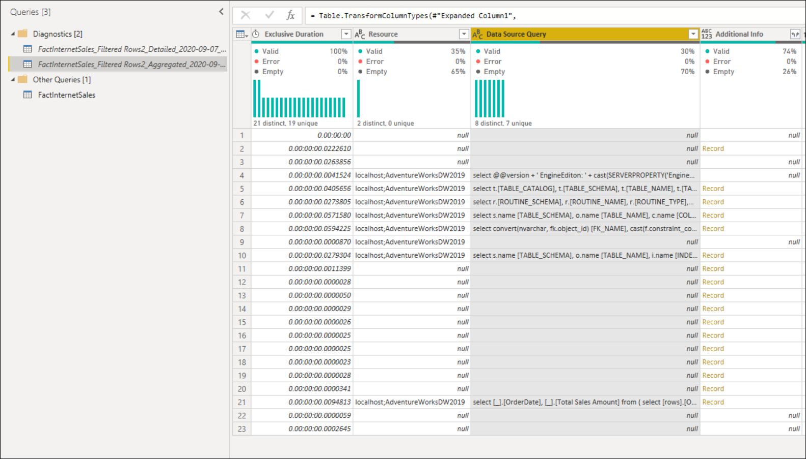

Reading the values in that column, you can see that the native query sent to the server to retrieve the information. You can right-click to drill down to a specific value. If you look at the specific cell value in row 21 in the previous image, you'll note that it is the same native query you can see in the **View Native Query** for the **Filtered Rows1** step.

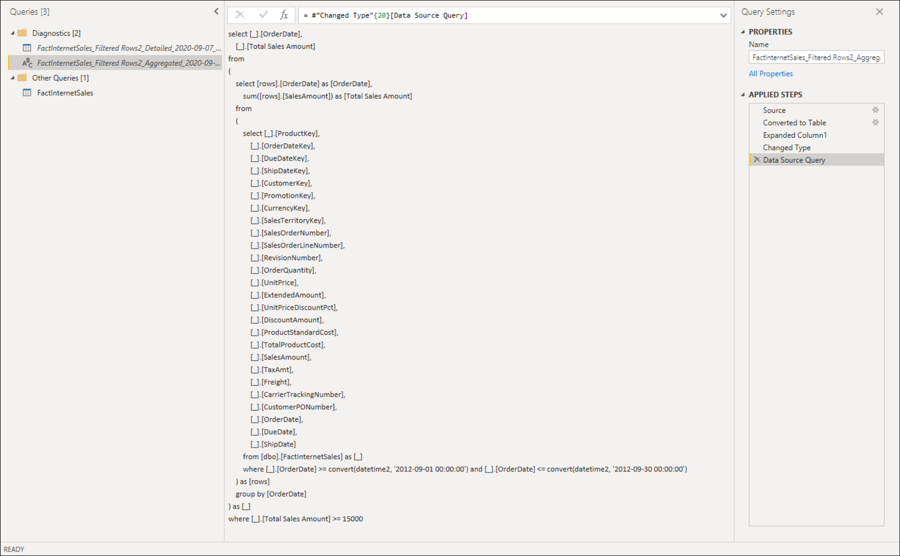

This means that your query will send that native query to the Microsoft SQL Server and perform the rest of the transformations locally. This is what it means to have a query that can partially fold.

>[!NOTE]
> We recommend that you read [Understanding folding with Query Diagnostics](querydiagnosticsfolding.md) to get the most out of the Query Diagnostics tools and learn how to verify query folding.

## No Query folding

Queries that rely solely on unstructured data sources, such as CSV or Excel files, don't have query folding capabilities. This means that Power Query evaluates all the required data transformations outside the data source.

One example can be seen in the article about [combining multiple CSV files from a local folder](combine-files-csv.md) where none of the steps have the **View Native Query** option active, and running the Query diagnostics for that step yields no results in the Data Source Query column.

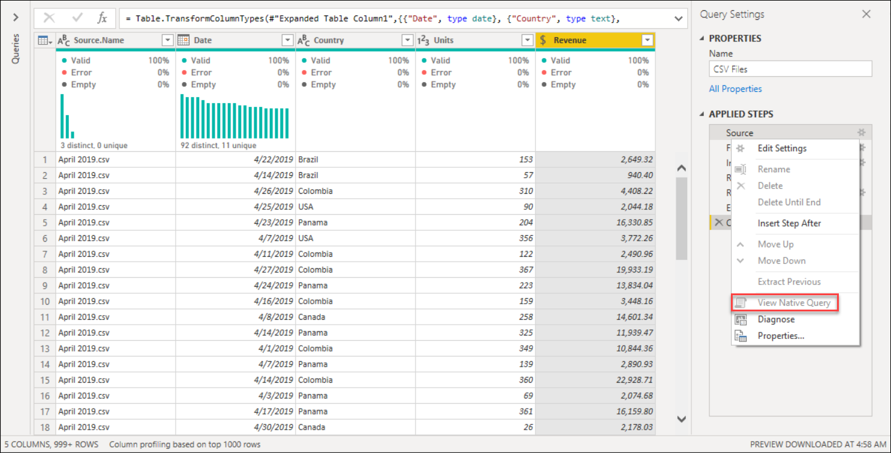

## Considerations and suggestions

* Follow the best practices when creating a new query as stated in [Best practices in Power Query](best-practices.md).
* Checking the **View Native Query** option is always recommended to make sure that your query can be folded back to the data source. If your step disables this option, you know that you've created a step that stops query folding. 
* Use the Query Diagnostics tool to your advantage and to better understand the requests being sent to your data source when query folding capabilities are available for the connector.
* When combining data sourced from the use of multiple connectors, Power Query tries to push as much work as possible to both of the data sources while complying with the privacy levels defined for each data source. 
* Read the article on [Privacy levels](dataprivacyfirewall.md) to protect your queries from running against a Data Privacy Firewall error.
* You can also use other tools to check query folding from the perspective of the request being received by the data source. Based on our example, you can use the Microsoft SQL Server Profile to check the requests being sent by Power Query and received by the Microsoft SQL Server. 

