# Understanding query evaluation and query folding in Power Query

*Get help from Bob or Doug to write this after the rest of the sections are finished*

## Create a Power Query M script

A query in Power Query is written in the M language. This query gets interpreted and evaluated by the Power Query engine to output its results. The M script or M code serves as the set of instructions needed to evaluate the query. 

>[!TIP]
>You can think of the M script as a recipe in order to prepare your data.

The most common way to create an M script is by using the Power Query Editor. For example, when you connect to a data source such as a SQL Server database you'll notice on the right-hand side of your screen that there's a section called [applied steps](applied-steps.md) which displays all the steps or transforms used in your query. In this sense, the Power Query Editor serves as an interface to help you create the appropriate M script for the transforms that you're after as well as validating that the code used is valid. 

>[!NOTE]
> The M script is used within the Power Query editor to:
> * Display the query as a series of steps and allow the creation or modification of new steps
> * Display a diagram view


As you can see from the previous image that shows the applied steps section, the query in the image has the following steps:

* **Source**: Makes the connection to the data source. In this case its a connection to a SQL Server database.
* **Navigation**: Navigates to a specific table within the database.
* **Removed other columns**: Selects which columns to keep from the table and removes the rest.
* **Sorted rows**: Sorts the table using one or multiple columns using a descending order.
* **Kept top rows**: Filters the table to only keep a certain number of rows from the top of the table.

The Power Query Editor helps you add these steps, through a diverse set of interactions on its user interface, to create the M Script that produces your desired query output.

These set of steps names are a friendly way to interpret the M script that Power Query has created for you. To view this full M script you can either go to the Advanced Editor window in the View tab or change the view of the formula bar to show the query script by going into the View tab and from the Layout group select the **Script view** to be *Query script*.

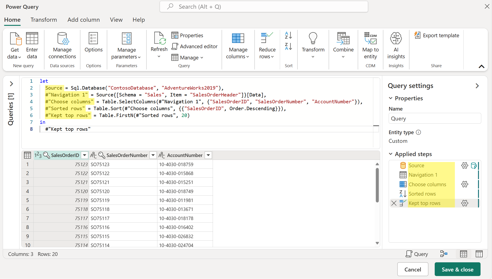 

From the previous image, you can see that most of the names that you see in the applied steps pane are also being used in the M script and in some cases they are wrapped around other symbols. The Power Query Editor always tries to show you a friendly name instead of the exact name being used inside your M script to help you interpret your query much easier.

>[!NOTE]
>Steps of a query are named using something called  *identifiers* in the M language. A quoted-identifier, such as the one for the *#"Kept top rows"*, can be used to allow any sequence of zero or more Unicode characters to be used as an identifier, including keywords, whitespace, comments, operators and punctuators. You can learn more about *identifiers* in the M language from the documentation on [lexical structure](https://docs.microsoft.com/powerquery-m/m-spec-lexical-structure#identifiers).

Furthermore, any changes that you make to your query through the Power Query Editor will automatically update the M script for your query. For example, using the previous image as the starting point, if you change the *Kept top rows* step name to be *Top 20 rows*, this will automatically be updated in the script view as shown in the image below:


While it is recommended to leverage the Power Query Editor to create all or most of the M script for you, you can manually add or modify pieces of your M code. You can learn more about the M language from the [official docs site for the language](https://docs.microsoft.com/powerquery-m/). 

>[!NOTE]
> M Script or M code are terms used for any code that uses the M Language. In the context of this article, M Script also refers to the code found inside a Power Query query and accessible through the Advanced Editor window in the View tab and also through the script view in the formula bar.

## How does a query get evaluated in Power Query?

The diagram below explores the process that happens in order to evaluate the previously mentioned query in Power Query:


1. The M Script, found inside the Advanced Editor, is submitted to the Power Query engine alongside with other important information such as credentials and data source privacy levels.
2. Power Query determines what data needs to be extracted from the data source and submits a request to the data source.
3. The data source responds to the request from Power Query by transferring the requested data to Power Query.
4. Power Query receives the incoming data from the data source and performs any transformations using the Power Query engine if necessary.
5. The results derived from the previous point are loaded to a destination.

>[!NOTE]
>While this example showcases a query with a SQL Database as a data source, the concept applies to queries with or without a data source.

When Power Query reads your M script, it runs it through an optimization process to more efficiently evaluate your query. In this process it determines which steps (transforms) from your query can be offloaded to your data source and which other steps would need to be evaluated using the Power Query engine. This optimization process is also called Query folding where Power Query tries to push as much of the possible execution to the data source in an effort to optimize your query's execution.

>[!IMPORTANT]
>All rules from the [Power Query formula language (also known as M Language)](https://docs.microsoft.com/powerquery-m/) are followed. Most notably, lazy evaluation plays an important role during the optimization process where Power Query will understand what specific transforms from your query need to be evaluated and what others do not need to be evaluated because they are not needed in the output of your query. 
>Furthermore, when multiple sources are involved the data privacy level of each data source is taken into consideration when evaluating the query. You can learn more about the behind the scenes of the [Data Privacy Firewall from this article](https://docs.microsoft.com/power-query/dataprivacyfirewall).

You can see in detail the steps that take place in this optimization process by following the below diagram:


1. The M Script, found inside the Advanced Editor, is submitted to the Power Query engine alongside with other important information such as credentials and data source privacy levels.
2. The Query folding mechanism submits metadata requests to the data source to determine the capabilities of the data source, table schemas, relationships between different entities at the data source and more. 
3. Based on the metadata received, the query folding mechanisms determines what information to extract from the data source and what set of transformations will need to happen inside the Power Query engine. It sends the instructions to two other components that will take care of retrieving the data from the data source and transforming the incoming data in the Power Query engine if necessary.
4. Once the instructions have been received by the internal components of Power Query, Power Query sends a request to the data source using a data source query.
5. The data source receives the request from Power Query and transfers the data to the Power Query engine.
6. Once the data is inside Power Query, the transformation engine inside Power Query (also known as mashup engine) performs the transformations that couldn't be folded back or offloaded to the data source.
7. The results derived from the previous point are loaded to a destination.

This is the process that happens to a Power Query query during its evaluation.

>[!NOTE]
>Depending on the transformations and data source used in the M script, Power Query will determine if it will stream or buffer the incoming data.

## What is query folding?

The goal of query folding is to offload or push as much of the evaluation of a query to the data source which is able to compute the transformations of your query. 

It accomplishes this goal by translating your M Script into a language that can be interpreted and executed by your data source, thus pushing the evaluation to your data source and sending the result of that evaluation to Power Query.

This often provides a much faster query execution than extracting all the required data from your data source and running all transforms required in the Power Query engine.

When you use the [Get Data experience](get-data-experience.md), Power Query guides you through the process that ultimately lets you connect to your data source. When doing so, Power Query leverages a series of functions in the M language categorized as [accessing data functions](https://docs.microsoft.com/powerquery-m/accessing-data-functions). These specific functions use mechanisms and protocols in order to connect to your data source using a language that your data source can understand. 

However, the steps that follow in your query are the steps or transforms that the query folding mechanism will attempt to optimize and check if they can be offloaded to your data source instead of them being processed using the Power Query engine. 

>[!IMPORTANT]
> All data source functions, commonly showcased as the *Source* step of a query, will query the data to the data source in its native language. The query folding mechanism applies to all transforms applied to your query after your data source function so they can be translated and combined into a single data source query or as many transforms that can be offloaded to the data source.

Depending on how the query is structured, there could be three possible outcomes to the query folding mechanism:

* **Full query folding**: When all of your query transformations get pushed back to the data source and minimal processing occurs at the Power Query engine. 
* **Partial query folding**: When only a few transformations in your query, and not all, can be pushed back to the data source. This means that a subset of your transformations is done at your data source and the rest of your query transformations occur in the Power Query engine.
* **No query folding**:  When the query contains transformations that can't be translated to the native query language of your data source, either because the transformations aren't supported or the connector doesn't support query folding. For this case, Power Query gets the raw data from your data source and uses the Power Query engine to achieve your desired output by processing the required transforms at the Power Query engine level.


>[!NOTE]
>The Query folding mechanism is primarily available in connectors for structured data sources such as, but not limited to, [Microsoft SQL Server](Connectors/sqlserver.md) and [OData Feed](Connectors/odatafeed.md). During the optimization phase, the engine may sometimes reorder steps in the query.
>
>Leveraging a data source that has more processing resources and has Query folding capabilities can expedite your query loading times as the processing occurs at the data source and not at the Power Query engine.

This article provides some example scenarios for each of the possible outcomes for query folding. It will also include some suggestions on how to get the most out of the query folding mechanism.

### Example scenario

Imagine a scenario where, using the [Wide World Importers database for Azure Synapse Analytics SQL database](https://docs.microsoft.com/azure/synapse-analytics/sql-data-warehouse/load-data-wideworldimportersdw), you are tasked with creating a query in Power Query that connects to the **fact_Sale** table and retrieves the last ten sales with only the following fields:

* Sales Key
* Customer Key
* Invoice Date Key
* Description
* Quantity

>[!NOTE]
>For demonstration purposes, this article uses the database outlined on the tutorial on loading the Wide World Importers database into Azure Synapse Analytics with the main difference being the fact_Sales table only holding data for the year 2000 and with a total of 3644356 rows.
>While the results might not exactly match the results that you get by following the tutorial from the Azure Synapse Analytics documentation, the goal of this article is to showcase the core concepts and impact that query folding can have in your queries.


This article will showcase three ways to achieve the same output with different levels of query folding:
- No query folding
- Partial query folding
- Full query folding

#### No query folding example: Creating the query

>[!IMPORTANT]
>Queries that rely solely on unstructured data sources or that don't have a compute engine, such as CSV or Excel files, don't have query folding capabilities. This means that Power Query evaluates all the required data transformations using the Power Query engine.

After connecting to your database and navigating to the **fact_Sales** table, you select the **Keep bottom rows** transform found inside the Reduce rows group of the home tab as shown in the next image.


After selecting this transform, a new dialog will appear where you can enter the number of rows that you'd like to keep. For this case, you enter the value ten as shown in the image below and then click the OK button.

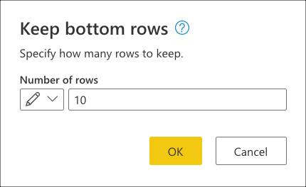

>[!TIP]
>For this case, performing this operation yields the result of the last ten sales. In most scenarios it is recommended to provide a more explicit logic that defines what rows are considered last last by applying a sort operation on the table.

Next, you select the **Choose columns** transform found inside the *Manage columns* group from the Home tab which will help you to explicitly select the columns that you want to keep from your table and remove the rest.

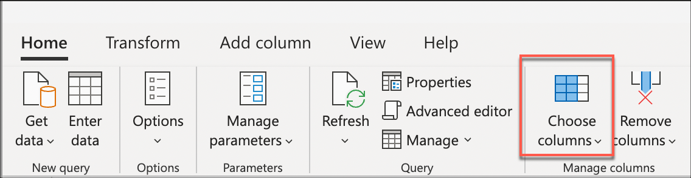

Lastly, now inside the **Choose columns** dialog, you select the columns *Sales Key*, *Customer Key*, *Invoice Date Key*, *Description*, and *Quantity* and click the OK button.

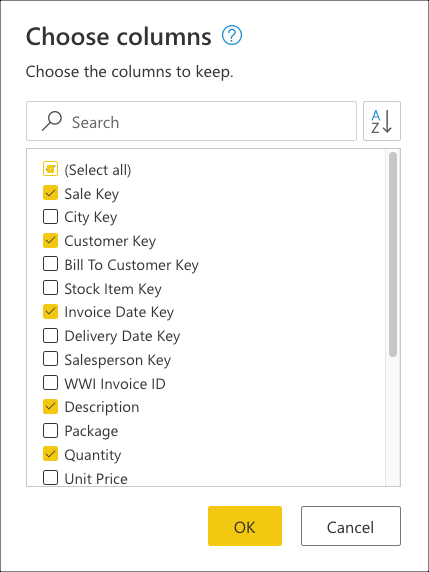

This yields exactly the output that you were tasked with and below is the full M script for the query created:

```
let
  Source = Sql.Database(ServerName, DatabaseName),
  Navigation = Source{[Schema = "wwi", Item = "fact_Sale"]}[Data],
  #"Kept bottom rows" = Table.LastN(Navigation, 10),
  #"Choose columns" = Table.SelectColumns(#"Kept bottom rows", {"Sale Key", "Customer Key", "Invoice Date Key", "Description", "Quantity"})
in
  #"Choose columns""
```

##### No query folding example: Understanding the query evaluation

Checking the applied steps pane, you notice that the step folding indicators are showing that the transforms that you added, Kept bottom rows and Choose columns, are marked as steps that will be evaluated outside the data source or, in other words, at the Power Query engine.


You can right click the last step of your query, the one named *Kept bottom rows*, and select the option that reads **Query plan** The goal of the Query plan is to showcase which transforms will be evaluated by the Power Query engine and which transforms could be offloaded to the data source.

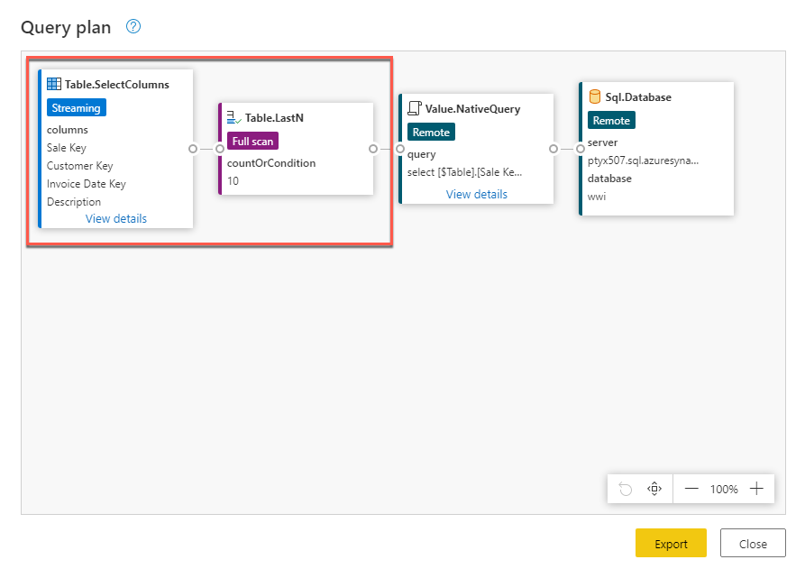

Each card in the previous image is called a node and it represents every process that needs to happen (from left to right) in order for your query to be evaluated. Some of these nodes can be evaluated at your data source while others like the nodes for Table.LastN and Table.SelectColumns, within the rectangle of the previous image, will be evaluated using the Power Query engine. These two nodes represent the two transforms that you added, *Kept bottom rows* and *Choose columns*, whilst the rest of the node represent operations that will happen at your data source level.

You can also see exactly the query that would be sent to your data source by clicking the *view details* hyperlink in the Value.NativeQuery node.


This query is in the native language of your data source. For this case, that language is SQL and this statement represents a query that requests all rows and fields from the **fact_Sales** table. 
Understanding this will help you better understand the story that the query plan tries to convey in order of the nodes which is a sequential process that starts by requesting the data from your data source:

* **Sql.Database**: Connects to the database and sends metadata requests to understand its capabilities.
* **Value.NativeQuery**: Power Query submits the data requests in a native SQL statement to the data source. For this case, that represents all records and fields from the fact_Sales table.
* **Table.LastN**: Once Power Query receives all records from the fact_Sales table, it uses the Power Query engine to filter the table and keep only the last ten rows.
* **Table.SelectColumns**: Power Query will use the output of the **Table.LastN** node and apply a new transform called Table.SelectRows which selects the specific columns that you want to keep from a table.

For its evaluation, this query had to download all rows and fields from the fact_Sales table and took an average of 2 minutes and 45 seconds to be processed in a standard instance of Power BI Dataflows (which accounts for the evaluation and loading of data to dataflows). 

#### Partial query folding: Creating the query

After connecting to the database and navigating to the **fact_Sales** table, you start by selecting the columns that you want to keep from your table. You select the **Choose columns** transform found inside the *Manage columns* group from the Home tab which will help you to explicitly select the columns that you want to keep from your table and remove the rest.


Inside the **Choose columns** dialog, you select the columns *Sales Key*, *Customer Key*, *Invoice Date Key*, *Description*, and *Quantity* and click the OK button.


You now create a logic that will sort the table to have the **last sales at the bottom of the table**. You select the *Sale Key* column, which is the primary key and incremental sequence or index of the table, and sort the table only using this field in ascending order right from the auto-filter menu inside the data preview view for the column.

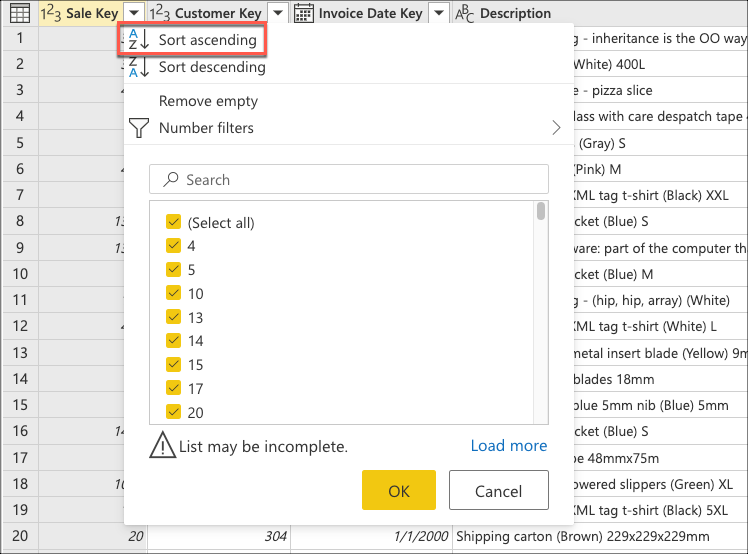

Next, you select the table contextual menu from inside the data preview view and choose the *Keep bottom rows* transform.


Inside the *Keep bottom rows* dialog, you enter the value ten and then click the OK button.

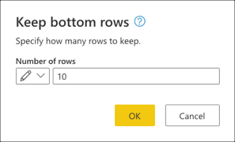

This yields exactly the output that you were tasked with and below is the full M script for the query created:

```
let
  Source = Sql.Database(ServerName, DatabaseName),
  Navigation = Source{[Schema = "wwi", Item = "fact_Sale"]}[Data],
  #"Choose columns" = Table.SelectColumns(Navigation, {"Sale Key", "Customer Key", "Invoice Date Key", "Description", "Quantity"}),
  #"Sorted rows" = Table.Sort(#"Choose columns", {{"Sale Key", Order.Ascending}}),
  #"Kept bottom rows" = Table.LastN(#"Sorted rows", 10)
in
  #"Kept bottom rows"
```

### Partial query folding example: Understanding the query evaluation

Checking the applied steps pane, you notice that the step folding indicators are showing that the last transform that you added, Kept bottom rows, is marked as a step that will be evaluated outside the data source or, in other words, at the Power Query engine.

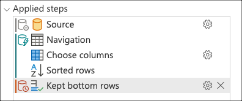

You can right click the last step of your query, the one named *Kept bottom rows*, and select the option that reads **Query plan** to better understand how your query might be evaluated.


Each card in the previous image is called a node and it represents every process that needs to happen (from left to right) in order for your query to be evaluated. Some of these nodes can be evaluated at your data source while others like the node for Table.LastN, represented by your *Kept bottom rows step*, will be evaluated using the Power Query engine.

You can also see exactly the query that would be sent to your data source by clicking the *view details* hyperlink in the Value.NativeQuery node.

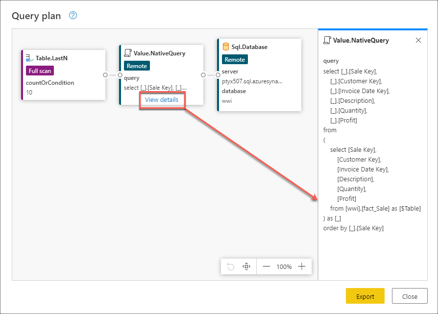

This query is in the native language of your data source. For this case, that language is SQL and this statement represents a query that requests all rows and only the requested fields from the **fact_Sales** table ordered by the Sale Key field. 
Understanding this will help you better understand the story that the query plan tries to convey in order of the nodes which is a sequential process that starts by requesting the data from your data source:

* **Sql.Database**: Connects to the database and sends metadata requests to understand its capabilities.
* **Value.NativeQuery**: Power Query submits the data requests in a native SQL statement to the data source. For this case, that represents all records and only the requested fields from the fact_Sales table in the database sorted in ascending order by the Sales Key field.
* **Table.LastN**: Once Power Query receives all records from the fact_Sales table, it uses the Power Query engine to filter the table and keep only the last ten rows.

For its evaluation, this query had to download all rows and only the required fields from the fact_Sales table. It took an average of 1 minutes and 45 seconds to be processed in a standard instance of Power BI Dataflows (which accounts for the evaluation and loading of data to dataflows). 

#### Full query folding example: Creating the query

After connecting to the database and navigating to the **fact_Sales** table, you start by selecting the columns that you want to keep from your table. You select the **Choose columns** transform found inside the *Manage columns* group from the Home tab which will help you to explicitly select the columns that you want to keep from your table and remove the rest.


Inside the **Choose columns** dialog, you select the columns *Sales Key*, *Customer Key*, *Invoice Date Key*, *Description*, and *Quantity* and click the OK button.


You now create a logic that will sort the table to have the **last sales at the top of the table.** You select the *Sale Key* column, which is the primary key and incremental sequence or index of the table, and sort the table only using this field in descending order right from the auto-filter menu inside the data preview view for the column.

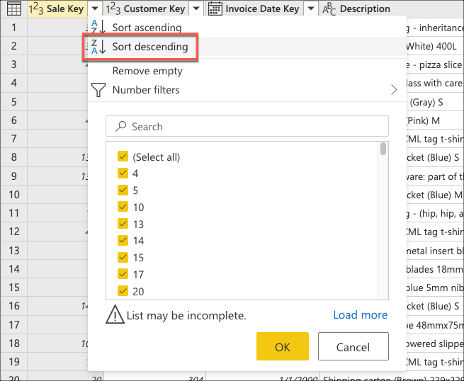

Next, you select the table contextual menu from inside the data preview view and choose the *Keep top rows* transform.

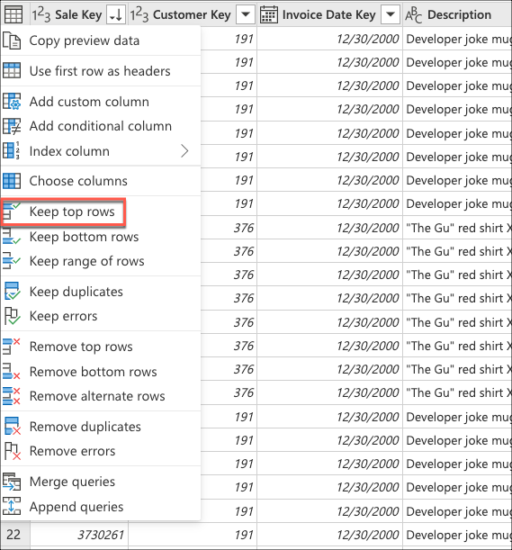

Inside the *Keep top rows* dialog, you enter the value ten and then click the OK button.

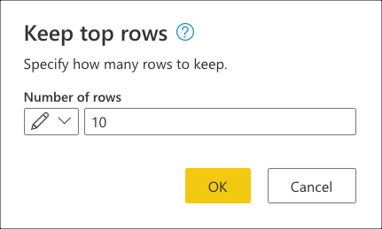

This yields exactly the output that you were tasked with and below is the full M script for the query created:
```
let
  Source = Sql.Database(ServerName, DatabaseName),
  Navigation = Source{[Schema = "wwi", Item = "fact_Sale"]}[Data],
  #"Choose columns" = Table.SelectColumns(Navigation, {"Sale Key", "Customer Key", "Invoice Date Key", "Description", "Quantity"}),
  #"Sorted rows" = Table.Sort(#"Choose columns", {{"Sale Key", Order.Descending}}),
  #"Kept top rows" = Table.FirstN(#"Sorted rows", 10)
in
  #"Kept top rows"
```

##### Full query folding example: Understanding the query evaluation

When checking the applied steps pane, you can notice that the step folding indicators are showing that the transforms that you added *Choose columns*, *Sorted rows* and *Kept top rows*, are marked as steps that will be evaluated at the data source.

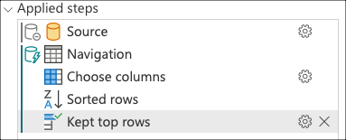

You can right click the last step of your query, the one named *Kept top rows*, and select the option that reads **Query plan**.


This query is in the native language of your data source. For this case, that language is SQL and this statement represents a query that requests all rows and fields from the **fact_Sales** table. 
Understanding this will help you better understand the story that the query plan tries to convey in order of the nodes which is:

* **Sql.Database**: Connects to the database and sends metadata requests to understand its capabilities.
* **Value.NativeQuery**: Power Query submits the data requests in a native SQL statement to the data source. For this case, that represents a request for only the top ten records of the fact_Sales table with only the required fields after being sorted in a descending order using the Sale Key field.

For its evaluation, this query only to download ten rows and exactly the fields that you needed from the fact_Sales table and took an average of 31 seconds to be processed in a standard instance of Power BI Dataflows (which accounts for the evaluation and loading of data to dataflows).

### Query performance comparison

Explain why the no folding and partial folding queries didn't work in contrast to why the full query folding worked better.
(how a SQL BOTTOM clause doesn't exist and why a sorting operation can do wonders)

* Query refresh times chart (Dataflows refresh history value)
* Query data (row count) throughput of the data source chart (average user would understand better a row count than "total bytes transferred")
* Transforms executed by Power Query (chart of how full query folding nets to almost zero work at the PQ level)
* Average data preview evaluation in PQ Editor chart

## Considerations and suggestions

* Follow the best practices when creating a new query as stated in [Best practices in Power Query](best-practices.md).
* Use the step folding indicators to check which steps are preventing your query from folding and re-order them if necessary to increase folding.
* Use the query plan to determine which transforms are happening at the Power Query engine for that particular step and consider re-arranging your query to check the updated query plan. For data sources that support folding, any nodes in the query plan other than Value.NativeQuery and data source access nodes represent transforms that didn’t fold.
* Check the **View Native Query** option is always recommended to make sure that your query can be folded back to the data source. If your step disables this option, you know that you've created a step that stops query folding. 
* Use the query diagnostics tool to your advantage and to better understand the requests being sent to your data source when query folding capabilities are available for the connector.
* When combining data sourced from the use of multiple connectors, Power Query tries to push as much work as possible to both of the data sources while complying with the privacy levels defined for each data source. 
* Read the article on [Privacy levels](dataprivacyfirewall.md) to protect your queries from running against a Data Privacy Firewall error.
* You can also use other tools to check query folding from the perspective of the request being received by the data source. Based on our example, you can use the Microsoft SQL Server Profile to check the requests being sent by Power Query and received by the Microsoft SQL Server.