# Query folding examples

This article provides some example scenarios for each of the three possible outcomes for query folding. It also includes some suggestions on how to get the most out of the query folding mechanism and the impact that it can have in your queries.

## The scenario

Imagine a scenario where, using the [Wide World Importers database for Azure Synapse Analytics SQL database](https://docs.microsoft.com/azure/synapse-analytics/sql-data-warehouse/load-data-wideworldimportersdw), you are tasked with creating a query in Power Query that connects to the **fact_Sale** table and retrieves the last ten sales with only the following fields:

- Sales Key
- Customer Key
- Invoice Date Key
- Description
- Quantity

>[!NOTE]
>For demonstration purposes, this article uses the database outlined on the tutorial on loading the Wide World Importers database into Azure Synapse Analytics with the main difference being the fact_Sales table only holding data for the year 2000 and with a total of 3644356 rows.
>While the results might not exactly match the results that you get by following the tutorial from the Azure Synapse Analytics documentation, the goal of this article is to showcase the core concepts and impact that query folding can have in your queries.

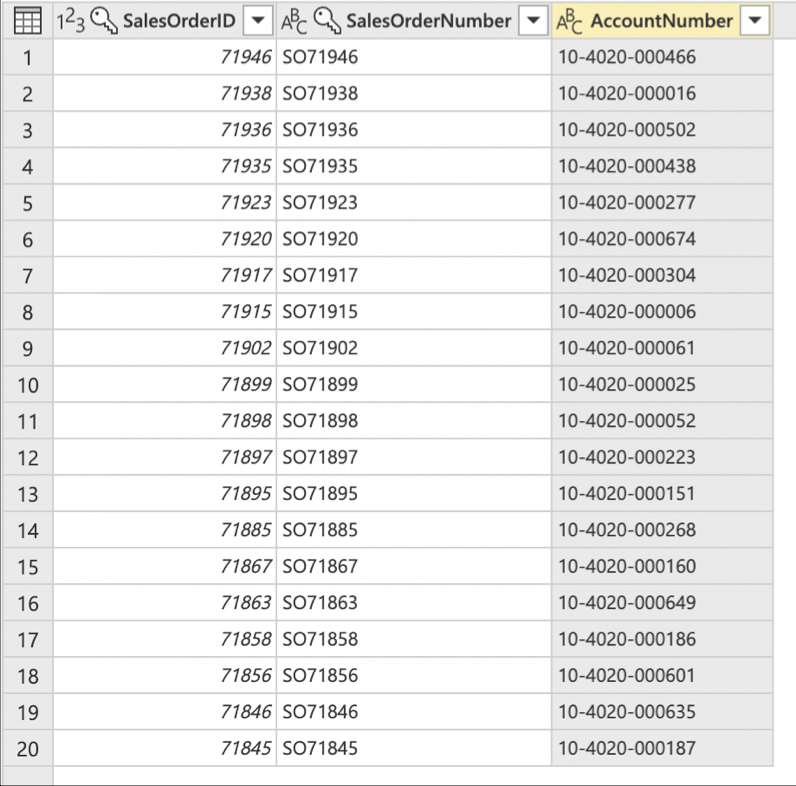

This article will showcase three ways to achieve the same output with different levels of query folding:
- No query folding
- Partial query folding
- Full query folding

## No query folding example

>[!IMPORTANT]
>Queries that rely solely on unstructured data sources or that don't have a compute engine, such as CSV or Excel files, don't have query folding capabilities. This means that Power Query evaluates all the required data transformations using the Power Query engine.

After connecting to your database and navigating to the **fact_Sales** table, you select the **Keep bottom rows** transform found inside the Reduce rows group of the home tab as shown in the next image.

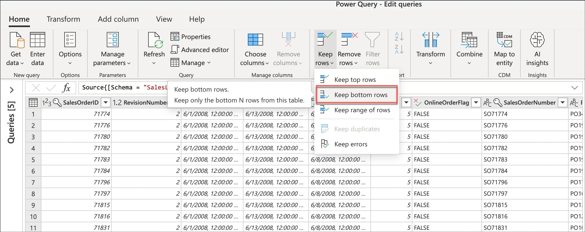

After selecting this transform, a new dialog will appear where you can enter the number of rows that you'd like to keep. For this case, you enter the value ten as shown in the image below and then click the OK button.


>[!TIP]
>For this case, performing this operation yields the result of the last ten sales. In most scenarios it is recommended to provide a more explicit logic that defines what rows are considered last last by applying a sort operation on the table.

Next, you select the **Choose columns** transform found inside the *Manage columns* group from the Home tab which will help you to explicitly select the columns that you want to keep from your table and remove the rest.

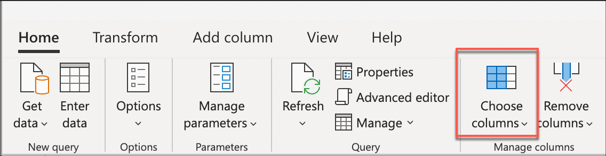

Lastly, now inside the **Choose columns** dialog, you select the columns *Sales Key*, *Customer Key*, *Invoice Date Key*, *Description*, and *Quantity* and click the OK button.

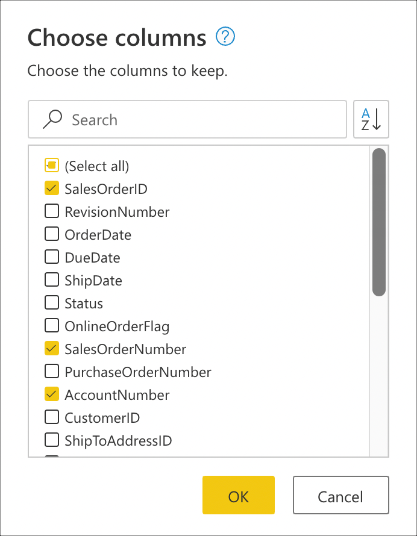

This yields exactly the output that you were tasked with and below is the full M script for the query created:

```
let
  Source = Sql.Database(ServerName, DatabaseName),
  Navigation = Source{[Schema = "wwi", Item = "fact_Sale"]}[Data],
  #"Kept bottom rows" = Table.LastN(Navigation, 10),
  #"Choose columns" = Table.SelectColumns(#"Kept bottom rows", {"Sale Key", "Customer Key", "Invoice Date Key", "Description", "Quantity"})
in
  #"Choose columns""
```

### No query folding: Understanding the query evaluation

Checking the applied steps pane, you notice that the step folding indicators are showing that the transforms that you added, Kept bottom rows and Choose columns, are marked as steps that will be evaluated outside the data source or, in other words, at the Power Query engine.

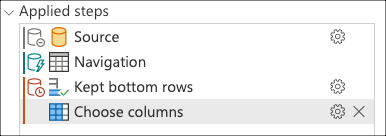

You can right click the last step of your query, the one named *Kept bottom rows*, and select the option that reads **Query plan** The goal of the Query plan is to showcase which transforms will be evaluated by the Power Query engine and which transforms could be offloaded to the data source.

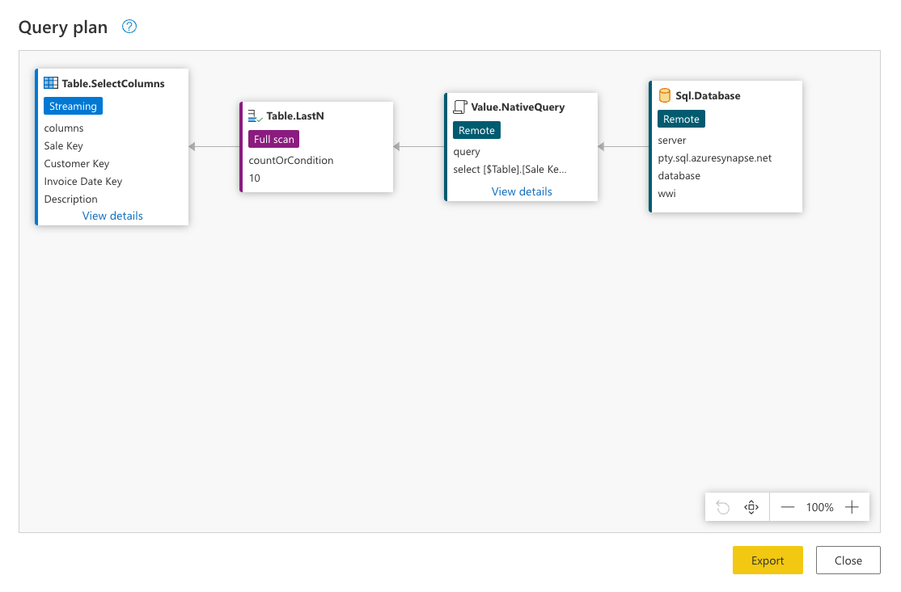

Each box in the previous image is called a node and it represents every process that needs to happen (from left to right) in order for your query to be evaluated. Some of these nodes can be evaluated at your data source while others like the nodes for Table.LastN and Table.SelectColumns, within the rectangle of the previous image, will be evaluated using the Power Query engine. These two nodes represent the two transforms that you added, *Kept bottom rows* and *Choose columns*, whilst the rest of the node represent operations that will happen at your data source level.

You can also see exactly the query that would be sent to your data source by clicking the *view details* hyperlink in the Value.NativeQuery node.

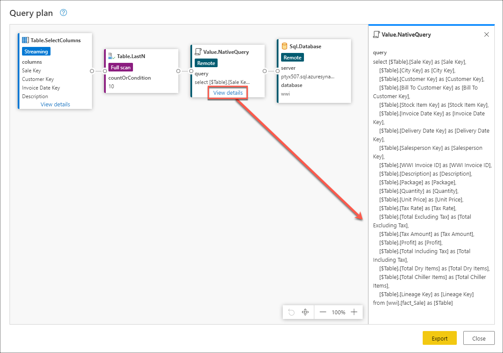

This query is in the native language of your data source. For this case, that language is SQL and this statement represents a query that requests all rows and fields from the **fact_Sales** table. 
Understanding this will help you better understand the story that the query plan tries to convey in order of the nodes which is a sequential process that starts by requesting the data from your data source:

- **Sql.Database**: Connects to the database and sends metadata requests to understand its capabilities.
- **Value.NativeQuery**: Power Query submits the data requests in a native SQL statement to the data source. For this case, that represents all records and fields from the fact_Sales table.
- **Table.LastN**: Once Power Query receives all records from the fact_Sales table, it uses the Power Query engine to filter the table and keep only the last ten rows.
- **Table.SelectColumns**: Power Query will use the output of the **Table.LastN** node and apply a new transform called Table.SelectRows which selects the specific columns that you want to keep from a table.

For its evaluation, this query had to download all rows and fields from the fact_Sales table and took an average of 3 minutes and 4 seconds to be processed in a standard instance of Power BI Dataflows (which accounts for the evaluation and loading processed of data to dataflows). 

## Partial query folding example

After connecting to the database and navigating to the **fact_Sales** table, you start by selecting the columns that you want to keep from your table. You select the **Choose columns** transform found inside the *Manage columns* group from the Home tab which will help you to explicitly select the columns that you want to keep from your table and remove the rest.


Inside the **Choose columns** dialog, you select the columns *Sales Key*, *Customer Key*, *Invoice Date Key*, *Description*, and *Quantity* and click the OK button.


You now create a logic that will sort the table to have the **last sales at the bottom of the table**. You select the *Sale Key* column, which is the primary key and incremental sequence or index of the table, and sort the table only using this field in ascending order right from the auto-filter menu inside the data preview view for the column.

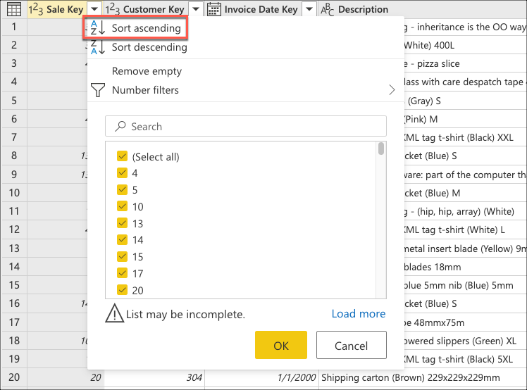

Next, you select the table contextual menu from inside the data preview view and choose the *Keep bottom rows* transform.


Inside the *Keep bottom rows* dialog, you enter the value ten and then click the OK button.

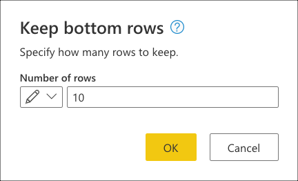

This yields exactly the output that you were tasked with and below is the full M script for the query created:

```
let
  Source = Sql.Database(ServerName, DatabaseName),
  Navigation = Source{[Schema = "wwi", Item = "fact_Sale"]}[Data],
  #"Choose columns" = Table.SelectColumns(Navigation, {"Sale Key", "Customer Key", "Invoice Date Key", "Description", "Quantity"}),
  #"Sorted rows" = Table.Sort(#"Choose columns", {{"Sale Key", Order.Ascending}}),
  #"Kept bottom rows" = Table.LastN(#"Sorted rows", 10)
in
  #"Kept bottom rows"
```

### Partial query folding example: Understanding the query evaluation

Checking the applied steps pane, you notice that the step folding indicators are showing that the last transform that you added, Kept bottom rows, is marked as a step that will be evaluated outside the data source or, in other words, at the Power Query engine.

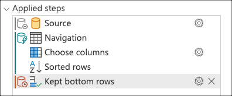

You can right click the last step of your query, the one named *Kept bottom rows*, and select the option that reads **Query plan** to better understand how your query might be evaluated.

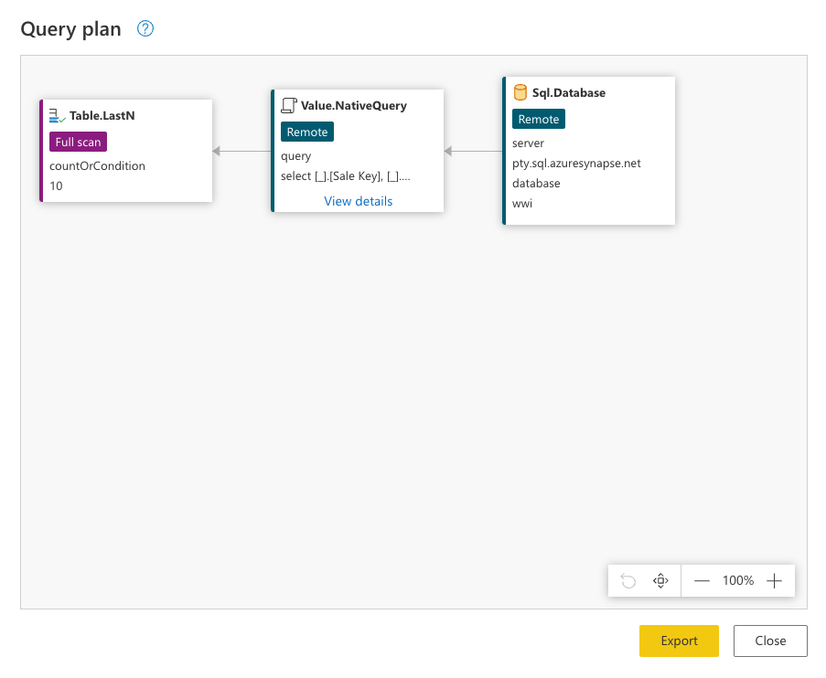

Each box in the previous image is called a node and it represents every process that needs to happen (from left to right) in order for your query to be evaluated. Some of these nodes can be evaluated at your data source while others like the node for Table.LastN, represented by your *Kept bottom rows step*, will be evaluated using the Power Query engine.

You can also see exactly the query that would be sent to your data source by clicking the *view details* hyperlink in the Value.NativeQuery node.

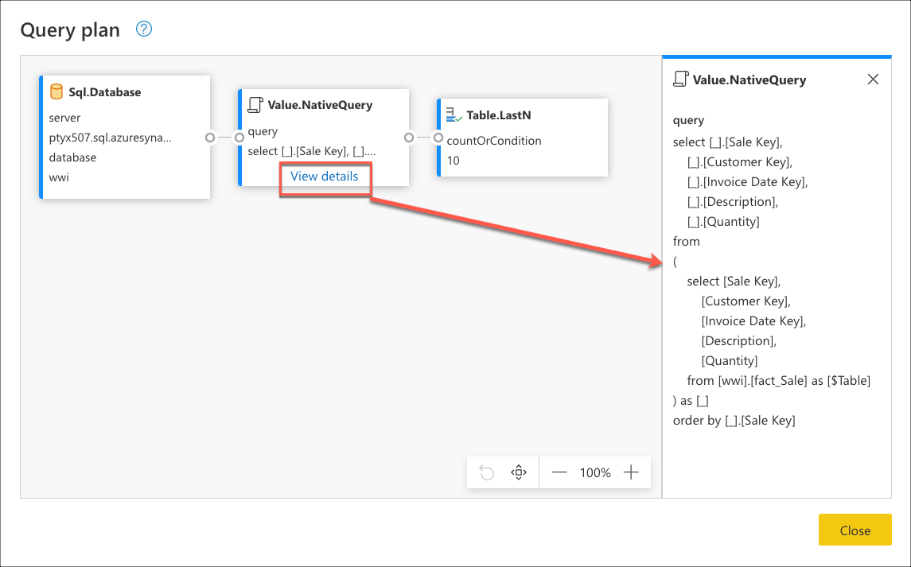

This query is in the native language of your data source. For this case, that language is SQL and this statement represents a query that requests all rows and only the requested fields from the **fact_Sales** table ordered by the Sale Key field. 
Understanding this will help you better understand the story that the query plan tries to convey in order of the nodes which is a sequential process that starts by requesting the data from your data source:

- **Sql.Database**: Connects to the database and sends metadata requests to understand its capabilities.
- **Value.NativeQuery**: Power Query submits the data requests in a native SQL statement to the data source. For this case, that represents all records and only the requested fields from the fact_Sales table in the database sorted in ascending order by the Sales Key field.
- **Table.LastN**: Once Power Query receives all records from the fact_Sales table, it uses the Power Query engine to filter the table and keep only the last ten rows.

For its evaluation, this query had to download all rows and only the required fields from the fact_Sales table. It took an average of 3 minutes and 4 seconds to be processed in a standard instance of Power BI Dataflows (which accounts for the evaluation and loading of data to dataflows).

## Full query folding example

After connecting to the database and navigating to the **fact_Sales** table, you start by selecting the columns that you want to keep from your table. You select the **Choose columns** transform found inside the *Manage columns* group from the Home tab which will help you to explicitly select the columns that you want to keep from your table and remove the rest.


Inside the **Choose columns** dialog, you select the columns *Sales Key*, *Customer Key*, *Invoice Date Key*, *Description*, and *Quantity* and click the OK button.


You now create a logic that will sort the table to have the **last sales at the top of the table.** You select the *Sale Key* column, which is the primary key and incremental sequence or index of the table, and sort the table only using this field in descending order right from the auto-filter menu inside the data preview view for the column.

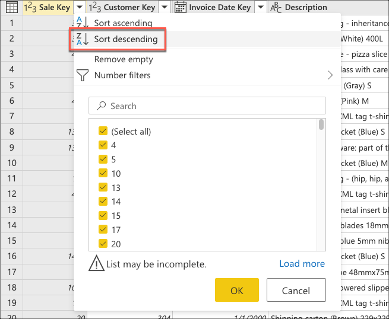

Next, you select the table contextual menu from inside the data preview view and choose the *Keep top rows* transform.

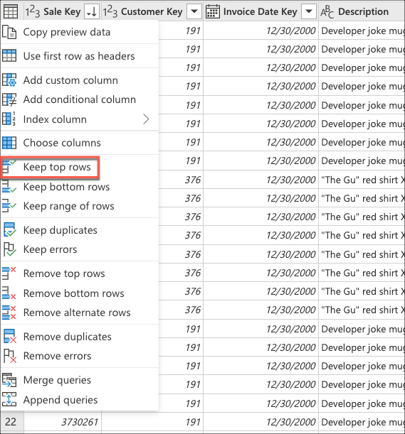

Inside the *Keep top rows* dialog, you enter the value ten and then click the OK button.

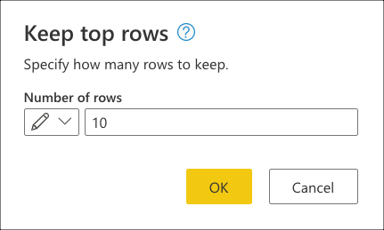

This yields exactly the output that you were tasked with and below is the full M script for the query created:
```
let
  Source = Sql.Database(ServerName, DatabaseName),
  Navigation = Source{[Schema = "wwi", Item = "fact_Sale"]}[Data],
  #"Choose columns" = Table.SelectColumns(Navigation, {"Sale Key", "Customer Key", "Invoice Date Key", "Description", "Quantity"}),
  #"Sorted rows" = Table.Sort(#"Choose columns", {{"Sale Key", Order.Descending}}),
  #"Kept top rows" = Table.FirstN(#"Sorted rows", 10)
in
  #"Kept top rows"
```

### Full query folding example: Understanding the query evaluation

When checking the applied steps pane, you can notice that the step folding indicators are showing that the transforms that you added *Choose columns*, *Sorted rows* and *Kept top rows*, are marked as steps that will be evaluated at the data source.

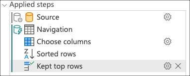

You can right click the last step of your query, the one named *Kept top rows*, and select the option that reads **Query plan**.

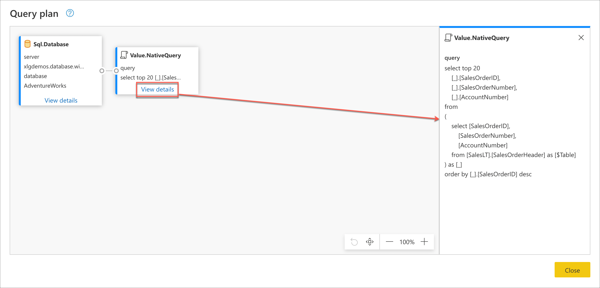

This query is in the native language of your data source. For this case, that language is SQL and this statement represents a query that requests all rows and fields from the **fact_Sales** table.
Understanding this will help you better understand the story that the query plan tries to convey in order of the nodes which is:

- **Sql.Database**: Connects to the database and sends metadata requests to understand its capabilities.
- **Value.NativeQuery**: Power Query submits the data requests in a native SQL statement to the data source. For this case, that represents a request for only the top ten records of the fact_Sales table with only the required fields after being sorted in a descending order using the Sale Key field.

>[!NOTE]
>In the T-SQL language, while there is no clause that will yield a SELECT operation for the bottom rows of a table, there is the TOP clause that retrieves the top rows of a table.

For its evaluation, this query only to download ten rows and exactly the fields that you needed from the fact_Sales table and took an average of 31 seconds to be processed in a standard instance of Power BI Dataflows (which accounts for the evaluation and loading of data to dataflows).

## Performance comparison

To better understand the impact that query folding has in these queries, you can refresh your queries, record the time it takes to fully refresh each query and compare them. For simplicity, this article provides the average refresh timings captured using the Power BI Dataflows refresh mechanic and connecting to a dedicated Azure Synapse Analytics environment with DW2000c as the service level.

The refresh time for each query was as follow:
|Example|Label|Time in seconds|
|--------|------|--------------|
|No query folding| None| 361|
|Partial query folding| Partial| 184|
|Full query folding| Full| 31|

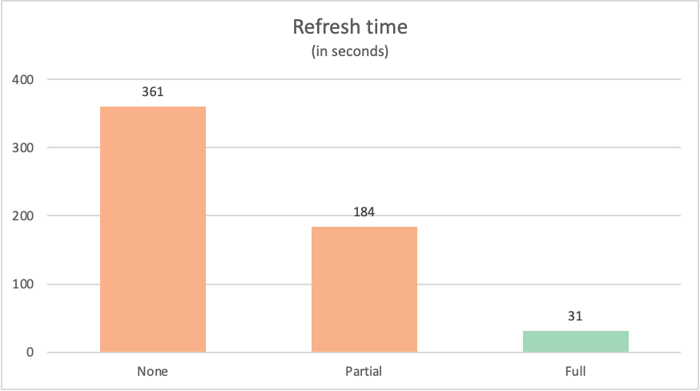

It is often the case that a query which fully folds back to the data source outperforms similar queries that do not completely fold back to the data source. While there could be many reasons why this is the case ranging from the complexity of the transforms that your query performs to the query optimizations implemented at your data source such as indexes and dedicated computing and network resources, there are two specific key processes that query folding tries to leverage and minimize the impact that both of these have with Power Query and these are:

- Data in transit
- Transforms executed by the Power Query engine

The next sub-sections will explain the impact that these two processes had in the previously mentioned queries.

### Data in Transit

When a query gets executed, it tries to fetch the data from the data source as one of its first steps. What data is fetched from the data source is defined by the query folding mechanism that identifies what steps from the query can be offloaded to the data source.

Below is a table with the amount of rows requested from the fact_Sales table of the database and a brief description of the SQL statement sent to request such data from the data source:

|Example|Label|Rows requested| Description|
|--------|------|--------------|---------|
|No query folding| None|  3644356 |Request for all fields and all records from the fact_Sale table|
|Partial query folding| Partial| 3644356|Request for all records, but only required fields from the fact_Sale table after it was sorted by the Sale Key field|
|Full query folding| Full| 10| Request for only the required fields and the TOP 10 records of the fact_Sales after being sorted in descending order by the Sale Key field|

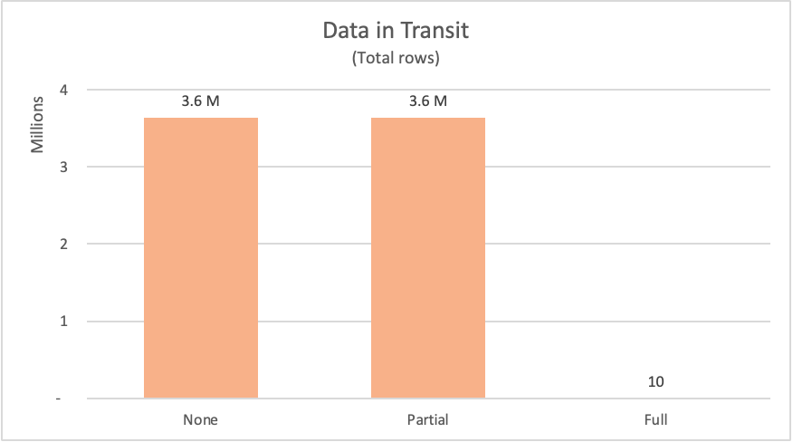

When requesting data from a data source, the data source needs to compute the results for the request and then send the data to the requestor. While the computing resources have already been mentioned, the network resources of moving the data from the data source to Power Query and then have Power Query be able to effectively receive the data and prepare it for the transforms that will happen locally can take some time depending on the size of the data.

For the showcased examples, Power Query had to request over 3.6 million rows from the data source for the no query folding and partial query folding examples, whereas for the full query folding it only requested 10 rows. For the fields requested, the no query folding example requested all the available fields from the table, whilst both the partial query folding and the full query folding only submitted a request for exactly the fields that they needed.

>[!CAUTION]
>It is recommended to implement incremental refresh solutions that leverage query folding for queries or entities with large amount of data. Different product integrations of Power Query implement timeouts to terminate long running queries. Some data sources also implement timeouts on long running sessions trying to execute expensive queries against their servers.

### Transforms executed by the Power Query Engine

This article showcased how you can leverage the [Query plan](query-plan.md) to better understand how your query might be evaluated. Inside the query plan, you are able to see exactly the nodes of the transform operations that will be performed by the Power Query Engine. 

The following table showcases the nodes from the query plans of the previous queries that would've been evaluated by the Power Query engine:

|Example|Label|Power Query Engine transform nodes|
|--------|------|--------------|
|No query folding| None|  Table.LastN, Table.SelectColumns |
|Partial query folding| Partial| Table.LastN |
|Full query folding| Full| --|

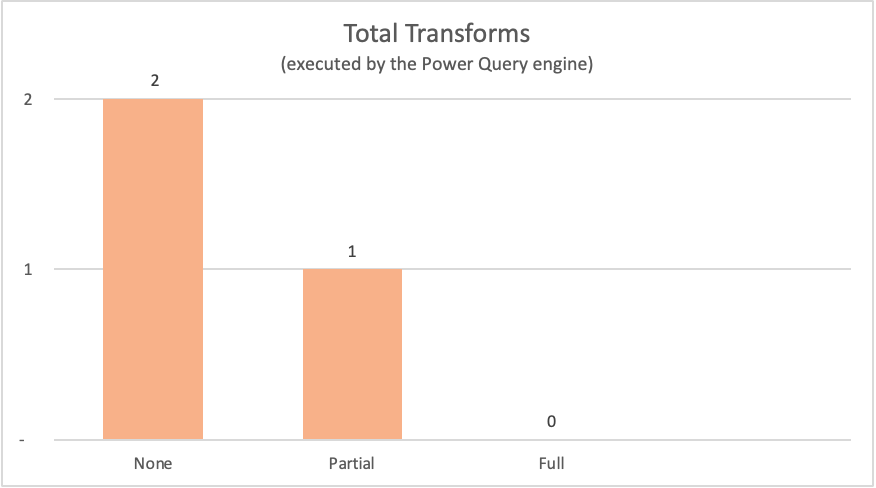

For the examples showcased in this article, the full query folding example doesn't require any transforms to happen inside the Power Query engine as the require output table comes directly from the data source. In contrast, the other two queries required some computation to happen at the Power Query engine and due to the amount of data that needs to be processed, the process for these examples takes more time than the full query folding example.

>[!TIP]
>While not every single transform requires the same resources to compute its resources, it is often more optimal to have a small number of nodes to show in the query plan. 

## Considerations and suggestions

* Follow the best practices when creating a new query as stated in [Best practices in Power Query](best-practices.md).
* Use the step folding indicators to check which steps are preventing your query from folding and re-order them if necessary to increase folding.
* Use the query plan to determine which transforms are happening at the Power Query engine for that particular step and consider re-arranging your query to check the updated query plan. For data sources that support folding, any nodes in the query plan other than Value.NativeQuery and data source access nodes represent transforms that didn’t fold.
* Check the **View Native Query** option is always recommended to make sure that your query can be folded back to the data source. If your step disables this option, you know that you've created a step that stops query folding. 
* Use the query diagnostics tool to your advantage and to better understand the requests being sent to your data source when query folding capabilities are available for the connector.
* When combining data sourced from the use of multiple connectors, Power Query tries to push as much work as possible to both of the data sources while complying with the privacy levels defined for each data source. 
* Read the article on [Privacy levels](dataprivacyfirewall.md) to protect your queries from running against a Data Privacy Firewall error.
* You can also use other tools to check query folding from the perspective of the request being received by the data source. Based on our example, you can use the Microsoft SQL Server Profile to check the requests being sent by Power Query and received by the Microsoft SQL Server.
* Whenever you add a new step to your query, Power Query will try to fold it back to the data source as a new data source query that will be evaluated by your data source.