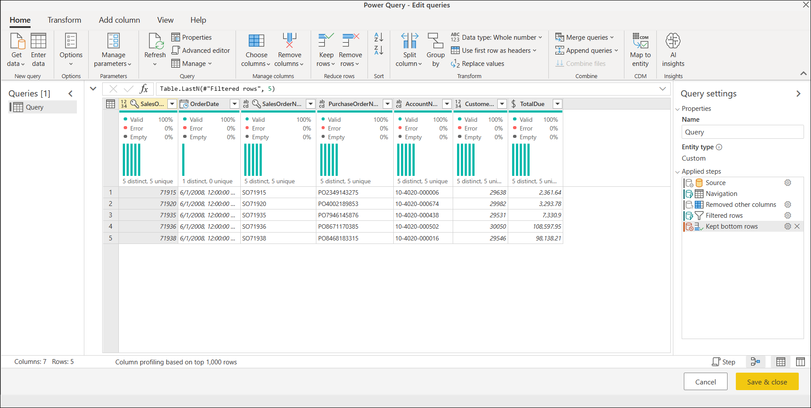
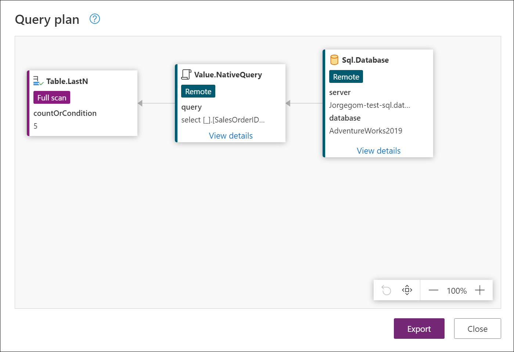
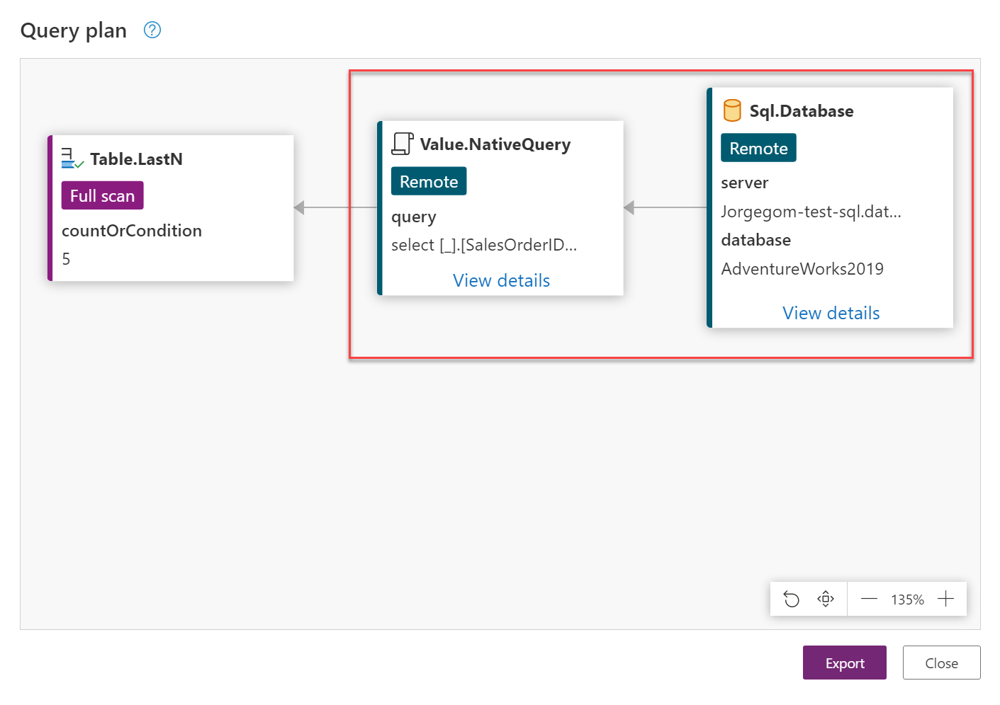
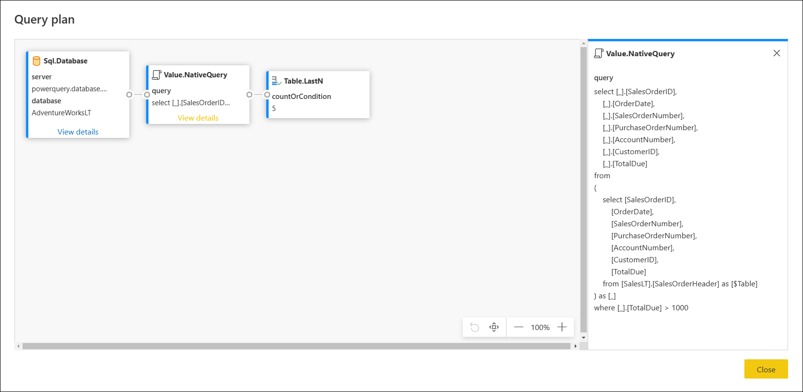
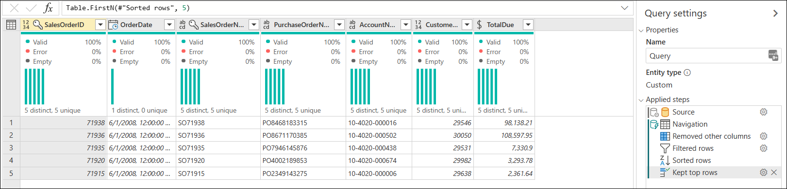

# Query plan for Power Query (Preview)

Query plan for Power Query is a feature that provides a better view on your query's evaluation. It's useful to help determine why a particular query might not fold at a particular step.

Through a practical example, this article will demonstrate the main use case and potential benefits of using the query plan feature to review your query steps. The examples used in this article have been created using the AdventureWorksLT sample database for Azure SQL Server, which you can download from the [official documentation here](https://docs.microsoft.com/sql/samples/adventureworks-install-configure?view=sql-server-ver15&tabs=ssms).

>[!NOTE]
>The query plan feature for Power Query is only available inside the Power Query Online experience.


This article has been divided in a series of recommended steps in order to interpret the query plan. These steps are:
1. [Review the step folding indicators](#1-review-the-step-folding-indicators)
2. [Select the query step to review its query plan](#2-select-the-query-step-to-review-its-query-plan)
3. [Implement changes to your query](#3-implement-changes-to-your-query)

Follow these steps to create the query in your own Power Query Online environment.
1. Open your Power Query Online experience.
2. Create a new blank query and replace the query's script with the one below.
```
let
  Source = Sql.Database("servername", "database"),
  Navigation = Source{[Schema = "Sales", Item = "SalesOrderHeader"]}[Data],
  #"Removed other columns" = Table.SelectColumns(Navigation, {"SalesOrderID", "OrderDate", "SalesOrderNumber", "PurchaseOrderNumber", "AccountNumber", "CustomerID", "TotalDue"}),
  #"Filtered rows" = Table.SelectRows(#"Removed other columns", each [TotalDue] > 1000),
  #"Kept bottom rows" = Table.LastN(#"Filtered rows", 5)
in
  #"Kept bottom rows"
```
3. Before hitting next, be sure to change the "servername" and "database" with the correct names for your own environment
4. *(Optional)* If you are trying to connect to a server and database for an on-premises environment, be sure to configure a gateway for it.
5. Provide the credentials to your data source by clicking on the configure connection ribbon.

>[!NOTE]
>For more information about the SQL Server connector, you can read the article on conecting to a [SQL Server database](connectors/sqlserver.md). 

After following these steps, your query will look exactly like the one shown in the screenshot below:



This query connects to the SalesOrderHeader table, selects a few columns from the last five orders with a **TotalDue** value above 1000.

>[!NOTE]
>This article uses a simplified example to showcase this feature, but please bear in mind the concepts described in this article apply to all queries. It is recommended that you have a good knowledge of query folding before reading the query plan. You can learn more about query folding from the article [Query folding basics](query-folding-basics.md). 
## 1. Review the step folding indicators
>[!NOTE]
>Before reading this section, it is recommended that you review the article on [Step Folding Indicators](step-folding-indicators.md).

Your first step in this process is to review your query and pay close attention to the step folding indicators. The goal is to review the steps that are marked as not folded and see if making changes to the overall query could make those transformations fold completely.

[  ](media/query-plan/step-folding-indicators-sample.png)

For this example, the only step that cannot be folded is **Kept bottom rows**, which is easy to identify through the *not folded* step indicator. This step is also the last step of the query.

The goal now is to review this step and understand what's being folded back to the data source and what can't be folded.

## 2. Select the query step to review its query plan
You've identified the **Kept bottom rows** step as a step of interest since it doesn't fold back to the data source. Right-click the step and select the option that reads **View Query plan**. This action will display a new dialog where you'll see a diagram for the query plan of the selected step.



Power Query tries to optimize your query by taking advantage of lazy evaluation and query folding as mentioned in the article on [Query folding basics](query-folding-basics.md). This query plan represents the optimized translation of your M query into the native query that will be sent to the data source and any transforms that will be performed locally.  

>[!NOTE]
>It's important to note that the query plan represents the optimized plan. When the engine is evaluating a query it will try to fold all operators into a data source. In some cases, it might even do some internal reordering of the steps to maximize folding. With this in mind, the nodes/operators left in this optimized query plan will typically contain the "folded" data source query and any operators that could not be folded and will be evaluated locally.

### Identify folded nodes from other nodes
You can identify the nodes in this diagram into two groups:
* **Folded nodes** -  This can be either "Value.NativeQuery" or "data source" nodes such as Sql.Database. 
* **Non-folded nodes** - Other table operators, such as Table.SelectRows, Table.SelectColumns, and other functions that couldn't be folded.

In the image below you'll see the folded nodes inside the red rectangle. The rest are nodes that could not be folded back to the data source. You'll need to review these nodes since the goal is to attempt to have those fold back to the data source.



You can click the *View details* text at the bottom of some nodes to display extended information. For example, the details of the Value.NativeQuery node show the native query (in SQL) that will be sent to the data source.




The query shown here might not be the exact same query sent to the data source, but it's a good approximation. The node next to it,  [Table.LastN](https://docs.microsoft.com/powerquery-m/table-lastn) is calculated locally by the Power Query engine as it can't be folded.

>[!NOTE]
>Note that the operators might not exactly match the functions used in the query's script.

### Review non-folded nodes and consider actions to take and make your transform fold
You've been able to determine which nodes couldn't be folded and would be evaluated locally. This case only has the Table.LastN node, but in other scenarios it could have many more.

The goal is to apply changes to your query so that the step can be folded. Some of the changes that you could implement could range from rearranging your steps to applying an alternate logic to your query that is more explicit to the data source. This doesn't mean that all queries and all operations are foldable by applying some changes, but it's a good practice to determine via trial and error if your query could be folded back.

Since the data source is a SQL Server database, if the goal is to retrieve the last five orders from the table, then a viable alternative would be to take advantage of the [TOP](https://docs.microsoft.com/sql/t-sql/queries/top-transact-sql?view=sql-server-ver15) and [ORDER BY](https://docs.microsoft.com/sql/t-sql/queries/select-order-by-clause-transact-sql?view=sql-server-ver15) clauses in SQL. Since there is no BOTTOM clause in SQL, the Table.LastN transform in PowerQuery cannot be translated into SQL. You could remove the Table.LastN step and replace it with:
1. **A sort descending step** - by the SalesOrderID column from the table since this column determines which order goes first and which has been entered last.
2. **Select the top five rows** - since the table has been sorted, this transform will accomplish the same as if it was a *Kept bottom rows* (Table.LastN).  

This alternative is equivalent to the original query. While this in theory seems like a good alternative, you need to make the changes in order to see if this will make this fully fold back to the data source.
## 3. Implement changes to your query
Implement the alternative discussed in the previous section:
* Close the query plan dialog and go back to the Power Query Editor. 
* Remove the Kept bottom rows step.
* Sort the **SalesOrderID** column in descending order


* Click the table icon on the top-left corner of the data preview view and select the option that reads Keep top rows. In the dialog, pass the number five as the argument and hit OK.


After implementing the changes, check again the step folding indicators and see if it is giving you a folded indicator.



Now it is time to review the query plan of the last step that is now the **Keep top rows**. Note how now there are only folded nodes. Click the view details of the Value.NativeQuery to verify which query is being sent to the database.


While the article is suggesting what alternative to apply, the main objective is for you to learn how to use the query plan to investigate query folding, and provide visibility of what's being sent to your data source and what transforms will be done locally. 

You can tweak your code to see the impact that it has in your query and, using the step folding indicators, have a better idea of which steps are preventing your query from folding.