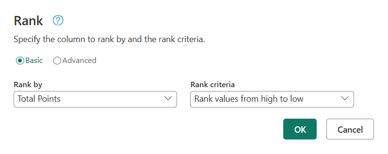
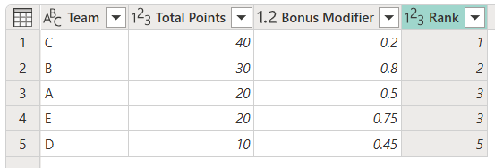

# Rank column (Preview)

The **Rank column** command adds a new column to a table with the ranking defined by one or more other columns from the table. A *Rank kind* option can be used to define how ties should be handled.

>[!NOTE]
>Currently, the Rank column feature is only available in Power Query Online.

## Adding a rank column

For the table below that has the fields *Team*, *Total Points* and *Bonus modifier*, imagine that you're tasked with the creation of a new column that effectively ranks the Teams using the values from the *Total Points* and *Bonus modifier* fields.

|Team|Total Points|Bonus modifier|
|----|------------|--------------|
|A|20|0.5|
|B|30|0.8|
|C|40|0.2|
|D|10|0.45|
|E|20|0.75|

The teams have shared a list of ways that they want to rank each other:

* [Using only the values from the *Total Points* field where higher values rank higher using **standard competition as the rank method**](#single-column-rank)
* [Using only the values from the *Total Points* field where higher values rank higher using **dense as the rank method**](#single-column-rank-with-specific-rank-method)
* [Ranking first by the *Total Points* and then by *Bonus modifier* where higher values rank higher using the **standard competition as rank method**](#multiple-column-rank-with-specific-rank-method)

### Single column rank

For the first requirement shared by the teams of using only the values from the *Total Points* field where higher values rank higher using **standard competition as the rank method**, you can follow the next steps.

1. With the original table already in Power Query, select the *Total Points* column and then select the **Rank column** button from the ribbon inside the *Add column* tab.
2. The rank dialog will appear where the *Rank by* should be the field selected (*Total Points*) and the *Rank criteria* should be "Higher value ranks higher".

 
By default, the rank method for this dialog is the **standard competition**, so you can simply select OK and this will give you a new step with the added Rank column.

### Single column rank with specific rank method

For the second requirement shared by the teams of using only the values from the *Total Points* field where higher values rank higher using **dense as the rank method**, you can follow the next steps.

1. With the original table already in Power Query, select the *Total Points* column and then select the **Rank column** button from the ribbon inside the *Add column* tab.
2. The rank dialog will appear where the *Rank by* should be the field selected (*Total Points*) and the *Rank criteria* should be "Higher value ranks higher".
3. Select the **Advanced** radio button on the top of the dialog to enable the advanced section of the dialog and in the Rank method section be sure to change the value from **Standard competition** to **Dense**.

After selecting the rank method, you can select the OK button, and this will give you a new step with the added Rank column.

### Multiple column rank with specific rank method

For the third requirement shared by the teams of ranking first by the *Total Points* and then by *Bonus modifier* where higher values rank higher using the **standard competition as rank method**, you can follow the next steps.

1. With the original table already in Power Query, select the *Total Points* and then *Bonus modifier* columns and then select the **Rank column** button from the ribbon inside the *Add column* tab.
2. The rank dialog should appear in its advanced section showing you both fields selected in the **Rank by** column, Total Points first and then Bonus modifier below it, and both using the *Rank criteria* of "Higher value ranks higher".
3. Make sure that the *Rank method* at the bottom is set to be **Standard competition**.

After verifying the above, you can select the OK button and this will give you a new step with the added Rank column.

## Rank methods

A rank method is what establishes the strategy in which ties will be handled by the ranking algorithm. This option is only available in the advanced section of the **Rank** dialog.

Below is a table that lists all three available rank methods and a description for each of them.

|Rank method|Description|
|-----------|-----------|
|Standard| Items that compare equal receive the same ranking number, and then a gap is left in the ranking numbers. for example, 1224|
|Dense| Items that compare equally receive the same ranking number, and the next items receive the immediately following ranking number. for example, 1223|
|Ordinal| All items receive distinct ordinal numbers, including items that compare equal. for example, 1234|