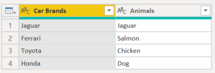
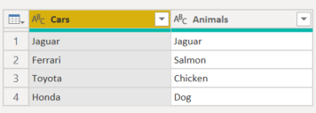
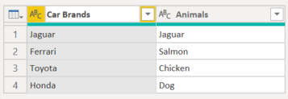
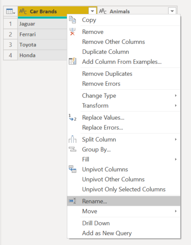

# Renaming a column

In Power Query, you can rename columns to format the dataset in a clearer and concise way. 

As an example, we'll start with this dataset:

and eventually the dataset columns will look like:

## How to rename a column

The first way to rename the column is to double select the column header where the name is. The double select action will immediately allow you to rename the column.

The second way is to open the context pane on the column header and from there, select on the **Rename...** selection.

Then you can change the name of the column as like above.

## Avoiding duplicate column names

If you try to rename the column to a column name that already exists, an error will appear. You will have to rename the column to something else.

## Replacing header actions

Any new action promoting the column headers based on the data and replacing the current column names will come with caveats.

If there are any repeated column names based on the header data, then the second matching column name will have suffix containing an underscore or period followed by a number.

### Use First Row as Headers action

To see the changes, you want to replace the headers with the first row of data use the **Use First Row as Headers** option. The column headers will then look like below. 

### Group By action

If you use a **Group By** action on a column with a matching name, then the result of the **Group By** will have a suffix with a period the number of the matching column names.

