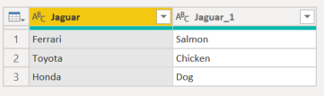
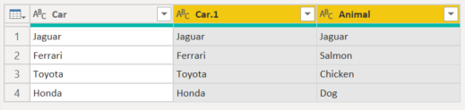

# Renaming a column

In Power Query, you can rename columns to format the dataset in a clear and concise way. 

As an example, we'll start with a dataset that has 2 columns as shown below.

|Column 1|Column 2|
-------|-----
Panama|Panama
USA| New York
Canada | Toronto

Note that the column headers are **Column 1** and **Column 2**, but you want to change those names for a more friendly name to your columns as follows.

|Original column Name | New column name|
-----|---
Column 1|Country
Column 2|City

The end result that you want in your Power Query is a query that looks like the following.

## How to rename a column

There are three ways to rename a column in Power Query.

* **Double-click the column header** - The double-click action will immediately allow you to rename the column.

* **Right-click the column of your choice** - A contextual menu will be displayed and you can select the option that reads **Rename** to rename the select column.

* **Rename option in the Transform tab** - You can select the **Rename** option from within the *Any column* group in the Transform tab as shown below.

## Avoiding duplicate column names

If you try to rename the column to a column name that already exists, an error will appear. You will have to rename the column to something else.

## Replacing header actions

Any new action promoting the column headers based on the data and replacing the current column names will come with caveats.

If there are any repeated column names based on the header data, then the second matching column name will have suffix containing an underscore or period followed by a number.

### Use First Row as Headers action

To see the changes, you want to replace the headers with the first row of data use the **Use First Row as Headers** option. The column headers will then look like below. 

### Group By action

If you use a **Group By** action on a column with a matching name, then the result of the **Group By** will have a suffix with a period the number of the matching column names.

