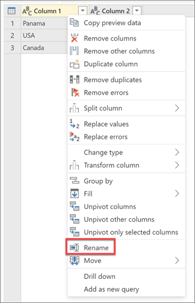
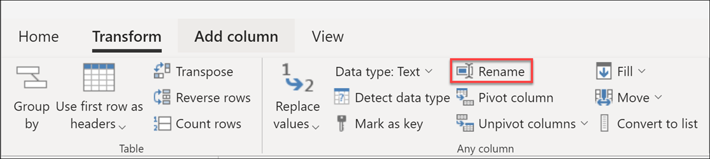

# Rename columns

In Power Query, you can rename columns to format the dataset in a clear and concise way. 

As an example, we'll start with a dataset that has 2 columns as shown below.

|Column 1|Column 2|
-------|-----
Panama|Panama
USA| New York
Canada | Toronto

The column headers are **Column 1** and **Column 2**, but you want to change those names for a more friendly name to your columns as follows.

|Original column Name | New column name|
-----|---
Column 1|Country
Column 2|City

The end result that you want in your Power Query is a query that looks like the following.

## How to rename a column

There are three ways to rename a column in Power Query.

* **Double-click the column header** - The double-click action will immediately allow you to rename the column.

* **Right-click the column of your choice** - A contextual menu will be displayed and you can select the option that reads **Rename** to rename the select column.

* **Rename option in the Transform tab** - You can select the **Rename** option from within the *Any column* group in the Transform tab as shown below.

## Avoiding duplicate column names

Power Query requires the table column names to be unique across all columns. This means that if you try to rename a column to a column name that already exists in the table, an error with the message *Column Name Conflict* will appear. You will have to rename the column to something else.

For example, for the first sample table provided in this article, imagine that you try to rename both **Column 1** and **Column 2** to "Geography". An error message will pop up that will prevent you from renaming a second column "Geography". 

## Column name disambiguation

With many actions performed in Power Query that might result in a *Column Name Conflict*, Power Query will try to disambiguate by renaming all duplicate instances of the same column name. The way that Power Query renames these columns is by adding a suffix to the original column name that has a separator (commonly a dot or an underscore) and then a number that represents the instance of the duplicated column name in the order that it was found by Power Query. This can often happen with actions such as but not limited to.

* **Promoting your column headers from your first row** -  For example, if you tried promoting the first row of the sample table in this article it will rename the columns to be **Panama** and **Panama_1**.

>[!NOTE]
> You can learn more about how to promote headers from your first row in the article [Promote or demote column headers](table-promote-demote-headers.md).

* **Expanding a column with a field name that also exists in the current table** -  This can happen, for example, when you perform a Merge operation and the column with the merged table has field names that also exist in the table. When you try to expand the fields from that column, Power Query will automatically try to disambiguate to prevent *Column Name Conflict* errors.

>[!NOTE]
> You can learn more about how to merge tables in Power Query from the article [Promote or demote column headers](merge-queries-overview.md).
