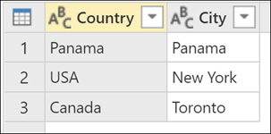
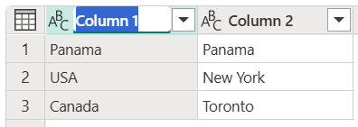
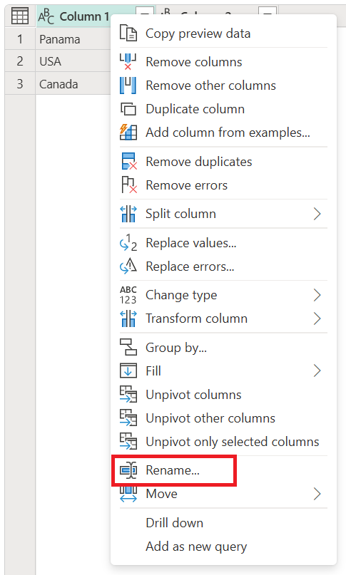
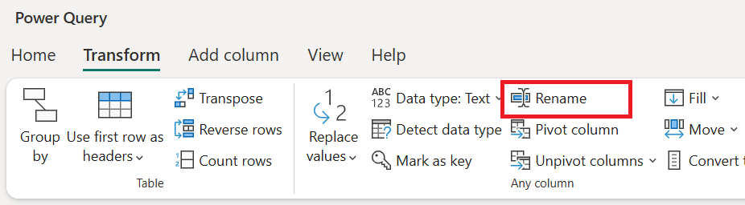
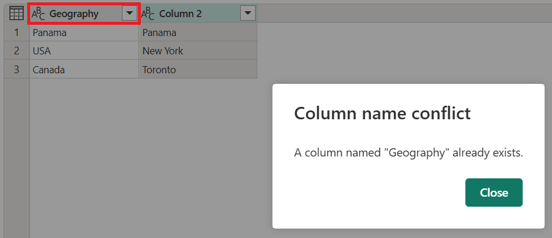
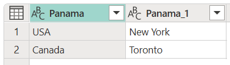
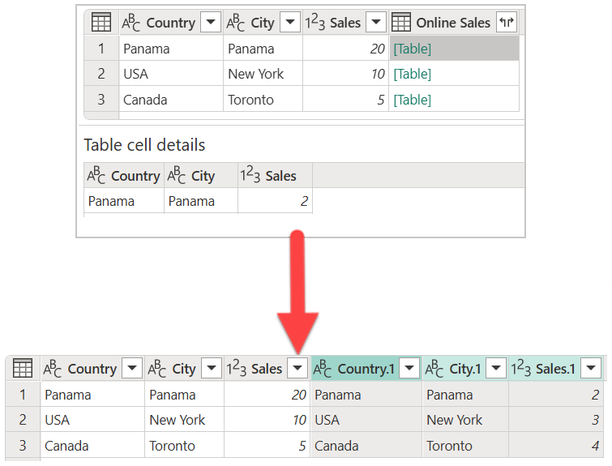

# Rename columns

In Power Query, you can rename columns to format the data set in a clear and concise way.

As an example, let's start with a data set that has two columns.

|Column 1|Column 2|
-------|-----
Panama|Panama
USA| New York
Canada | Toronto

The column headers are **Column 1** and **Column 2**, but you want to change those names to more friendly names for your columns.

* **Column 1** becomes **Country**
* **Column 2** becomes **City**

The end result that you want in Power Query looks like the following table.

## How to rename a column

There are three ways to rename a column in Power Query.

* **Double-click the column header**: The double-click action immediately lets you rename the column.

   

* **Right-click the column of your choice**: A contextual menu is displayed and you can select the **Rename** option to rename the selected column.

   

* **Rename option in the Transform tab**: In the **Transform** tab, under the **Any column** group, select the **Rename** option.

   

## Avoiding duplicate column names

Power Query requires table column names to be unique across all columns. This means that if you try to rename a column to a column name that already exists in the table, an error with the message *Column Name Conflict* appears. You'll have to rename the column to something else.

For example, for the first sample table provided in this article, imagine that you try to rename both **Column 1** and **Column 2** to "Geography". An error message pops up that prevents you from renaming the second column to "Geography".

## Column name disambiguation

With many actions performed in Power Query that might result in a *Column Name Conflict*, Power Query tries to disambiguate by renaming all duplicate instances of the same column name. The way that Power Query renames these columns is by adding a suffix to the original column name that has a separator (commonly a dot or an underscore), and then a number that represents the instance of the duplicated column name in the order that it was found by Power Query. This renaming can often happen with actions such as, but not limited to:

* **Promoting your column headers from your first row**:  For example, if you tried promoting the first row of the sample table in this article, Power Query renames the columns to **Panama** and **Panama_1**.

   

   > [!NOTE]
   > To learn more about how to promote headers from your first row, go to [Promote or demote column headers](table-promote-demote-headers.md).

* **Expanding a column with a field name that also exists in the current table**: This can happen, for example, when you perform a merge operation and the column with the merged table has field names that also exist in the table. When you try to expand the fields from that column, Power Query automatically tries to disambiguate to prevent *Column Name Conflict* errors.

   
