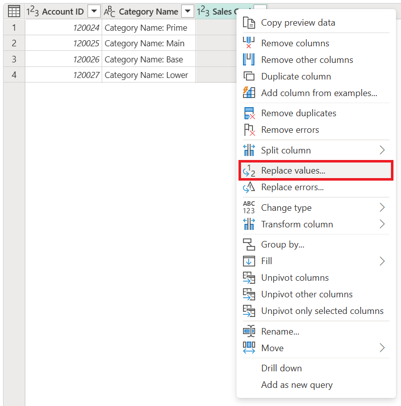

# Replace values and errors

With Power Query, you can replace one value with another value wherever that value is found in a column. The **Replace values** command can be found:

- On the cell shortcut menu. Right-click the cell to replace the selected value in the column with another value.

   

- On the column shortcut menu.

   

- On the **Home** tab, in the **Transform** group.

   

- On the **Transform** tab, in the **Any column** group.

   

The replace values operation has two modes:

- **Replace entire cell contents**: This is the default behavior for non-text columns, where Power Query searches for and replaces the full contents of a cell. You can enable this mode for text columns by selecting **Advanced options**, and then selecting the **Match entire cell contents** check box.
- **Replace instances of a text string**: This is the default behavior for text columns, where Power Query will search for a specific text string in all rows of a column and replace as many instances of the text string that it finds.

Advanced options are only available in columns of the Text data type. Within that set of options is the **Replace using special characters** option.

## Replace entire cell contents

Imagine a table like the following, where you have columns for **Account ID**, **Category Name**, and **Sales Goal**.

The value of **-1** in the **Sales Goal** column is an error in the source and needs to be replaced with the standard sales goal defined by the business for these instances, which is 250,000. To do that, right-click the **-1** value, and then select **Replace values**. This action will bring up the **Replace values** dialog box with **Value to find** set to **-1**. Now all you need to do is enter **250000** in the **Replace with** box.

The outcome of that operation will give you the result that you're looking for.

## Replace instances of a text string

Continuing with the previous table, let's say you want to remove the text string "Category Name: " from the **Category Name** column. To do that, go to the **Transform** group on the **Home** tab, and select **Replace values**. In the **Replace values** dialog box, enter the text string **Category Name:** (followed by a space) in the **Value to find** box, leave the **Replace with** box empty, and then select **OK**.

The result of that operation gives you the table in the following image.

