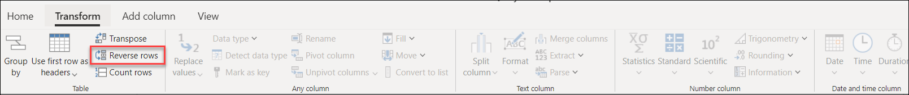
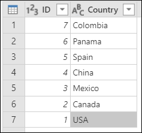

# Reverse rows

With Power Query is possible to reverse the rows of a table with one single click. 

Imagine the following table with 2 columns, ID and Country:

To reverse the rows of this table we can go to the Transform tab and select the option to reverse rows from the Table group as shown in the next image:

The result of that operation will give us the result that we're looking for:

