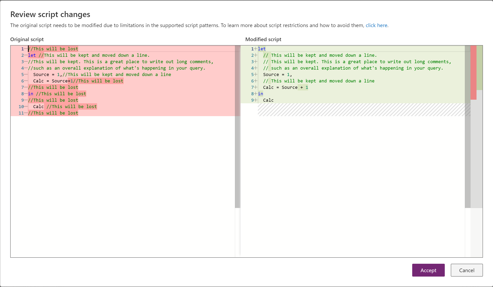

# Review script changes in Power Query Online

## Background

Due to the way that queries are stored in Power Query Online, there are cases where manually entered M script (generally comments) is lost. The **Review Script Changes** pane provides a "diff" experience highlighting the changes, which allows users to understand what changes are being made. Users can then accept the changes or rearrange their script to fix it.

There are three notable cases that may cause this experience.

### Script for ribbon transforms

Ribbon transforms always generate the same M script, which may be different than the way they are manually entered. This should always be equivalent script. Contact support if this is not the case.

### Comments

Comments always have to be inside the ```Let .. in``` expression, and above a step. This will be shown in the user interface as a 'Step property'. We lose all other comments. Comments that are written on the same line as one step, but above another step (for example, after the comma that trails every step) will be moved down.

### Removing script errors

In certain cases, your script will be updated if it results in a syntax error by escaping your script (for example, when using the formula bar).

## Experience

When you commit a query, Power Query Online will evaluate it to see if the 'stored' version of the script differs at all from what you have submitted. If it does, it will present you with a **Review script changes** dialog box that will allow you to accept or cancel.

- If you accept, the changes will be made to your query.
- If you cancel, you might rewrite your query to make sure that you move your comments properly, or rearrange however else you want.


