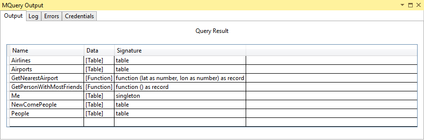

# TripPin Part 1 - Data Connector for an OData Service

This multi-part tutorial covers the creation of a new data source extension for Power Query. The tutorial is meant to be done sequentially&mdash;each lesson builds on the connector created in previous lessons, incrementally adding new capabilities to your connector.

In this lesson, you will:

> [!div class="checklist"]
> * Create a new Data Connector project using the Visual Studio SDK
> * Author a base function to pull data from a source
> * Test your connector in Visual Studio
> * Register your connector in Power BI Desktop

## Creating a Basic OData Connector

In this section, you will create a new Data Connector project, provide some basic information, and test it in Visual Studio.

Open Visual Studio, and create a new Project. Under the Power Query folder, select the Data Connector project. For this sample, set the project name to `TripPin`.


Open the TripPin.pq file and paste in the following connector definition.

```
section TripPin;

[DataSource.Kind="TripPin", Publish="TripPin.Publish"]
shared TripPin.Feed = Value.ReplaceType(TripPinImpl, type function (url as Uri.Type) as any);

TripPinImpl = (url as text) =>
    let
        source = OData.Feed(url)
    in
        source;

// Data Source Kind description
TripPin = [
    Authentication = [
        Anonymous = []
    ],
    Label = "TripPin Part 1 - OData"
];

// Data Source UI publishing description
TripPin.Publish = [
    Beta = true,
    Category = "Other",
    ButtonText = { "TripPin OData", "TripPin OData" }
];
```

 This connector definition contains:

* A Data Source definition record for the TripPin connector
* A declaration that Implicit (Anonymous) is the only authentication type for this source
* A function (`TripPinImpl`) with an implementation that calls [OData.Feed](/powerquery-m/odata-feed)
* A shared function (`TripPin.Feed`) that sets the parameter type to `Uri.Type`
* A Data Source publishing record that will allow the connector to appear in the Power BI **Get Data** dialog 

Open the TripPin.query.pq file. Replace the current contents with a call to your exported function.

```
TripPin.Feed("https://services.odata.org/v4/TripPinService/")
```

Select the **Start** button to launch the M Query utility.

The \<project>.query.pq file is used to test out your extension without having to deploy it to your Power BI Desktop's bin folder. Selecting the **Start** button (or pressing **F5**) automatically compiles your extension and launches the M Query utility.

Running your query for the first time results in a credential error. In Power Query, the hosting application would convert this error into a credential prompt. In Visual Studio, you'll receive a similar prompt that calls out which data source is missing credentials and its data source path. Select the shortest of the data source paths (`https://services.odata.org/`)&mdash;this will apply your credential to all URLs under this path.

Select the **Anonymous** credential type, and then select **Set Credential**.


Select **OK** to close the dialog, and then select the **Start** button once again. You see a query execution status dialog, and finally a Query Result table showing the data returned from your query.



You can try out a few different OData URLs in the test file to see what how different results are returned. For example:

* `https://services.odata.org/v4/TripPinService/Me`
* `https://services.odata.org/v4/TripPinService/GetPersonWithMostFriends()`
* `https://services.odata.org/v4/TripPinService/People`

The TripPin.query.pq file can contain single statements, let statements, or full section documents.

```
let
    Source = TripPin.Feed("https://services.odata.org/v4/TripPinService/"),
    People = Source{[Name="People"]}[Data],
    SelectColumns = Table.SelectColumns(People, {"UserName", "FirstName", "LastName"})
in
    SelectColumns
```

Open [Fiddler](https://www.telerik.com/fiddler) to capture HTTP traffic, and run the query. You should see a few different requests to services.odata.org, generated by the mashup container process. You can see that accessing the root URL of the service results in a 302 status and a redirect to the longer version of the URL. Following redirects is another behavior you get “for free” from the base library functions.

One thing to note if you look at the URLs is that you can see the query folding that happened with the `SelectColumns` statement.
`https://services.odata.org/v4/TripPinService/People?$select=UserName%2CFirstName%2CLastName`

If you add more transformations to your query, you can see how they impact the generated URL.

This behavior is important to note. Even though you did not implement explicit folding logic, your connector inherits these capabilities from the [OData.Feed](/powerquery-m/odata-feed) function. M statements are compose-able&mdash;filter contexts will flow from one function to another, whenever possible. This is similar in concept to the way data source functions used within your connector inherit their authentication context and credentials. In later lessons, you'll replace the use of [OData.Feed](/powerquery-m/odata-feed), which has native folding capabilities, with [Web.Contents](/powerquery-m/web-contents), which does not. To get the same level of capabilities, you'll need to use the `Table.View` interface and implement your own explicit folding logic.

## Loading Your Extension in Power BI Desktop

To use your extension in Power BI Desktop, you'll need to copy your connector project's output file (TripPin.mez) to your Custom Connectors directory.

1. In Visual Studio, select **Build | Build Solution (F6)** from the menu bar. This will generate the .mez file for you project. By default, this will go in your project's bin\Debug folder.
2. Create a `[My Documents]\Power BI Desktop\Custom Connectors` directory.
3. Copy the extension file into this directory.
4. Check the option **(Not Recommended) Allow any extension to load without validation or warning** in Power BI Desktop (under **File** > **Options and settings** > **Options** > **Security** > **Data Extensions**).
5. Restart Power BI Desktop.
6. Select **Get Data > More** to bring up the **Get Data** dialog.

You can locate your extension by typing its name into the search box.


Select the function name, and select **Connect**. A third-party message appears&mdash;select **Continue** to continue. The function invocation dialog now appears. Enter the root URL of the service (`https://services.odata.org/v4/TripPinService/`), and select **OK**.


Since this is the first time you are accessing this data source, you'll receive a prompt for credentials. Check that the shortest URL is selected, and then select **Connect**.


Notice that instead of getting a simple table of data, the navigator appears. This is because the [OData.Feed](/powerquery-m/odata-feed) function returns a table with special metadata on top of it that the Power Query experience knows to display as a navigation table. This walkthrough will cover how you can create and customize your own navigation table in a future lesson.


Select the **Me** table, and then select **Transform Data**. Notice that the columns already have types assigned (well, most of them). This is another feature of the underlying [OData.Feed](/powerquery-m/odata-feed) function. If you watch the requests in [Fiddler](https://www.telerik.com/fiddler), you'll see that you've fetched the service's $metadata document. The engine's OData implementation does this automatically to determine the service's schema, data types, and relationships.


## Conclusion

This lesson walked you through the creation of a simple connector based on the [OData.Feed](/powerquery-m/odata-feed) library function. As you saw, very little logic is needed to enable a fully functional connector over the `OData` base function. Other extensibility enabled functions, such as [ODBC.DataSource](/powerquery-m/odbc-datasource), provide similar capabilities.

In the next lesson, you'll replace the use of [OData.Feed](/powerquery-m/odata-feed) with a less capable function&mdash;[Web.Contents](/powerquery-m/web-contents). Each lesson will implement more connector features, including paging, metadata/schema detection, and query folding to the OData query syntax, until your custom connector supports the same range of capabilities as [OData.Feed](/powerquery-m/odata-feed).

## Next steps

[TripPin Part 2 - Data Connector for a REST Service](../2-Rest/README.md)
