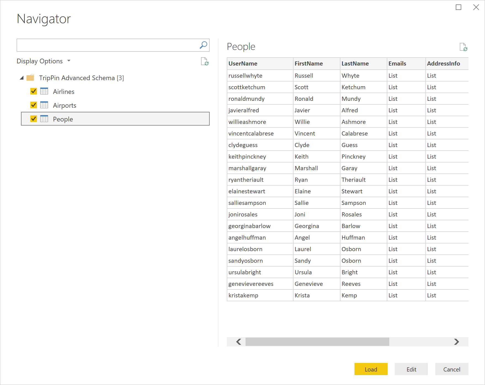

# TripPin part 9 - TestConnection

This multi-part tutorial covers the creation of a new data source extension for Power Query. The tutorial is meant to be done sequentially&mdash;each lesson builds on the connector created in previous lessons, incrementally adding new capabilities to your connector.

In this lesson, you'll:

> [!div class="checklist"]
> * Add a TestConnection handler
> * Configure the on-premises data gateway (personal mode)
> * Test scheduled refresh through the Power BI service

Custom connector support was added to the April 2018 release of the [personal on-premises data gateway](/data-integration/gateway/service-gateway-install#download-and-install-a-personal-mode-gateway).
This new (preview) functionality allows for Scheduled Refresh of reports that make use of your custom connector.

This tutorial will cover the process of enabling your connector for refresh, and provide a quick walkthrough of the steps to configure the gateway. Specifically you'll:

1. Add a TestConnection handler to your connector.
2. Install the On-Premises Data Gateway in Personal mode.
3. Enable Custom Connector support in the Gateway.
4. Publish a workbook that uses your connector to PowerBI.com.
5. Configure scheduled refresh to test your connector.

Go to [Handling Gateway Support](../../../HandlingGatewaySupport.md) for more information on the TestConnection handler.

## Background

There are three prerequisites for configuring a data source for scheduled refresh using PowerBI.com:

* **The data source is supported:** This means that the target gateway environment is aware of all of the functions contained in the query you want to refresh.
* **Credentials are provided:** To present the right credential entry dialog, Power BI needs to know the support authentication mechanism for a given data source.
* **The credentials are valid:** After the user provides credentials, they're validated by calling the data source's `TestConnection` handler.

The first two items are handled by registering your connector with the gateway.
When the user attempts to configure scheduled refresh in PowerBI.com, the query information is sent to your personal gateway to determine if any data sources that aren't recognized by the Power BI service (that is, custom ones that you created) are available there.
The third item is handled by invoking the TestConnection handler defined for your data source.

## Adding a TestConnection handler

The TestConnection handler is added to the Data Source Kind declaration record (the same place you declare its supported authentication type(s)).
The handler is a `function` with a single parameter of type `any`, which returns a `list`.
The first value in the list is the function that will be called to actually test the connection. This is generally the same as your main data source function.
In some cases you may need to expose a separate `shared` function to provide an efficient connection test, however, this should generally be avoided.

Since the TripPin data source function has no required arguments, the implementation for TestConnection is fairly simple:

```powerquery-m
// Data Source Kind description
TripPin = [
    // TestConnection is required to enable the connector through the Gateway
    TestConnection = (dataSourcePath) => { "TripPin.Contents" },
    Authentication = [
        Anonymous = []
    ],
    Label = "TripPin Part 9 - TestConnection"
];
```

>[!Note]
> Future versions of the Power Query SDK will provide a way to validate the TestConnection handler from Visual Studio. Currently, the only mechanism that uses TestConnection is the on-premises data gateway.

## Enabling custom connectors in the personal gateway

Download and install the [on-premises data gateway](/data-integration/gateway/service-gateway-install#download-and-install-a-personal-mode-gateway). When you run the installer, select the personal mode.

After installation is complete, launch the gateway and sign into Power BI. The sign-in process will automatically register your gateway with the Power BI services. Once signed in, perform the following steps:

1. Select the **Connectors** tab.
2. Select the switch to enable support for **Custom data connectors**.
3. Select the directory you want to load custom connectors from. This will usually be the same directory that you'd use for Power BI Desktop, but the value is configurable.
4. The page should now list all extension files in your target directory.


Go to the [online documentation](/data-integration/gateway/) for more information about the gateway.

## Testing scheduled refresh

Open Power BI Desktop and create a report that imports data using the TripPin connector.



Add one or more visuals to your report page (optional), and then publish the report to PowerBI.com.

After publishing, go to PowerBI.com and find the dataset for the report you just published. Select the ellipses, and then select **Schedule Refresh**. Expand the **Gateway connection** and **Data source credentials** sections.


>[!Note]
> If the dataset configuration page says that the report contains unknown data sources, your gateway/custom connector might not be configured properly. Go to the personal gateway configuration UI and make sure that there are no errors next to the TripPin connector. You may need to restart the gateway (on the **Service Settings** tab) to pick up the latest configuration.

Select the **Edit credentials** link to bring up the authentication dialog, and then select sign-in.

>[!Note]
> If you receive an error similar to the one below ("Failed to update data source credentials"), you most likely have an issue with your TestConnection handler.


After a successful call to TestConnection, the credentials will be accepted. You can now schedule refresh, or select the dataset ellipse and then select **Refresh Now**. You can select the **Refresh history** link to view the status of the refresh (which generally takes a few minutes to get kicked off).


## Conclusion

Congratulations! You now have a production ready custom connector that supports automated refresh through the Power BI service.

## Next steps

[TripPin Part 10 - Query Folding](../10-tableview1/readme.md)
