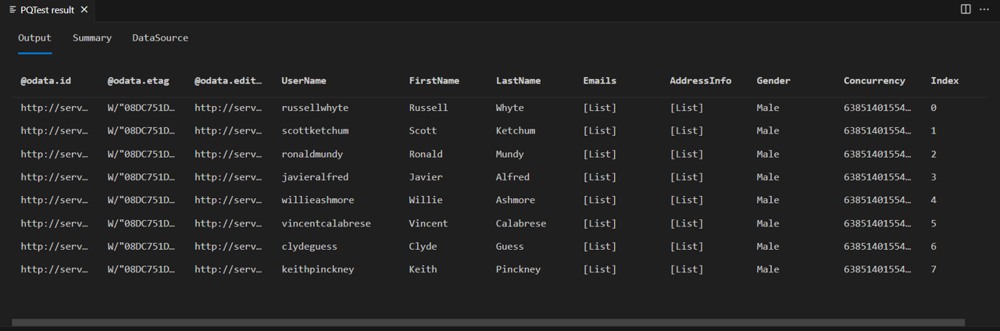
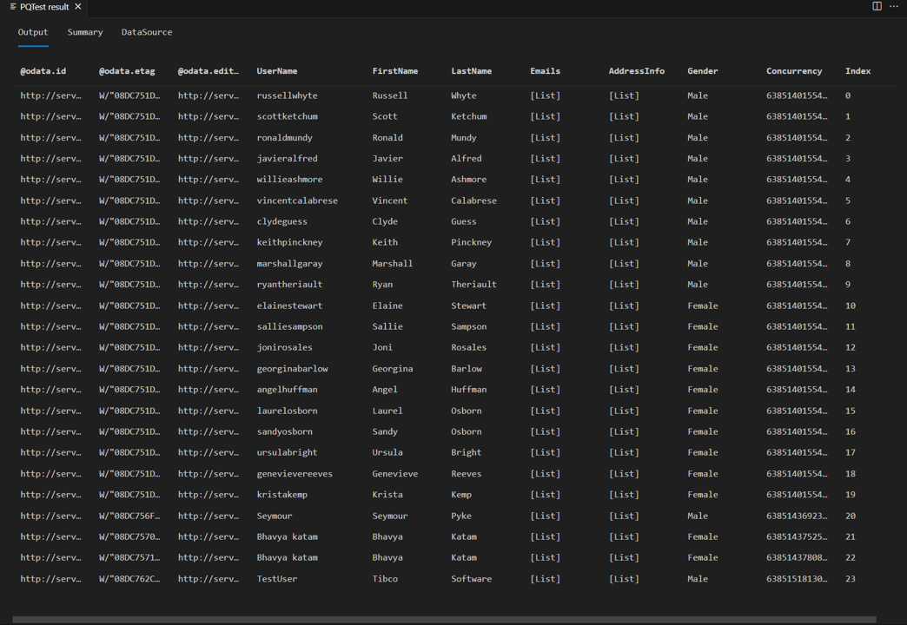

# TripPin part 5 - Paging

This multi-part tutorial covers the creation of a new data source extension for Power Query. The tutorial is meant to be done sequentially&mdash;each lesson builds on the connector created in previous lessons, incrementally adding new capabilities to your connector.

In this lesson, you will:

> [!div class="checklist"]
> * Add paging support to the connector

Many Rest APIs return data in "pages", requiring clients to make multiple requests to stitch the results together. 
Although there are some common conventions for pagination (such as [RFC 5988](https://tools.ietf.org/html/rfc5988)), it 
generally varies from API to API. Thankfully, TripPin is an OData service, and the [OData standard](https://docs.oasis-open.org/odata/odata-json-format/v4.0/cs01/odata-json-format-v4.0-cs01.html)
defines a way of doing pagination using [odata.nextLink](https://docs.oasis-open.org/odata/odata-json-format/v4.0/cs01/odata-json-format-v4.0-cs01.html#_Toc365464689) values returned in the body of the response.

To simplify [previous iterations](../4-paths/readme.md) of the connector, the `TripPin.Feed` function wasn't _page aware_. It simply parsed whatever JSON was returned from the request and formatted it as a table. Those familiar with the OData protocol might have noticed that many incorrect assumptions were made on the [format of the response](https://docs.oasis-open.org/odata/odata-json-format/v4.0/cs01/odata-json-format-v4.0-cs01.html#_Toc365464681)
(such as assuming there's a `value` field containing an array of records).

In this lesson, you'll improve your response handling logic by making it page aware.
Future tutorials make the page handling logic more robust and able to handle multiple response formats (including errors from the service).

>[!Note]
> You do not need to implement your own paging logic with connectors based on [OData.Feed](/powerquery-m/odata-feed), as it handles it all for you automatically.

## Paging checklist

When implementing paging support, you'll need to know the following things about your API:

* How do you request the next page of data?
* Does the paging mechanism involve calculating values, or do you extract the URL for the next page from the response?
* How do you know when to stop paging? 
* Are there parameters related to paging that you should be aware of? (such as "page size")

The answer to these questions impact the way you implement your paging logic. While there's some amount of code reuse
across paging implementations (such as the use of [Table.GenerateByPage](../../../helper-functions.md#tablegeneratebypage), most connectors will
end up requiring custom logic.

>[!Note]
> This lesson contains paging logic for an OData service, which follows a specific format. Check the documentation for your API to determine the changes you'll need to make in your connector to support its paging format.

## Overview of OData Paging

OData paging is driven by [nextLink annotations](https://docs.oasis-open.org/odata/odata-json-format/v4.0/cs01/odata-json-format-v4.0-cs01.html#_Annotation_odata.nextLink) contained within the response payload. The nextLink value contains the URL to the next page of data. You'll know if there's another page of data by looking for an `odata.nextLink` field in outermost object in the response. If there's no `odata.nextLink` field, you've read all of your data.

```json
{
  "odata.context": "...",
  "odata.count": 37,
  "value": [
    { },
    { },
    { }
  ],
  "odata.nextLink": "...?$skiptoken=342r89"
}
```

Some OData services allow clients to supply a [max page size preference](https://docs.oasis-open.org/odata/odata/v4.0/errata03/os/complete/part1-protocol/odata-v4.0-errata03-os-part1-protocol-complete.html#_The_odata.maxpagesize_Preference), but it's up to the service whether or not to honor it. Power Query should be able to handle responses of any size, so you don't need to worry about specifying a page size preference&mdash;you can support whatever the service throws at you.

More information about [Server-Driven Paging](https://docs.oasis-open.org/odata/odata/v4.0/errata03/os/complete/part1-protocol/odata-v4.0-errata03-os-part1-protocol-complete.html#_Server-Driven_Paging) can be found in the OData specification.

### Testing TripPin

Before fixing your paging implementation, confirm the current behavior of the extension from the [previous tutorial](../4-paths/readme.md). The following test query retrieves the People table and add an index column to show your current row count.

```powerquery-m
let
    source = TripPin.Contents(),
    data = source{[Name="People"]}[Data],
    withRowCount = Table.AddIndexColumn(data, "Index")
in
    withRowCount
```

Turn on fiddler, and run the query in the Power Query SDK. You'll notice that the query returns a table with eight rows (index 0 to 7).



If you look at the body of the response from fiddler, you'll see that it does in fact contain an `@odata.nextLink` field, indicating that there are more pages of data available.

```json
{
  "@odata.context": "https://services.odata.org/V4/TripPinService/$metadata#People",
  "@odata.nextLink": "https://services.odata.org/v4/TripPinService/People?%24skiptoken=8",
  "value": [
    { },
    { },
    { }
  ]
}
```

## Implementing paging for TripPin

You're now going to make the following changes to your extension:

1. Import the common `Table.GenerateByPage` function
2. Add a `GetAllPagesByNextLink` function that uses [`Table.GenerateByPage`](../../../helper-functions.md#tablegeneratebypage) to glue all pages together
3. Add a `GetPage` function that can read a single page of data
4. Add a `GetNextLink` function to extract the next URL from the response
5. Update `TripPin.Feed` to use the new page reader functions

>[!Note]
> As stated earlier in this tutorial, paging logic will vary between data sources. The implementation here tries to break up the logic into functions that should be reusable for sources that use _next links_ returned in the response.

### Table.GenerateByPage

To combine the (potentially) multiple pages returned by the source into a single table, we'll use [`Table.GenerateByPage`](../../../helper-functions.md#tablegeneratebypage). This function takes as its argument a `getNextPage` function that should do just what its name suggests: fetch the next page of data. `Table.GenerateByPage` will repeatedly call the `getNextPage` function, each time passing it the results produced the last time it was called, until it returns `null` to signal back that no more pages are available.

Since this function isn't part of Power Query's standard library, you'll need to copy its [source code](../../../helper-functions.md#tablegeneratebypage) into your.pq file.

### Implementing GetAllPagesByNextLink

The body of your `GetAllPagesByNextLink` function implements the `getNextPage` function argument for [`Table.GenerateByPage`](../../../helper-functions.md#tablegeneratebypage). It will call the `GetPage` function, and retrieve the URL for the next page of data from the `NextLink` field of the `meta` record from the previous call.

```powerquery-m
// Read all pages of data.
// After every page, we check the "NextLink" record on the metadata of the previous request.
// Table.GenerateByPage will keep asking for more pages until we return null.
GetAllPagesByNextLink = (url as text) as table =>
    Table.GenerateByPage((previous) => 
        let
            // if previous is null, then this is our first page of data
            nextLink = if (previous = null) then url else Value.Metadata(previous)[NextLink]?,
            // if NextLink was set to null by the previous call, we know we have no more data
            page = if (nextLink <> null) then GetPage(nextLink) else null
        in
            page
    );
```

### Implementing GetPage

Your `GetPage` function will use [Web.Contents](/powerquery-m/web-contents) to retrieve a single page of data from the TripPin service, and convert the response into a table. It passes the response from [Web.Contents](/powerquery-m/web-contents) to the `GetNextLink` function to extract the URL of the next page, and sets it on the `meta` record of the returned table (page of data).

This implementation is a slightly modified version of the `TripPin.Feed` call from the previous tutorials.

```powerquery-m
GetPage = (url as text) as table =>
    let
        response = Web.Contents(url, [ Headers = DefaultRequestHeaders ]),        
        body = Json.Document(response),
        nextLink = GetNextLink(body),
        data = Table.FromRecords(body[value])
    in
        data meta [NextLink = nextLink];
```

### Implementing GetNextLink

Your `GetNextLink` function simply checks the body of the response for an `@odata.nextLink` field, and returns its value.

```powerquery-m
// In this implementation, 'response' will be the parsed body of the response after the call to Json.Document.
// Look for the '@odata.nextLink' field and simply return null if it doesn't exist.
GetNextLink = (response) as nullable text => Record.FieldOrDefault(response, "@odata.nextLink");
```

### Putting it all together

The final step to implement your paging logic is to update `TripPin.Feed` to use the new functions. For now, you're simply calling through to `GetAllPagesByNextLink`, but in subsequent tutorials, you'll be adding new capabilities (such as enforcing a schema, and query parameter logic).

```powerquery-m
TripPin.Feed = (url as text) as table => GetAllPagesByNextLink(url);
```

If you re-run the same [test query](#testing-trippin) from earlier in the tutorial, you should now
see the page reader in action. You should also see that you have 24 rows in the response rather than eight.



If you look at the requests in fiddler, you should now see separate requests for each page of data.


>[!Note]
> You'll notice duplicate requests for the first page of data from the service, which is not ideal. The extra request is a result of the M engine's schema checking behavior. Ignore this issue for now and resolve it in the [next tutorial](../6-schema/readme.md), where you'll apply an explicit schema.

## Conclusion

This lesson showed you how to implement pagination support for a Rest API. While the logic will likely vary between APIs, the pattern established here should be reusable with minor modifications.

In the next lesson, you'll look at how to apply an explicit schema to your data, going beyond the simple `text` and `number` data types you get from `Json.Document`.

## Next steps

[TripPin Part 6 - Schema](../6-schema/readme.md)
