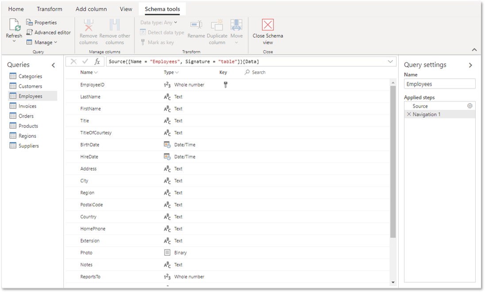
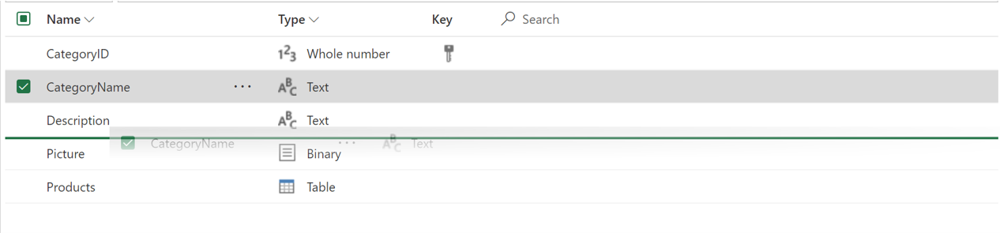

# Using Schema view (Preview)

Schema view is designed to optimize your flow when working on schema level operations by putting your query's column information front and center. Schema view provides contextual interactions to shape your data structure, and lower latency operations as it only requires the column metadata to be computed and not the complete data results.

This article walks you through schema view and the capabilities it offers.

> [!NOTE]
> The Schema view feature is available only for Power Query Online.

## Overview

When working on data sets with many columns, simple tasks can become incredibly cumbersome because even finding the right column by horizontally scrolling and parsing through all the data is inefficient. Schema view displays your column information in a list that's easy to parse and interact with, making it easier than ever to work on your schema.

In addition to an optimized column management experience, another key benefit of schema view is that transforms tend to yield results faster. These results are faster because this view only requires the columns information to be computed instead of a preview of the data. So even working with long running queries with a few columns will benefit from using schema view.

You can turn on schema view by selecting **Schema view** in the **View** tab. When you're ready to work on your data again, you can select **Data view** to go back.

## Reordering columns

One common task when working on your schema is reordering columns. In Schema View this can easily be done by dragging columns in the list and dropping in the right location until you achieve the desired column order.

## Applying transforms

For more advanced changes to your schema, you can find the most used column-level transforms right at your fingertips directly in the list and in the Schema tools tab. Plus, you can also use transforms available in other tabs on the ribbon.

