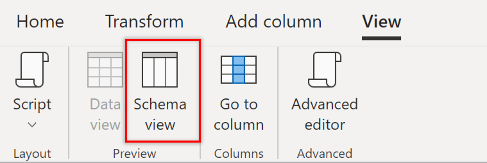
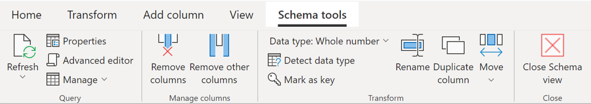

# Using Schema view
Schema view is designed to optimize your flow when working on schema level operations by putting your query's column information front and center, providing contextual interactions to shape your data structure, and lower latency operations as it only requires the column metadata to be computed and not the complete data results. 

This article walks you through Schema view and the capabilities it offers. 

## Overview
When working on data sets with many columns, simple tasks can become incredibly cumbersome because even finding the right column by horizontally scrolling and parsing through all the data is inefficient. Schema view displays your column information in a list that is easy to parse and interact with making it easier than ever to work on your schema.

In addition to an optimized column management experience, another key benefit of Schema view is that transforms tend to yield results faster because this view only requires the columns information to be computed instead of a preview of the data so even working with long running queries with few columns will benefit from this.

You can turn it on by clicking on *Schema view* in the View tab. When you're ready to work on your data again, you can click on *Data view* to go back.

## Working on your schema
You can reorder your columns by dragging and dropping list items.

For additional changes on your schema, you have the most used column-level transforms right at your fingertips directly in the list and in the Schema tools tab, plus you can also use transforms available in other tabs the ribbon. 

