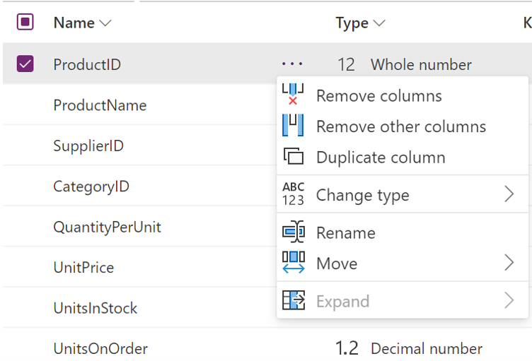

# Using Schema view
Schema view is designed to optimize your flow when working on schema level operations by putting your query's column information front and center as well as providing contextual interactions to shape your data structure directly in the list or through the *Schema tools*.

This article walks you through Schema view and the capabilities it offers. 

>[!Note]
>Schema view only requires for column metadata to be computed when applying transforms on your data so you might notice that some operations run faster than when in Data view. 

## Overview
When working on data sets with many columns, simple tasks can become incredibly cumbersome because even finding the right column by horizontally scrolling and parsing through all the data is inefficient. 

To turn it on, click on *Schema view* in the View tab. When you're ready to work on your data again, you can click on *Data view* to go back.

When in Schema view, you'll have the most used column-level transforms right at your fingertips with Schema tools. These are the same transforms already available in Power Query now surfaced in the context of performing schema operations. 

## Working on your schema
In *Schema view*, you can quickly reorder your columns by dragging and dropping list items.

For additional changes on your schema, you can apply transforms for columns directly in the list, via transforms available in the Schema tools, or using other transforms available in the ribbon. 

