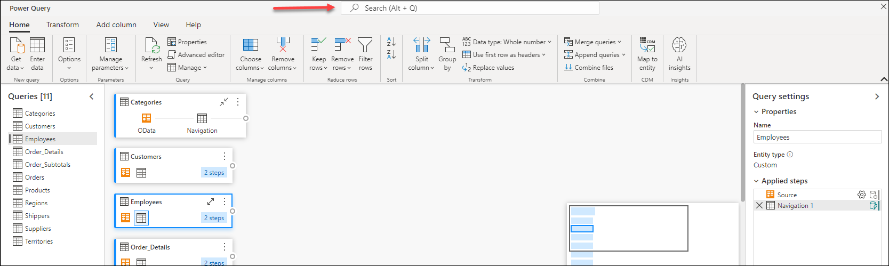
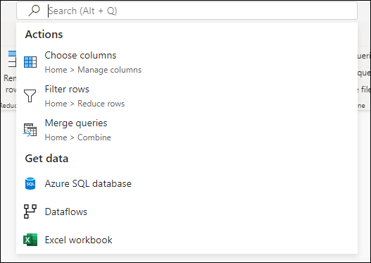
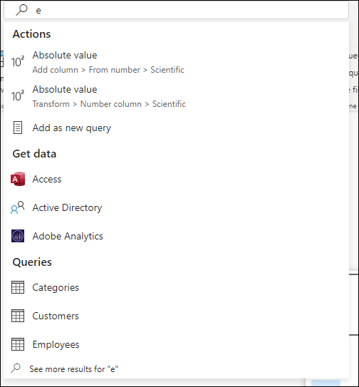
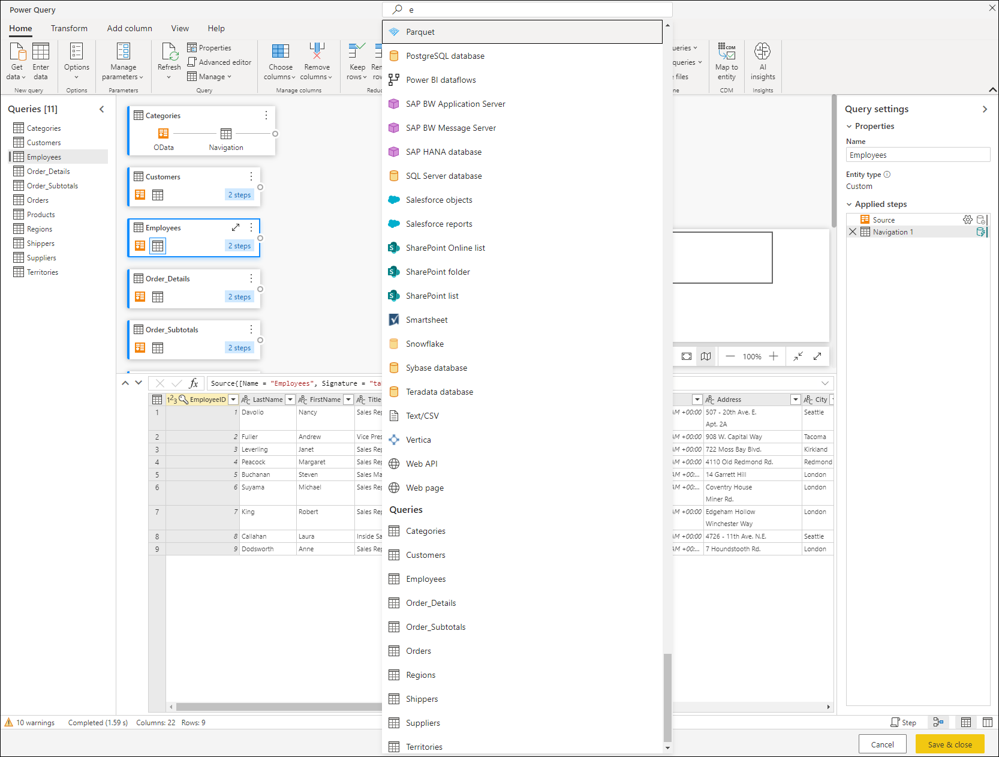

# Global search box (Preview)

The global search box offers you the ability to search for:

* **Queries** found in your project
* **Actions** available in your version of Power Query that are commonly found in the ribbon
* **Get data** connectors that can also be found through the 'Get Data' dialog

The global search box is located at the top center of the Power Query editor window and follows the same design principles that you find in the [Microsoft Search in Office](https://support.microsoft.com/office/find-what-you-need-with-microsoft-search-in-office-2457d4d8-48a8-4ad4-ab89-5a0657aa8446), but contextualized to the Power Query experience.

## Search results

To make use of the global search box, simply click the search box or press Alt + Q, and before you even type anything you will be presented with some default options to choose from.

While you start typing, the results will be updated in real time and displaying queries, actions and get data connectors that match the text that you've typed.

For scenarios where you'd like to see all available options for a given search query, you can also click the *"See more results for ..."* option positioned as the last result of the search box query when there are multiple matches to your query.

