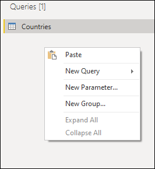
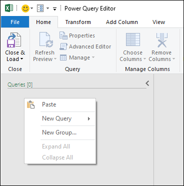
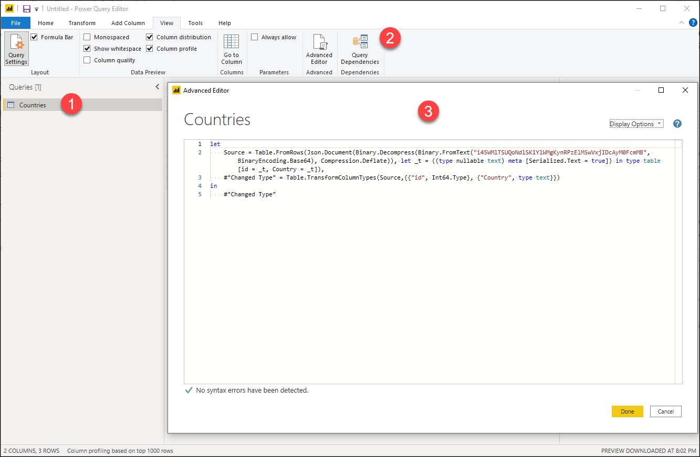

# Share a query

This article covers the general mechanisms to share a query in Power Query.

A query consists of ....

## Copy / Paste

In the queries pane, right click the query that you want to copy. From the dropdown menu select the **Copy** option. The query and its definition will be added to your clipboard.


>[!Note]
> The copy feature is currently not available in Power Query Online instances.

To paste the query from your clipboard simply go to the queries pane and rightclick on any empty space in it. From the menu, select the Paste option.



When pasting this on an instance that already has the same query name, the pasted query will be added a suffix with the format ```(#)``` where the pound sign is replaced with a number to distinguish the pasted queries.


You can also paste queries between multiple instances and product integrations. For example, you can copy the query from Power BI Desktop as shown in the images above and paste it in Power Query for Excel as shown below:



>[!WARNING]
>Copying and pasting queries between product integrations doesn't guarantee that all functions and components found in the pasted query will work on the destination as some components might only be available in the origin product integration.

## Copy the M code

You can also copy the full code of your query.



1. Select the query that you want to share
2. In the ribbon, select the View tab and select the option for *Advanced Editor*
3. In the *Advanced Editor* window, select all the code and copy it

With the code of your query in your clipboard, you can share this query through means of your choice. The recipient of this code needs to create a *Blank query* and follow the same steps as mentioned above, but instead of copying the code the recipient will replace the code found in their *Blank query* with the code that you provided.

>[!NOTE]
>To create a *Blank query* simply go to the **Get Data** window and select *Blank query* from the options.

## Product specific query sharing capabilities

Some Power Query product integrations might offer more ways to share queries such as but not limited to:
* **In Microsoft Excel** - Creating an Office Data Connection (.odc) to share with other users.
* **In Power BI Desktop** - Creating a Power BI Template (.pbit) to share with other users.

It is recommended that you read the documentation of the product integration that you're interested in to learn more about the query sharing capabilities found within.