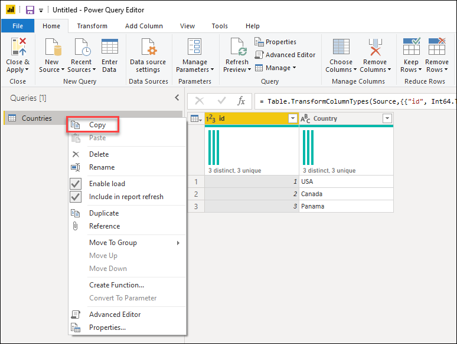
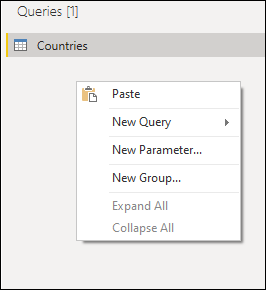
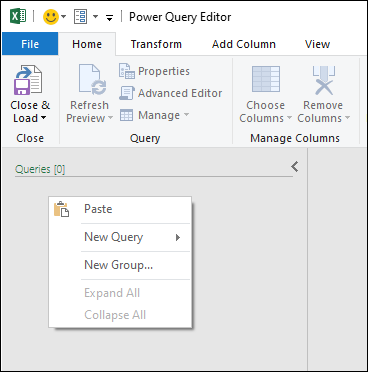
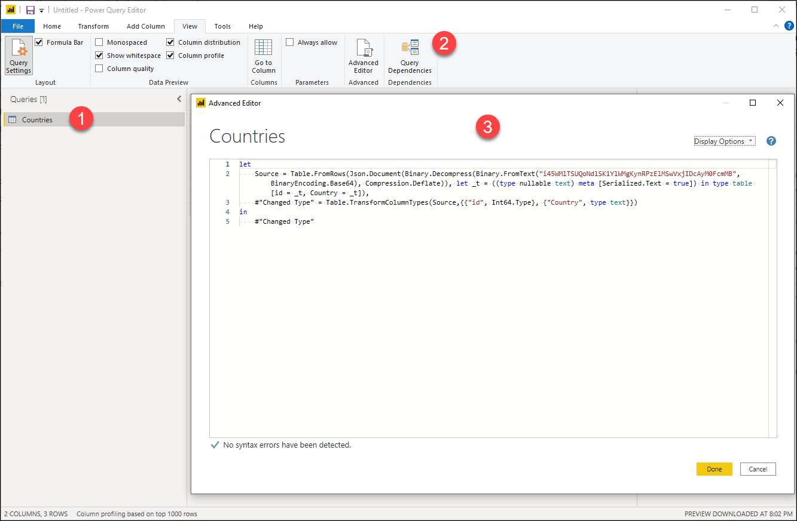

# Share a query

You can use Power Query to extract and transform data from external data sources. These extraction and transformations steps are represented as queries. Queries created with Power Query are expressed using the M language and executed through the M Engine.

You can easily share and reuse your queries across projects, and also across Power Query product integrations. This article covers the general mechanisms to share a query in Power Query.

## Copy / Paste

In the queries pane, right-click the query you want to copy. From the dropdown menu, select the **Copy** option. The query and its definition will be added to your clipboard.



>[!Note]
> The copy feature is currently not available in Power Query Online instances.

To paste the query from your clipboard, go to the queries pane and right-click on any empty space in it. From the menu, select **Paste**.



When pasting this query on an instance that already has the same query name, the pasted query will have a suffix added with the format ```(#)```, where the pound sign is replaced with a number to distinguish the pasted queries.


You can also paste queries between multiple instances and product integrations. For example, you can copy the query from Power BI Desktop, as shown in the previous images, and paste it in Power Query for Excel as shown in the following image.



>[!WARNING]
>Copying and pasting queries between product integrations doesn't guarantee that all functions and functionality found in the pasted query will work on the destination. Some functionality might only be available in the origin product integration.

## Copy the M code

You can also copy the full code of your query.



1. Select the query that you want to share.
2. In the ribbon, select the **View** tab and then select **Advanced Editor**.
3. In the **Advanced Editor** window, select all the code and copy it.

With the code of your query in your clipboard, you can share this query through the means of your choice. The recipient of this code needs to create a blank query and follow the same steps as described above. But instead of copying the code, the recipient will replace the code found in their blank query with the code that you provided.

>[!NOTE]
>To create a blank query, go to the **Get Data** window and select **Blank query** from the options.

## Product-specific query sharing capabilities

Some Power Query product integrations might offer more ways to share queries such as but not limited to:

* **In Microsoft Excel**&mdash;Creating an Office Data Connection (.odc) to share with other users.
* **In Power BI Desktop**&mdash;Creating a Power BI Template (.pbit) to share with other users.

We recommend that you read the documentation of the product integration that you're interested in to learn more about the query sharing capabilities found in those products.
