# Use SharePoint & OneDrive for Business files in Power Query

Power Query offers a series of methods to gain access to files that are hosted on either SharePoint or OneDrive.

## Browse files Experience

>[!NOTE]
>This experience currently only available inside of the Power Query Online experience for PowerApps and can only browse for files in the OneDerive for Business account of the authenticated user.

When creating a Dataflow inside of PowerApps using any of these connectors:
* Excel
* JSON
* PDF
* XML
* TXT / CSV

Power Query will provide a button next to the *File path or URL* parameter with a label that reads **Browse OneDrive...**.

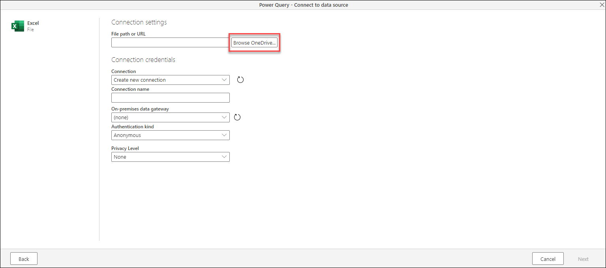

When you click this button, you'll be prompted to go through the authentication process. After finalizing this process, a new window will appear with all the files inside the OneDrive for business of the authenticated user. 

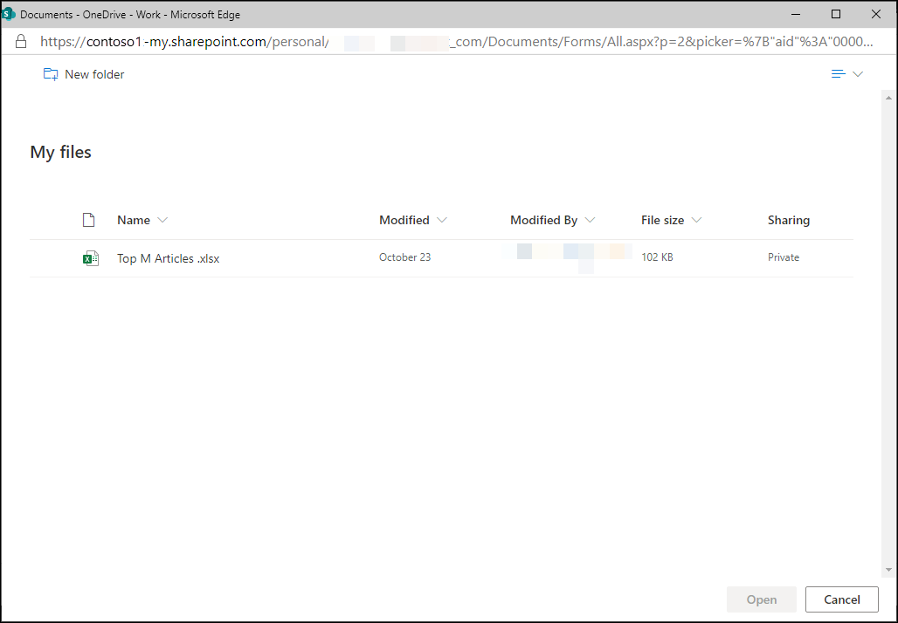

You can select the file of your choice and then click the OK button. After clicking the OK button, you'll be taken back to the initial connection settings page where you'll see that the *File path or URL* parameter now holds the exact url to the file that you've selected from OneDrive for Business.

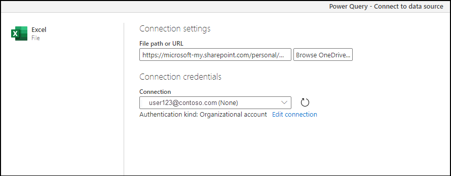

You can click the **Next** button at the bottom right corner of the window to continue the process and get your data.

## From Web connector using a file url

1. Navigate to your OneDrive for Business location using a browser. Right-click the file you want to use, and select **Open in Excel**.
   
   > [!NOTE]
   > Your browser interface might not look exactly like the following image. There are many ways to select **Open in Excel** for files in your OneDrive for Business browser interface. You can use any option that allows you to open the file in Excel.
   
   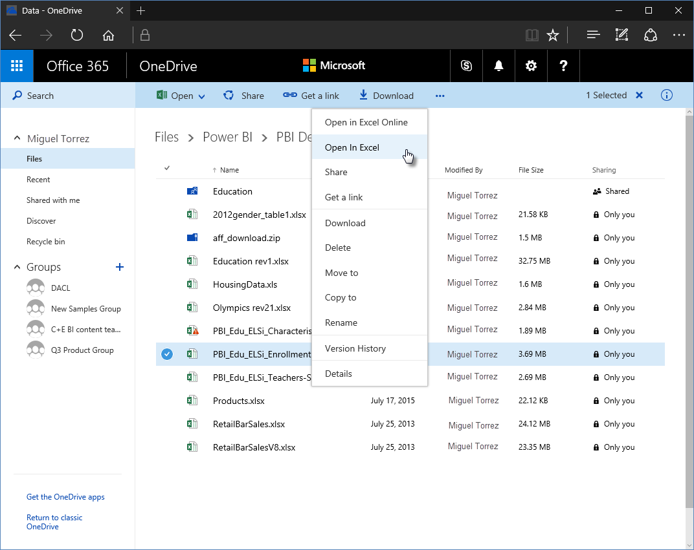

2. In Excel, select **File** > **Info**, and then select the **Copy path** button, as shown in the following image.
   
   

### Use the link in Power Query
In Power Query, you can use the link you just copied to the clipboard. Take the following steps:

1. Select **Get Data** > **Web**.
   
   

2. With the **Basic** option selected, paste the link into the **From Web** dialog box.
3. Remove the *?web=1* string at the end of the link so that Power Query can properly navigate to your file, and then select **OK**.
   
    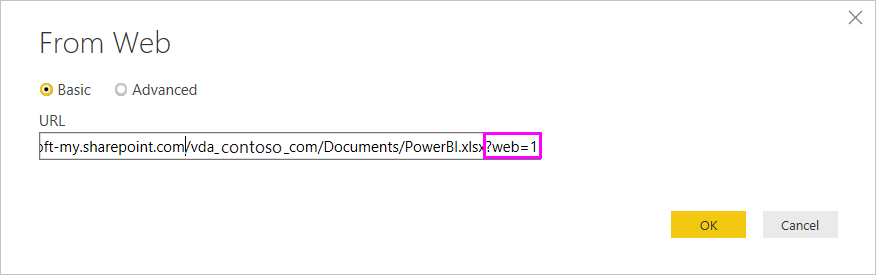 
4. If Power Query prompts you for credentials, choose either **Windows** (for on-premises SharePoint sites) or **Organizational Account** (for Microsoft 365 or OneDrive for Business sites).
   
   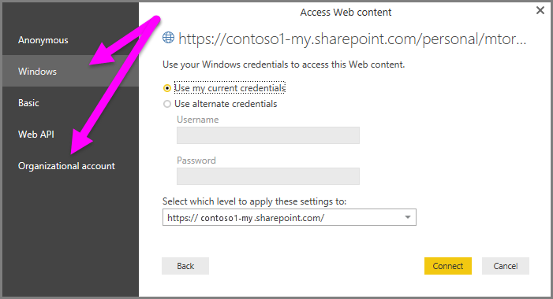

   A **Navigator** dialog box appears, allowing you to select from the list of tables, sheets, and ranges found in the Excel workbook. From there, you can use the OneDrive for Business file just like any other Excel file. You can create reports and use it in datasets like you would with any other data source.

> [!NOTE]
> To use a OneDrive for Business file as a data source in the Power BI service, with **Service Refresh** enabled for that file, make sure you select **OAuth2** as the **Authentication method** when configuring your refresh settings. Otherwise, you may encounter an error (such as, *Failed to update data source credentials*) when you attempt to connect or to refresh. Selecting **OAuth2** as the authentication method remedies that credentials error.

>[!CAUTION]
>When working with files hosted on OneDrive Personal, the file that you want to connect to needs to be publicly available. When setting the authentication method for this connection, select the option that reads **Anonymous**.

## SharePoint folder connector

You can read a detailed step by step guide on how to connect to the files hosted on your SharePoint site from this article on the [SharePoint folder](connectors/sharepointfolder#connect-to-a-sharepoint-folder.md).

After successfully establishing the connection, you'll be prompted with a table preview with  the files in your SharePoint site. Click the **Transform Data** button at the bottom right of the window.

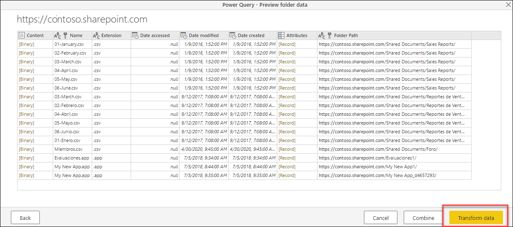

Clicking the **Transform Data** button will take you to a view of the data called the *File system view*. Each of the rows in this table represent a file that was found in your SharePoint.

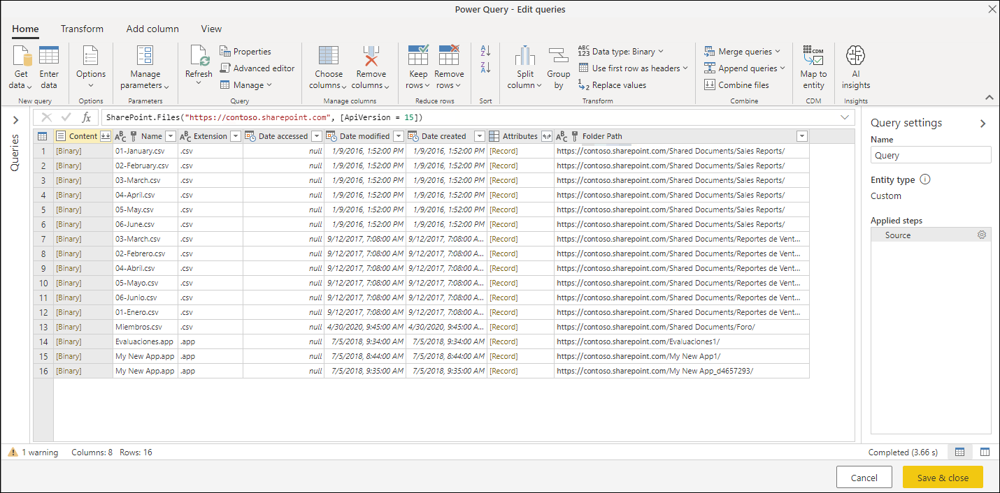

The table has a field named **Content** that has your file in a Binary format. The values in the **Content** field will have a different color than the rest of the values in the other fields of the table and this is to denote that they're clickable.

By clicking a *Binary* value in the **Content** field, Power Query will automatically add a series of steps in your query to navigate to the file and interpret the contents of it whereas possible.

For example, from the table shown in the previous image of this section, you can click the second row where the **Name** field has a value of *02-February.csv* and Power Query will automatically create a series of steps to navigate and interpret the contents of the file as a CSV file.

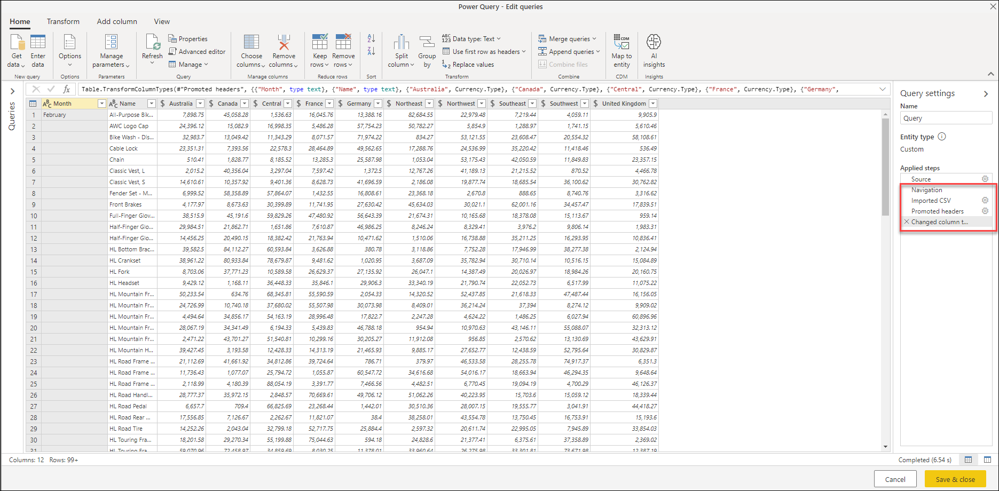

>[!NOTE]
>You can interact with the table by applying filters, sortings, and other transforms before navigating to the file of your choice when clicking the *Binary* value of your choice.

### OneDrive for Business experience

This connector and its experience also work for files hosted on OneDrive for Business.
However, the url that you need to use is different from the one used for the SharePoint site. To locate your unique url, go to your OneDrive for Business portal and copy the url from your browser which may look as follows:

`https://contoso-my.sharepoint.com/personal/user123_contoso_com/_layouts/15/onedrive.aspx`

You do not need the full url, but only the first few parts. The url that you need to use in Power Query needs to have the following format:

`https://<unique_tenant_name>.sharepoint.com/personal/<user_identifier>`

For example:

`https://contoso-my.sharepoint/personal/user123_contoso_com`

## SharePoint.Contents function

While the SharePoint folder connector offers you an experience where you can see all the files available in your SharePoint / OneDrive for Business site at once, you can also opt for a different experience where you can navigate through the folders of your SharePoint / OneDrive and reach the desired folder or file(s) that you're interested in.

This experience is provided through the `SharePoint.Contents` function as described in [the documenation article for that function](https://docs.microsoft.com/powerquery-m/sharepoint-contents). Take the following steps to use this function:

1. Create a Blank Query
2. Change the code in the formula bar to be `SharePoint.Contents("url")` where the url is the exact same format as for the SharePoint folder connector. 
    * For example:  `SharePoint.Contents("https://contoso.sharepoint.com/marketing/data")`
   >[!NOTE]
   >By default, this function will try to use the SharePoint API Version 14 to connect. If you are not certain of the API version being used by your SharePoint site, you might want to try using the following example code: `SharePoint.Contents("https://contoso.sharepoint.com/marketing/data", [ApiVersion="Auto"])`
3. Power Query will request you to add an authentication method for your connection. Use the same authentication method that you'd use for the SharePoint files connector.
4. Navigate through the different documents to the specific folder or file(s) that you're interested in.
    For example, imagine a SharePoint site with with a *Shared Documents* folder and you can click the *Table* value on the **Content** column for that folder and navigate directly to that folder.

    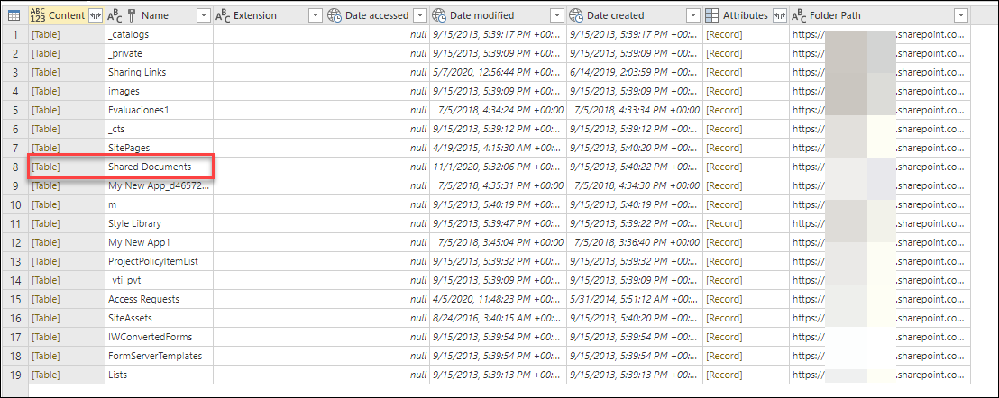

    Inside this *Documents* folder there's a folder where the company stores all the sales reports and have named this folder *Sales Reports*. You can click on the *Table* value on the **Content** column for that row.

    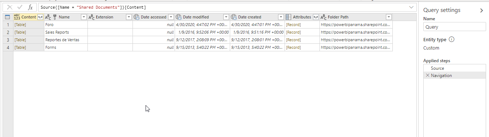

    With all the files inside the *Sales Reports* folder, you could click the **Combine files** button as documented in the article [Combine files overview](combine-files-overview.md) to combine the data from all the files in this folder into just a single table or you could navigate directly to a single file of your choice by clicking the *Binary* value from the **Content** column.

     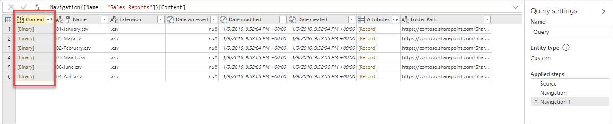

>[!NOTE]
> The experience provided by the `SharePoint.Contents` function is optimal for SharePoint and OneDrive environments with large number of files.