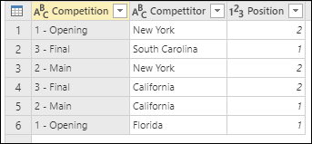
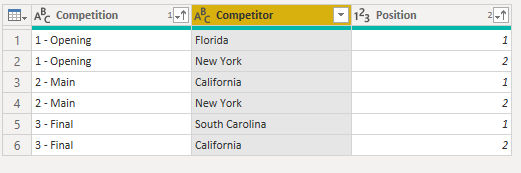
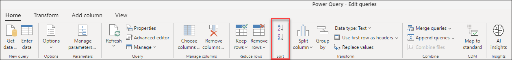
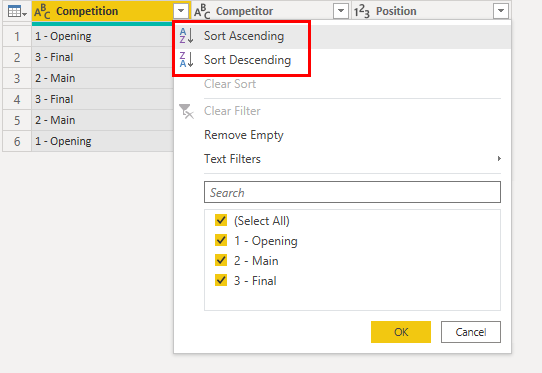
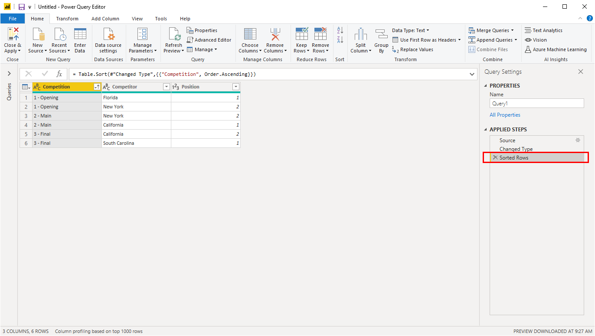
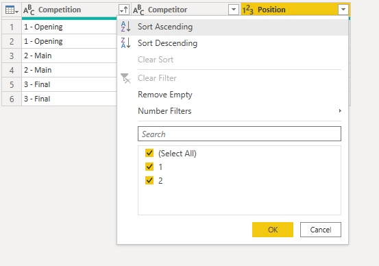
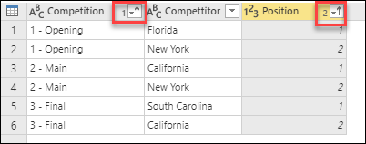

# Sort columns

You can sort a table in Power Query by either one or multiple columns. For example, take the following table with the fields **Competition**, **Competitor**, and **Position**.

For this example, the goal is to sort this table by the **Competition** and **Position** fields in ascending order.

## To sort a table

To sort the table, first select the column to be sorted. Once the column has been selected, you can select the sort operation from two places:

- **Home tab**&mdash;you'll find a group called **Sort** where you'll see the icons to sort your column by either ascending or descending order.

- **Field dropdown**&mdash;next to the name of the field you'll see a dropdown icon. When you select the dropdown icon, you'll see the option to sort your column.

In this example, first you need to do the sort on the **Competition** field. In this case, you've chosen to do the operation through the **Sort** group inside the **Home** tab. See how this action creates a new step in the **Applied Steps** section called **Sorted Rows**.

A visual indicator, displayed as an arrow, gets added to the **Field** dropdown to display how the column is being sorted.

Now you can sort by the **Position** field in ascending order as well, but this time you'll do it using the **Field** dropdown menu.

Notice how this action doesn't create a new step, but modifies the existing one to do both sort operations in just one step. When you sort based on multiple columns, the order or hierarchy of the sorting is based on the order that the columns were selected. A visual indicator prior to the **Field** dropdown is displayed, which provides a number that represents the order of this order or hierarchy.   

## To clear a sort

You can clear a sort operation of a specific column by going through the **Field** dropdown and selecting **Clear Sort** or by deleting the step from the Applied Steps pane.
