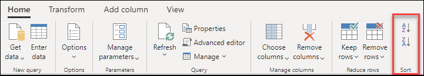
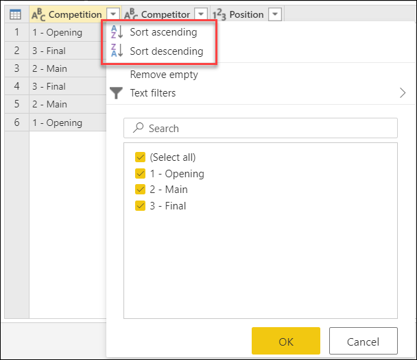
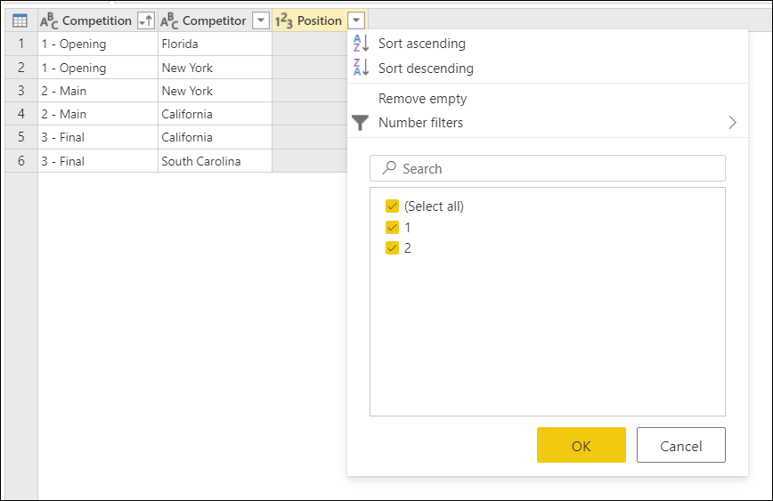

# Sort columns

You can sort a table in Power Query by one column or multiple columns. For example, take the following table with the columns named **Competition**, **Competitor**, and **Position**.

:::image type="complex" source="media/sort-columns/sort-by-column-start.png" alt-text="Sample source table for sorting.":::
   Table with Competition, Competitor, and Position columns. The Competition column contains 1 - Opening in rows 1 and 6, 2 - Main in rows 3 and 5, and 3-Final in rows 2 and 4. The Position row contains a value of either 1 or 2 for each of the Competition values.
:::image-end:::

For this example, the goal is to sort this table by the **Competition** and **Position** fields in ascending order.

:::image type="complex" source="media/sort-columns/sort-by-column-final.png" alt-text="Sample output table after sorting.":::
   Table with Competition, Competitor, and Position columns. The Competition column contains 1 - Opening in rows 1 and 2, 2 - Main in rows 3 and 4, and 3-Final in rows 5 and 6. The Position row contains, from top to bottom, a value of 1, 2, 1, 2, 1, and 2.
:::image-end:::

## To sort a table by using columns

To sort the table, first select the column to be sorted. After the column has been selected, you can select the sort operation from one of two places:

- On the **Home** tab, in the **Sort** group, there are icons to sort your column in either ascending or descending order.

   

- From the column heading drop-down menu. Next to the name of the column there's a drop-down menu indicator :::image type="icon" source="media/sort-columns/col-head-drop-down-menu.png":::. When you select the icon, you'll see the option to sort the column.

  

In this example, first you need to sort the **Competition** column. You'll perform the operation by using the buttons in the **Sort** group on the **Home** tab. This action creates a new step in the **Applied steps** section named **Sorted rows**.

A visual indicator, displayed as an arrow pointing up, gets added to the **Competitor** drop-down menu icon to show that the column is being sorted in ascending order.

Now you'll sort the **Position** field in ascending order as well, but this time you'll use the **Position** column heading drop-down menu.

Notice that this action doesn't create a new **Sorted rows** step, but modifies it to perform both sort operations in one step. When you sort multiple columns, the order that the columns are sorted in is based on the order the columns were selected in. A visual indicator, displayed as a number to the left of the drop-down menu indicator, shows the place each column occupies in the sort order.

## To clear a sort operation from a column

Do one of the following actions:

- Select the down arrow next to the column heading, and then select **Clear sort**.
- In **Applied steps** on the **Query Settings** pane, delete the **Sorted rows** step.
