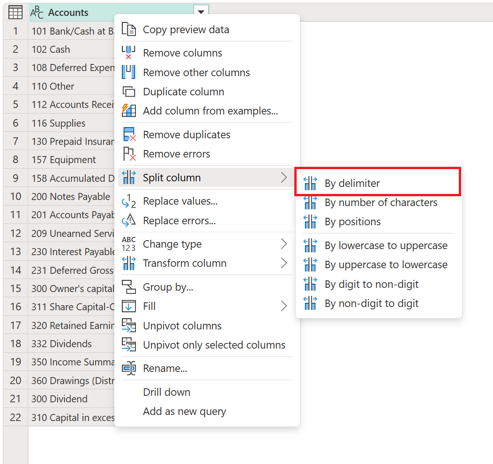
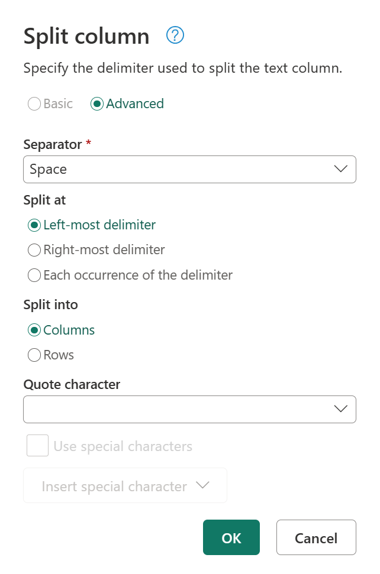
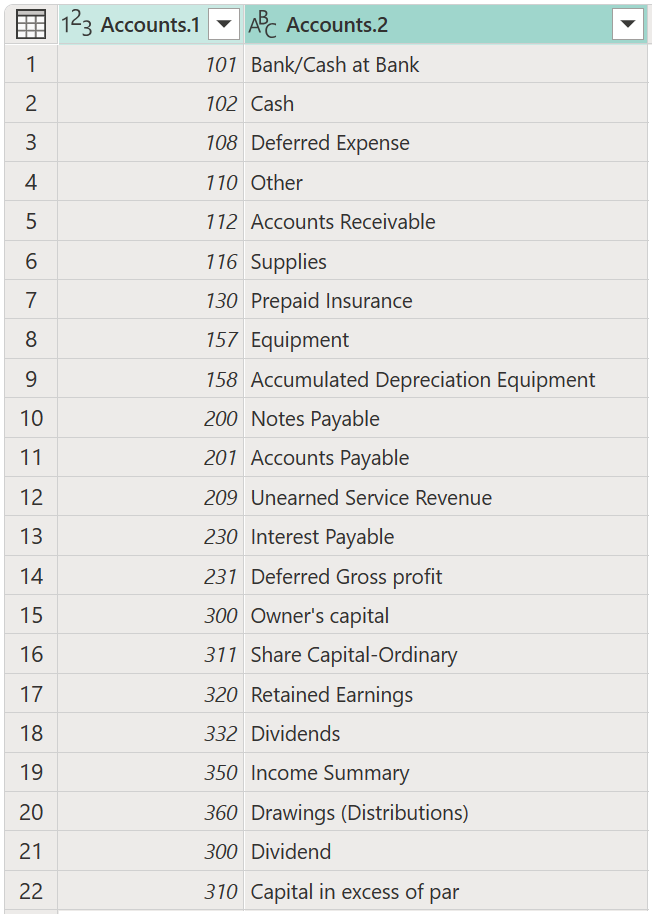
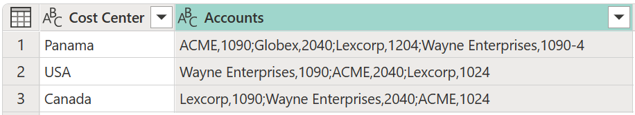

# Split columns by delimiter

In Power Query, you can split a column through different methods.
In this case, the column(s) selected can be split by a delimiter.

## Where to find Split Columns > By Delimiter

You can find the **Split Columns: By Delimiter** option in three places:

* **Home tab**&mdash;under the **Split column** dropdown menu inside the **Transform** group.

   

* **Transform tab**&mdash;under the **Split column** dropdown menu inside the **Text column** group.

   

* **Right-click a column**&mdash;inside the **Split column** option.

   

## Split columns by delimiter into columns

In this example, the initial table will be the one shown in the image below, with only one column for **Accounts**.

This column holds two values:

* Account number
* Account name

In this example, you want to split this column into two columns. The values are delimited by a space&mdash;the first space from left to right. To do this split, select the column, and then select the option to split the column by a delimiter. In **Split Column by Delimiter**, apply the following configuration:

* **Select or enter delimiter**: Space
* **Split at**: Left-most delimiter

The result of that operation will give you a table with the two columns that you're expecting.

>[!Note]
>Power Query will split the column into as many columns as needed. The name of the new columns will contain the same name as the original column. A suffix that includes a dot and a number that represents the split sections of the original column will be appended to the name of the new columns. 

## Split columns by delimiter into rows

In this example, your initial table will be the one shown in the image below, with the columns **Cost Center** and **Accounts**.

The **Accounts** column has values in pairs separated by a comma. These pairs are separated by a semicolon. The goal of this example is to split this column into new rows by using the semicolon as the delimiter.

To do that split, select the **Accounts** column. Select the option to split the column by a delimiter. In **Split Column by Delimiter**, apply the following configuration:

* **Select or enter delimiter**: Semicolon
* **Split at**: Each occurrence of the delimiter
* **Split into**: Rows

The result of that operation will give you a table with the same number of columns, but many more rows because the values inside the cells are now in their own cells.

### Final Split

Your table still requires one last split column operation. You need to split the **Accounts** column by the first comma that it finds. This split will create a column for the account name and another one for the account number.

To do that split, select the **Accounts** column and then select **Split Column > By Delimiter**. Inside the **Split column** window, apply the following configuration:

* **Select or enter delimiter**: Comma
* **Split at**: Each occurrence of the delimiter

The result of that operation will give you a table with the three columns that you're expecting. You then rename the columns as follows:

Previous Name | New Name
--------------|----------
Accounts.1 | Account Name
Accounts.2 | Account Number

Your final table looks like the one in the following image.

