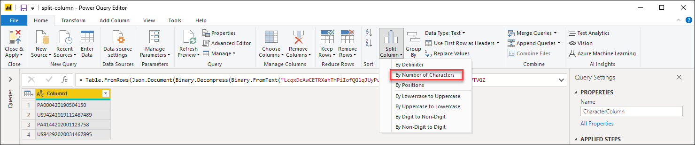
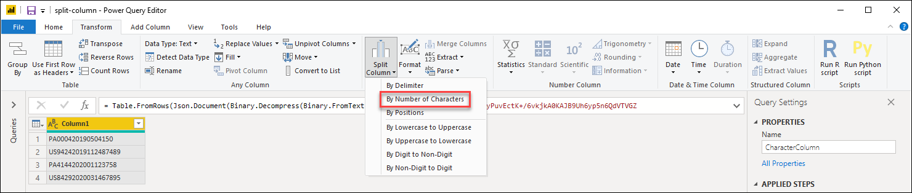
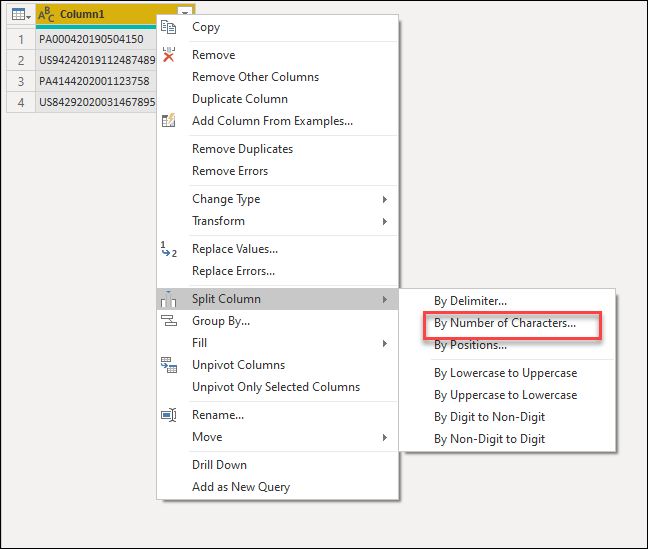
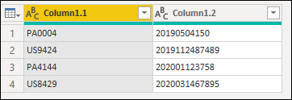
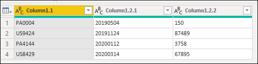
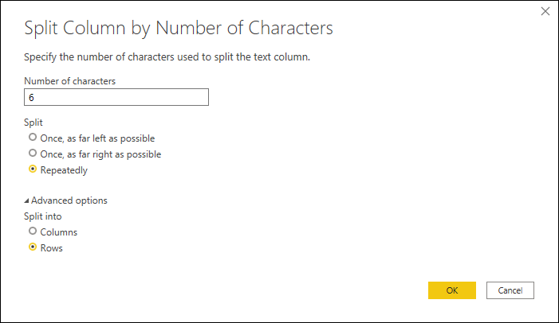
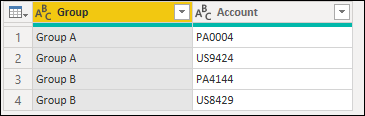

# Split Columns: By Number of Characters

In Power Query, you can split a column through different methods.
In this case, the column(s) selected can be split by a number of characters.

## Where to find the Split columns: by Number of Characters
We can find the Split columns: by Number of Characters option in 3 places:
1. **Home tab** - under the Split column dropdown menu inside the Transform group 

2. **Transform tab** - under the Split column dropdown menu inside the Text column group

3. **Right click a column** - inside the split columns option

## Split columns by number of characters into columns
Our initial table will be the one below with only one column for "Column1". 

This column holds 3 values:
1. **Account Name** - in the first 6 characters
2. **Date** - in the subsequent 8 characters with the format yyyymmdd
3. **Units** - the remainder of the characters 

We want to split this column into the 3 columns describe before. 
To do this, we simply select the column and select the option to split the column by number of characters. Inside the 'Split column' window, we apply the following configuration:

* **Number of characters**: 6
* **Split**: Once, as far left as possible

The result of that operation will give us a table with two columns. One for the Account Name and the other one for the values for the Date and Units combined:

>[!Note]
>Power Query will split the column into only two columns. The name of the new columns will contain the same name of the original column and a suffix created by a dot and a number that represents the splitted section of the column which will be appended to the name of the new columns. 

We now proceed to do the same operation over the new Column1.2 column but with the following configuration:

* **Number of characters**: 8
* **Split**: Once, as far left as possible

The result of that operation will yield a table with 3 columns. Notice the new names of the two columns on the far right, Column1.2.1 and Column1.2.2 which were automatically created by the Split column operation:

We can now change the name of the columns as well as define the data types of each column as follows:

Original Column Name | New Column name | Data type
---------------------|-----------------|---------- 
Column1.1|Account Name|Text
Column1.2.1|Date|Date
Column1.2.2|Units|Whole Number

Our final table will look like this:

## Split columns by number of characters into rows
Our initial table will be the one below with the columns 'Group' and 'Account'. 

The 'Account' column can hold multiple values in the same cell. Each value has the same lenght in characters with a total of 6 characters. We want to split these values so we can have each Account value in its own row.
To do that, we select the 'Account' column and select the option to split the column by number of characters. Inside the 'Split column' window, we apply the following configuratiton:

* **Number of characters**: 6
* **Split**: Repeatedly
* **Split into**: Rows

The result of that operation will give us a table with the same amount of columns, but many more rows as the values inside the cells are now in their own cells as shown below:

