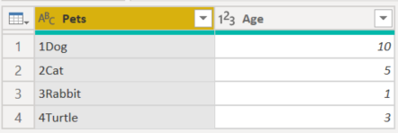
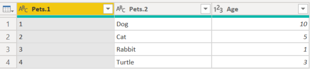

# Split columns by digit to non-digit

In Power Query, you can split a column through different methods.
In this case, the column(s) selected can be split by every instance of a digit followed by a non-digit.

## Where to find Split columns > By Digit to Non-Digit

You can find the **Split Columns: By Digit to Non-Digit** option in three places:

* **Home tab**&mdash;under the **Split Column** dropdown menu inside the **Transform** group.

   :::image type="content" source="media/splitcolumns-digit-to-nondigit/sc-home-dtnd.png" alt-text="Image shows By Digit to Non-Digit under the Home tab.":::

* **Transform tab**&mdash;under the **Split Column** dropdown menu inside the **Text Column** group.

   :::image type="content" source="media/splitcolumns-digit-to-nondigit/sc-transform-dtnd.png" alt-text="Image shows By Digit to Non-Digit under the Transform tab.":::

* **Right-click a column**&mdash;inside the **Split Column** option.

   :::image type="content" source="media/splitcolumns-digit-to-nondigit/sc-rightclick-dtnd.png" alt-text="Image shows By Digit to Non-Digit when right-clicking a column.":::

## Split columns by digit to non-digit into columns

The initial table in this example will be the one shown in the image below, with a column for **Pets** and other extra columns.
This example will only focus on the **Pets** column.

This column holds two values in each row:

* **Rank**&mdash;The rank of the animal.
* **AnimalType**&mdash;The second part of the word is the type of animal.

In this example, you want to split this column into the two columns described in the list above. Select the column and then select the option to split the column by digit to non-digit.

This single column will split into multiple columns, given every instance of a digit followed with a non-digit. In this case, it only splits it into two.

Your final table will look like the following image.

